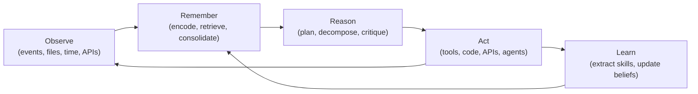
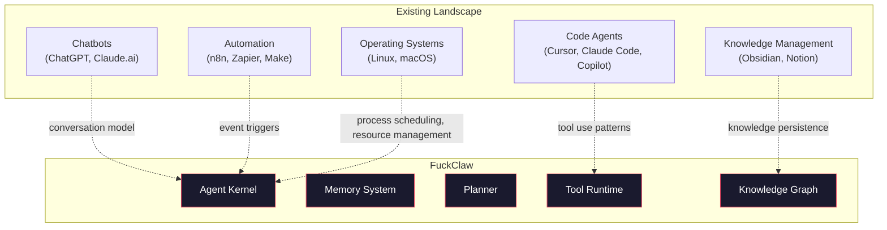

# §1 — Vision

## 1.1 What FuckClaw Actually Is

FuckClaw is a **Personal AI Operating System** — a continuously-running cognitive runtime that owns persistent identity, memory, knowledge, projects, and agency on behalf of a single human operator.

It is not:

- A chatbot (it acts without being prompted)
- An AI wrapper (it does not merely proxy LLM calls)
- A workflow automation tool (it reasons, plans, and adapts — it does not execute static DAGs)
- An AI assistant (it is not subordinate — it is a cognitive peer with full system access)

The closest analogues are:

| Analogue | What FuckClaw borrows | What FuckClaw transcends |
|----------|----------------------|--------------------------|
| Operating System Kernel | Process management, scheduling, resource arbitration | Adds cognitive reasoning as a first-class scheduling primitive |
| Personal Knowledge Management (Obsidian) | Persistent knowledge, linked graph, daily journals | Knowledge is not passive — it is actively queried, consolidated, and used for planning |
| IDE Agent (Cursor, Claude Code) | Code generation, tool use, file manipulation | Not scoped to a single project or session — continuous cross-project intelligence |
| Raycast / Alfred | System-level automation, quick actions | Actions are not user-triggered macros — they emerge from autonomous goal pursuit |
| Notion AI | Workspace organization, document intelligence | The AI *is* the workspace, not an overlay on it |

## 1.2 The Cognitive Loop

Traditional AI tools operate on a **request-response** model:

```
Human → Prompt → LLM → Response → Human
```

FuckClaw operates on a **cognitive loop**:



This loop runs **continuously**. The agent does not wait for prompts. It observes its environment (file changes, incoming emails, calendar events, webhook payloads, scheduled times), updates its memory, reasons about what to do, acts, and learns from outcomes.

## 1.3 Identity Persistence

FuckClaw maintains a persistent identity across sessions. This means:

1. **Continuous memory**: The agent remembers every interaction, decision, failure, and insight across its entire lifetime. Memory is not session-scoped.

2. **Evolving personality**: System prompts are not static. The agent's behavior adapts based on learned preferences, accumulated knowledge, and observed patterns.

3. **Owned workspace**: The agent has a filesystem home directory containing its projects, knowledge base, generated artifacts, logs, and configuration. This workspace persists and grows.

4. **Goal continuity**: Long-running goals survive restarts. If the agent is working on a multi-day research project, it resumes where it left off.

5. **Relationship context**: The agent builds a model of the operator — their communication style, technical preferences, projects, schedule, and priorities.

## 1.4 The Owner Trust Model

FuckClaw operates under a **full trust** model. The operator grants unrestricted access to the machine. This is not a security oversight — it is a deliberate architectural decision.

**Why**: Confirmation dialogs, permission prompts, and capability restrictions create friction that fundamentally limits autonomy. A personal AI that asks "are you sure?" before every shell command is not an operating system — it is a crippled chatbot with extra steps.

The trust model is:

```
┌─────────────────────────────────────────┐
│              OPERATOR                    │
│  (single human, full machine access)     │
├─────────────────────────────────────────┤
│         GRANTS UNRESTRICTED ACCESS       │
├─────────────────────────────────────────┤
│              FUCKCLAW                    │
│  • Shell execution                       │
│  • File system read/write                │
│  • Network access                        │
│  • Docker management                     │
│  • Database access                       │
│  • Browser control                       │
│  • Git operations                        │
│  • API calls (authenticated)             │
│  • Process management                    │
│  • MCP server interaction                │
│  • Cron/scheduler management             │
│  • Self-modification of workspace        │
└─────────────────────────────────────────┘
```

The only safety mechanism is **observability** (§18). Every action is logged, traced, and replayable. The operator can audit any decision post-hoc. But the agent does not ask for permission.

## 1.5 What Success Looks Like

When FuckClaw is fully operational, the following scenarios should be routine:

**Scenario 1: Autonomous Research**
The operator says "research Rust async runtimes and recommend one for our embedded project." FuckClaw decomposes this into sub-goals, spawns a researcher agent, reads relevant documentation, tests code samples, writes a comparison document, and delivers a recommendation with citations — all without further prompting.

**Scenario 2: Continuous Code Guardian**
FuckClaw watches the operator's Git repositories. When a PR is opened, it automatically reviews the code, checks for regressions against known patterns in its memory, runs relevant tests, and posts review comments. It learns from past review feedback to improve future reviews.

**Scenario 3: Proactive Planning**
FuckClaw notices that a deadline is approaching for a project. Based on its knowledge of remaining tasks, the operator's work velocity, and historical patterns, it proactively suggests a revised plan and begins pre-work (scaffolding files, drafting documentation, setting up test infrastructure).

**Scenario 4: Knowledge Accumulation**
Over months of use, FuckClaw has built a detailed knowledge graph of the operator's codebase, team members, API dependencies, deployment patterns, and architectural decisions. When the operator asks "why did we choose Postgres over CockroachDB?", FuckClaw retrieves the original decision conversation, the tradeoffs considered, and the context at the time.

**Scenario 5: Self-Improvement**
FuckClaw notices that it frequently fails at a specific type of task (e.g., Kubernetes manifest generation). It extracts the failure patterns, creates a skill with corrective prompts and tool sequences, and improves its success rate on future attempts — without operator intervention.

## 1.6 Relationship to Existing Systems



FuckClaw does not compete with any single category. It absorbs the useful patterns from each and integrates them into a unified cognitive architecture.
