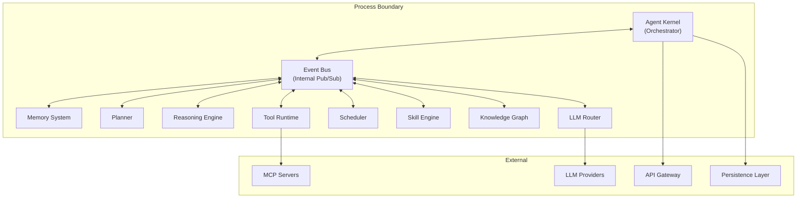

# §2 — System Philosophy

## 2.1 Design Principles

### 2.1.1 Intelligence Over Simplicity

Every architectural decision prioritizes the system's ability to reason, learn, and adapt — even when simpler alternatives exist. A dumb system that is easy to implement is not acceptable. A complex system that genuinely learns is.

**Example**: The Memory System (§6) could be implemented as a simple key-value store with embedding search. Instead, it implements five distinct memory types (working, semantic, episodic, procedural, long-term), consolidation cycles, decay functions, and conflict resolution. This complexity exists because human cognition uses differentiated memory systems for a reason — they serve different retrieval patterns and different temporal horizons.

### 2.1.2 Extensibility Over Convenience

The system is designed to be extended at every boundary. Every subsystem exposes well-defined interfaces. Nothing is hardcoded when it can be configured. Nothing is configured when it can be discovered dynamically.

**Concretely this means**:
- Tools are registered, not compiled in (§9)
- Skills are composable and learnable (§10)
- LLM providers are routed, not hardcoded (§12)
- Events are published on a bus, not passed as function arguments (§14)
- Agents are spawnable with dynamic capabilities (§15)

### 2.1.3 Modularity Over Monoliths

Every subsystem is independently deployable, testable, and replaceable. The Agent Kernel (§4) orchestrates modules but does not contain their logic. The Memory System (§6) does not know about the Planner (§5). The Tool Runtime (§9) does not know about the Reasoning Engine (§11).

**Module boundaries are enforced by**:
1. Communication through the Event Bus (§14) — not direct function calls
2. Each module owning its own persistence schema (§20)
3. Interfaces defined as TypeScript types, not implementations
4. Dependency injection at the kernel level

### 2.1.4 Event-Driven Architecture

The system is fundamentally **event-driven**, not request-response. Components communicate by emitting and subscribing to events on a central bus (§14). This enables:

- **Temporal decoupling**: A producer does not need to know if or when a consumer processes an event
- **Spatial decoupling**: Producers and consumers do not need to know each other's existence
- **Reactive composition**: New behaviors emerge by subscribing to existing event streams
- **Auditability**: Every event is logged, creating a complete causal history

### 2.1.5 Persistence by Default

Nothing is ephemeral unless explicitly marked as such. Every conversation, every tool invocation, every decision, every failure is persisted. The system assumes that any piece of information might be valuable in the future.

**Why**: Traditional AI tools discard context between sessions. FuckClaw's entire value proposition is that intelligence *accumulates*. Discarding information by default destroys accumulated intelligence.

### 2.1.6 Autonomous Planning

The system does not require human-specified task decomposition. Given a high-level goal, it autonomously:

1. Decomposes the goal into sub-tasks (§5)
2. Identifies dependencies between sub-tasks
3. Estimates resource requirements (tokens, time, tools)
4. Executes the plan with dynamic replanning
5. Reflects on outcomes and updates its planning heuristics

### 2.1.7 Native Tool Usage

Tools are not afterthoughts bolted onto a chat interface. They are **first-class citizens** of the runtime. The agent thinks in terms of tool capabilities. Tool execution is as natural as text generation.

### 2.1.8 Complete Transparency

Every decision the agent makes is traceable to:
- The memory that was retrieved
- The reasoning that was applied
- The plan that was followed
- The tool that was invoked
- The result that was observed
- The learning that was extracted

This is not for security — it is for **debuggability** and **trust calibration**.

## 2.2 Tradeoffs

Every architecture embodies tradeoffs. These are ours, stated explicitly:

| We Choose | Over | Rationale |
|-----------|------|-----------|
| Latency of complex reasoning | Speed of simple responses | A 5-second thoughtful answer beats a 200ms shallow one. The user has ChatGPT for fast shallow responses. |
| Storage cost of full persistence | Memory efficiency | Disk is cheap. Lost context is expensive. Every interaction is persisted. |
| Complexity of multi-memory architecture | Simplicity of single vector store | Different memory types serve different cognitive functions. A single embedding store cannot model temporal decay, procedural knowledge, and episodic recall simultaneously. |
| Cloud-first LLM routing | Local model execution | Frontier models (Claude, GPT-4, Gemini) dramatically outperform local models for complex reasoning. Local models are supported as fallbacks, not defaults. |
| Event-driven loose coupling | Direct function call performance | The 0.1ms overhead of event bus routing is negligible compared to the 1-30 second LLM calls that dominate execution time. Loose coupling enables extensibility. |
| Autonomous execution | User confirmation | The full-trust model eliminates confirmation friction. Observability provides post-hoc auditability. |
| Rich type system (TypeScript) | Dynamic flexibility (Python) | TypeScript's type system catches integration errors at compile time. The agent runtime is too complex for dynamic typing. Python is supported as a tool execution target, not a runtime language. |
| SQLite for single-node | Distributed databases | FuckClaw is a single-owner system. It runs on one machine. SQLite provides ACID transactions, zero configuration, and excellent single-node performance. Postgres is available for scaling if needed. |

## 2.3 Goals

### Primary Goals

1. **Continuous cognitive presence**: The agent runs persistently, observing and acting on its environment without requiring human prompts.

2. **Accumulative intelligence**: Every interaction makes the system smarter. Knowledge compounds over time.

3. **Autonomous multi-step execution**: Given a high-level goal, the system plans, executes, and delivers results across multiple steps, tools, and time horizons.

4. **Cross-project knowledge transfer**: Lessons learned in one project inform behavior in others.

5. **Self-improvement**: The system identifies its own weaknesses and generates corrective skills, prompts, and workflows.

6. **Unified workspace**: All projects, knowledge, memory, and artifacts live in a single coherent workspace managed by the agent.

### Secondary Goals

7. **Multi-modal interaction**: Desktop GUI, web interface, CLI, terminal UI, voice — the agent is accessible through multiple interfaces.

8. **Plugin ecosystem**: Third-party developers can extend the system with new tools, skills, memory backends, and LLM providers.

9. **MCP interoperability**: The system both consumes and provides MCP services, integrating with the broader agent ecosystem.

10. **Efficient resource usage**: Token budgets, caching, and intelligent model routing minimize API costs without sacrificing capability.

## 2.4 Non-Goals

These are explicitly out of scope. Including them would dilute the architecture.

| Non-Goal | Reason |
|----------|--------|
| Multi-user / multi-tenant support | This is a personal AI. Multi-tenancy adds complexity without value. |
| Enterprise RBAC / permissions | Single owner, full trust. No roles, no permissions. |
| Offline-first / local-only operation | Cloud LLMs are the primary intelligence source. Offline degrades to cached responses and local tools only. |
| Backward compatibility with OpenClaw | Clean break. Better architecture > migration convenience. |
| Mobile-first design | Desktop and CLI are primary. Mobile is a companion interface, not the primary one. |
| Real-time collaboration | One owner. No collaboration primitives needed. |
| HIPAA / SOC2 / compliance frameworks | Personal system, not enterprise. No compliance overhead. |
| Blockchain / decentralized anything | Centralized single-node is optimal for a personal system. |

## 2.5 Architectural Style

FuckClaw uses a **modular monolith** with an event-driven internal architecture:



**Why modular monolith instead of microservices?**

1. **Single-node deployment**: FuckClaw runs on one machine. Network overhead between microservices adds latency without value.
2. **Shared memory space**: In-process communication is ~1000x faster than inter-process RPC for the high-frequency event bus.
3. **Simpler deployment**: One binary/process to run, not a container orchestration stack.
4. **Module boundaries via TypeScript interfaces**: Type-safe module boundaries provide the same isolation guarantees as service boundaries, without network overhead.

The event bus provides the decoupling benefits of microservices (independent evolution, loose coupling) without the operational cost.

## 2.6 Technology Choices

| Component | Technology | Rationale |
|-----------|-----------|-----------|
| **Runtime Language** | TypeScript (Node.js) | Strong typing for complex module interfaces. Excellent async/await for I/O-heavy LLM workloads. Rich npm ecosystem for integrations. |
| **Build System** | tsup + turborepo | Fast TypeScript compilation. Monorepo support for multi-package structure. |
| **Primary Database** | SQLite (via better-sqlite3) | Zero-config, embedded, ACID, single-file. Perfect for single-owner personal system. WAL mode for concurrent reads. |
| **Vector Database** | SQLite + sqlite-vec extension | Keeps vector search in the same DB engine. No separate vector DB process. Good enough for personal-scale (< 10M vectors). |
| **Knowledge Graph** | SQLite with adjacency-list model | Graph queries via recursive CTEs. No need for Neo4j at personal scale. |
| **Optional Scale DB** | PostgreSQL + pgvector | Available when SQLite limits are reached (~100GB+ or concurrent write pressure). |
| **Event Bus** | Custom in-process (EventEmitter3 + persistence) | In-process for speed. Persistent event log for replay. No Kafka/Redis overhead for single-node. |
| **LLM SDK** | Vercel AI SDK | Provider-agnostic. Streaming. Tool calling. Structured output. Active maintenance. |
| **MCP Client/Server** | @modelcontextprotocol/sdk | Official MCP SDK. Standard protocol compliance. |
| **HTTP Server** | Hono | Lightweight, fast, TypeScript-native. Middleware ecosystem. |
| **WebSocket** | ws | Battle-tested. Low overhead. |
| **CLI Framework** | Commander + Ink (React for CLI) | Declarative TUI components. Rich interactive output. |
| **Desktop App** | Tauri v2 | Rust backend, web frontend. ~10x smaller than Electron. Native system access. |
| **Process Management** | Node.js cluster + child_process | Built-in. No external process manager needed for single-node. |
| **Task Queue** | BullMQ (Redis-backed) or custom SQLite queue | BullMQ for production. SQLite queue for zero-dependency mode. |
| **Testing** | Vitest | Fast. TypeScript-native. Good mocking. Compatible with Node APIs. |
| **Documentation** | TypeDoc + Mermaid | Auto-generated API docs. Architecture diagrams as code. |

## 2.7 Why Not Python?

This question will arise. Here is the explicit reasoning:

1. **Type safety at scale**: FuckClaw has 20+ interacting subsystems. TypeScript's structural type system catches integration bugs at compile time. Python's type hints are optional and not enforced at runtime.

2. **Async model**: Node.js's event loop is naturally suited to I/O-bound LLM workloads (waiting for API responses, streaming tokens). Python's asyncio is functional but has ecosystem fragmentation (sync vs async libraries).

3. **Ecosystem for system integration**: npm has superior packages for WebSocket, HTTP servers, CLI tools, desktop apps (Tauri), and real-time streaming. Python excels at ML/data science, which FuckClaw delegates to cloud LLMs.

4. **Single runtime**: TypeScript runs the kernel, the API server, the CLI, the desktop app frontend, and plugins — all in one language. Python would require a polyglot architecture.

5. **Python as a tool target**: Python is fully supported as a *tool execution* language. The agent can write and run Python scripts. The runtime itself is TypeScript.

## 2.8 Concurrency Model

FuckClaw uses **cooperative concurrency** via the Node.js event loop, with **worker threads** for CPU-bound operations:

```
┌─────────────────────────────────────────────────────┐
│                   Main Thread                        │
│  ┌───────────────────────────────────────────────┐  │
│  │  Event Loop                                    │  │
│  │  • Agent Kernel tick                           │  │
│  │  • Event Bus dispatch                          │  │
│  │  • LLM API calls (async I/O)                   │  │
│  │  • Tool execution coordination                 │  │
│  │  • WebSocket message handling                  │  │
│  │  • HTTP request handling                       │  │
│  └───────────────────────────────────────────────┘  │
├─────────────────────────────────────────────────────┤
│                  Worker Pool                         │
│  ┌──────────┐ ┌──────────┐ ┌──────────┐            │
│  │ Worker 1 │ │ Worker 2 │ │ Worker 3 │  ...       │
│  │ Embedding│ │ Memory   │ │ File     │            │
│  │ compute  │ │ indexing │ │ hashing  │            │
│  └──────────┘ └──────────┘ └──────────┘            │
├─────────────────────────────────────────────────────┤
│                Child Processes                       │
│  ┌──────────┐ ┌──────────┐ ┌──────────┐            │
│  │ Shell    │ │ Python   │ │ Docker   │            │
│  │ commands │ │ scripts  │ │ exec     │            │
│  └──────────┘ └──────────┘ └──────────┘            │
└─────────────────────────────────────────────────────┘
```

**Why not multi-threaded?**: The Agent Kernel's state machine (§4) must be single-threaded to avoid race conditions in plan execution, memory updates, and event ordering. The event loop provides natural serialization of state transitions. CPU-bound work (embedding computation, file indexing) is offloaded to workers.
