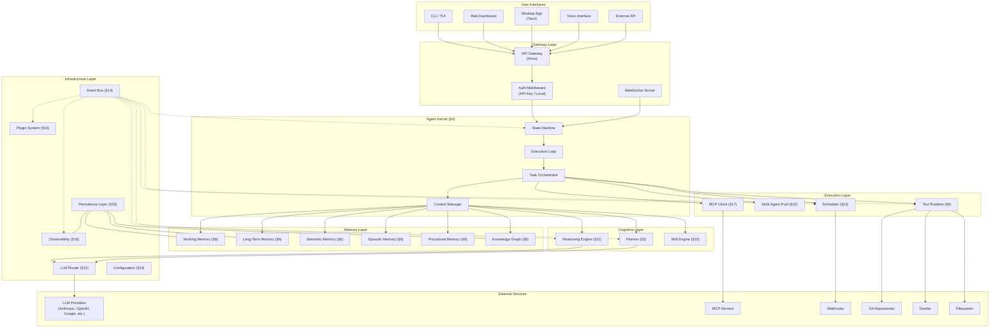
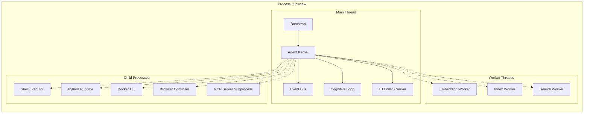
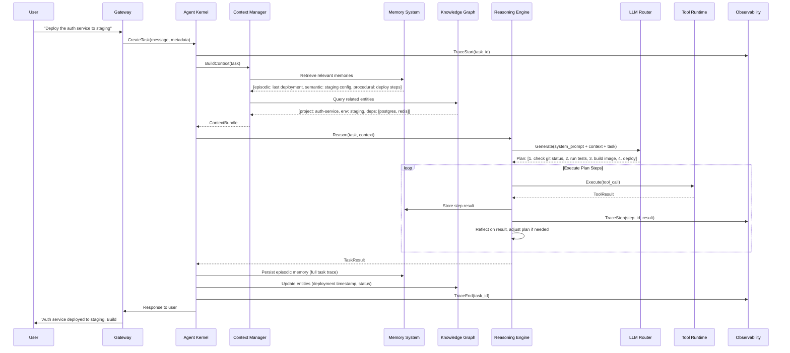
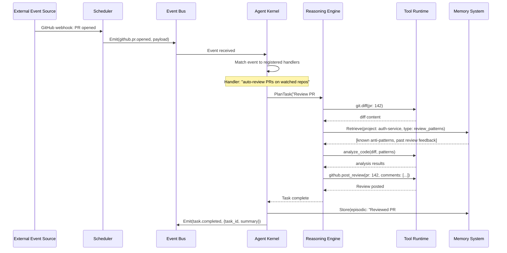
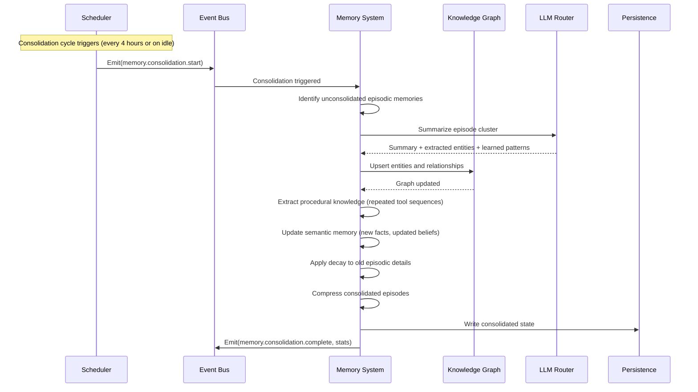
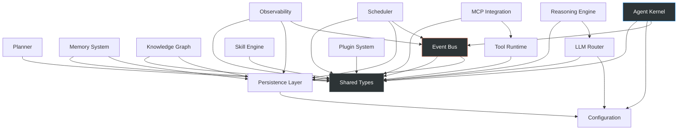

# §3 — High-Level Architecture

## 3.1 System Architecture Overview



## 3.2 Runtime Architecture

FuckClaw runs as a **single long-lived Node.js process** with the following runtime structure:



### 3.2.1 Boot Sequence

```mermaid
sequenceDiagram
    participant OS as Operating System
    participant BOOT as Bootstrap
    participant CONFIG as Config Loader
    participant PERSIST as Persistence
    participant EB as Event Bus
    participant KERNEL as Agent Kernel
    participant PLUGINS as Plugin System
    participant SCHED as Scheduler
    participant MCP as MCP Manager
    participant LOOP as Cognitive Loop

    OS->>BOOT: Start process
    BOOT->>CONFIG: Load workspace config
    CONFIG-->>BOOT: Configuration tree
    BOOT->>PERSIST: Initialize databases
    PERSIST-->>BOOT: DB connections ready
    BOOT->>EB: Initialize event bus
    EB-->>BOOT: Bus ready
    BOOT->>KERNEL: Initialize kernel
    KERNEL->>KERNEL: Load state from last checkpoint
    KERNEL->>PLUGINS: Discover and load plugins
    PLUGINS-->>KERNEL: Plugin registry populated
    KERNEL->>MCP: Start MCP connections
    MCP-->>KERNEL: MCP tools registered
    KERNEL->>SCHED: Initialize scheduler
    SCHED->>SCHED: Load pending schedules from DB
    SCHED-->>KERNEL: Scheduler active
    KERNEL->>LOOP: Start cognitive loop
    LOOP->>EB: Emit(system.ready)
    
    Note over LOOP: Continuous operation begins
    
    loop Cognitive Tick
        LOOP->>EB: Check event queue
        LOOP->>KERNEL: Process next task
        KERNEL->>KERNEL: Observe → Remember → Reason → Act → Learn
    end
```

### 3.2.2 Shutdown Sequence

```mermaid
sequenceDiagram
    participant OS as Operating System
    participant KERNEL as Agent Kernel
    participant LOOP as Cognitive Loop
    participant TASKS as Active Tasks
    participant MEM as Memory System
    participant PERSIST as Persistence
    participant EB as Event Bus

    OS->>KERNEL: SIGTERM / SIGINT
    KERNEL->>LOOP: Stop accepting new tasks
    KERNEL->>TASKS: Graceful cancel (30s deadline)
    TASKS->>TASKS: Checkpoint in-progress work
    TASKS-->>KERNEL: All tasks checkpointed or completed
    KERNEL->>MEM: Flush working memory to persistence
    MEM->>PERSIST: Write checkpoint
    PERSIST-->>KERNEL: Checkpoint saved
    KERNEL->>EB: Emit(system.shutdown)
    KERNEL->>PERSIST: Close database connections
    KERNEL->>OS: Exit(0)
    
    Note over OS: On next boot, kernel resumes from checkpoint
```

## 3.3 Data Flow Architecture

### 3.3.1 User-Initiated Request Flow



### 3.3.2 Autonomous Event-Driven Flow



### 3.3.3 Memory Consolidation Flow (Background)



## 3.4 Component Responsibility Matrix

| Component | Owns | Produces | Consumes |
|-----------|------|----------|----------|
| **Agent Kernel** | Task lifecycle, state machine | `task.*` events, context requests | All events (routing) |
| **Planner** | Goal decomposition, dependency graphs | Task plans, sub-goal trees | Task requests, memory context |
| **Memory System** | All memory stores, consolidation | Memory query results, consolidation events | Episodic inputs, tool results, conversation turns |
| **Knowledge Graph** | Entity/relationship model | Graph query results, entity change events | Entity upsert requests, consolidation outputs |
| **Tool Runtime** | Tool registry, execution sandbox | Tool results, error reports | Tool invocation requests |
| **Skill Engine** | Skill registry, composition logic | Composed tool sequences, skill learning events | Skill invocation requests, procedural memory |
| **Reasoning Engine** | Reasoning loop, reflection | Reasoning traces, action decisions | Context bundles, tool results |
| **LLM Router** | Provider connections, routing logic | LLM responses, cost metrics | Generation requests |
| **Scheduler** | Time-based and event-based triggers | Trigger events, scheduled task requests | Cron specs, webhook registrations |
| **Event Bus** | Event routing, persistence | Routed events | All events from all components |
| **Plugin System** | Plugin lifecycle, SDK | Plugin capability registrations | Plugin manifests |
| **MCP Integration** | MCP client connections, server exposure | Tool registrations from MCP | MCP transport messages |
| **Observability** | Traces, logs, metrics | Dashboards, audit logs | All events (passive consumer) |
| **Persistence Layer** | Database connections, migrations | Query results | CRUD operations from all components |
| **Configuration** | Config tree, profiles | Resolved config values | Config files, environment variables |

## 3.5 Module Dependency Graph

This graph shows **compile-time dependencies** (imports), not runtime communication (which goes through the event bus):



**Key observation**: All modules depend on `Shared Types` and most depend on `Event Bus`. No module directly depends on another module's *implementation* — only on shared interfaces. This is the modularity enforcement mechanism.

## 3.6 Deployment Architecture

### Single-Node (Default)

```
┌─────────────────────────────────────────────────────────┐
│  Host Machine (Linux/macOS/Windows)                      │
│                                                          │
│  ┌───────────────────────────────────────────────────┐  │
│  │  fuckclaw (Node.js process)                        │  │
│  │  ├── Agent Kernel                                  │  │
│  │  ├── HTTP Server (:3141)                           │  │
│  │  ├── WebSocket Server (:3141/ws)                   │  │
│  │  ├── Worker Threads (embedding, indexing)          │  │
│  │  └── Child Processes (shell, python, docker)       │  │
│  └───────────────────────────────────────────────────┘  │
│                                                          │
│  ┌───────────────────────────────────────────────────┐  │
│  │  Data Directory (~/.fuckclaw/)                      │  │
│  │  ├── data/                                         │  │
│  │  │   ├── fuckclaw.db (SQLite - main)               │  │
│  │  │   ├── vectors.db (SQLite - embeddings)          │  │
│  │  │   └── events.db (SQLite - event log)            │  │
│  │  ├── workspace/                                    │  │
│  │  │   ├── projects/                                 │  │
│  │  │   ├── knowledge/                                │  │
│  │  │   └── artifacts/                                │  │
│  │  ├── config/                                       │  │
│  │  ├── logs/                                         │  │
│  │  ├── cache/                                        │  │
│  │  └── plugins/                                      │  │
│  └───────────────────────────────────────────────────┘  │
│                                                          │
│  ┌─────────────────────┐  ┌─────────────────────┐      │
│  │  Optional: Redis    │  │  Optional: Postgres  │      │
│  │  (task queue)       │  │  (scale persistence) │      │
│  └─────────────────────┘  └─────────────────────┘      │
└─────────────────────────────────────────────────────────┘
```

### Docker Deployment (Alternative)

```yaml
# docker-compose.yml (conceptual)
services:
  fuckclaw:
    image: fuckclaw:latest
    ports:
      - "3141:3141"
    volumes:
      - ~/.fuckclaw:/data
      - /var/run/docker.sock:/var/run/docker.sock  # Docker-in-Docker
      - ~/.ssh:/root/.ssh:ro                         # Git SSH keys
    environment:
      - ANTHROPIC_API_KEY
      - OPENAI_API_KEY
      - GOOGLE_AI_API_KEY
```

## 3.7 Package Structure

```
fuckclaw/
├── packages/
│   ├── core/                    # Shared types, interfaces, utilities
│   │   ├── src/
│   │   │   ├── types/           # All shared TypeScript types
│   │   │   ├── interfaces/      # Module interface definitions
│   │   │   ├── errors/          # Error hierarchy
│   │   │   └── utils/           # Shared utilities
│   │   └── package.json
│   │
│   ├── kernel/                  # Agent Kernel (§4)
│   │   ├── src/
│   │   │   ├── state-machine.ts
│   │   │   ├── execution-loop.ts
│   │   │   ├── task-orchestrator.ts
│   │   │   ├── context-manager.ts
│   │   │   └── index.ts
│   │   └── package.json
│   │
│   ├── planner/                 # Planner (§5)
│   ├── memory/                  # Memory System (§6)
│   ├── knowledge-graph/         # Knowledge Graph (§8)
│   ├── tools/                   # Tool Runtime (§9)
│   ├── skills/                  # Skill Engine (§10)
│   ├── reasoning/               # Reasoning Engine (§11)
│   ├── llm-router/              # LLM Router (§12)
│   ├── scheduler/               # Scheduler (§13)
│   ├── event-bus/               # Event Bus (§14)
│   ├── agents/                  # Multi-Agent Architecture (§15)
│   ├── plugins/                 # Plugin System (§16)
│   ├── mcp/                     # MCP Integration (§17)
│   ├── observability/           # Observability (§18)
│   ├── config/                  # Configuration (§19)
│   ├── persistence/             # Persistence Layer (§20)
│   ├── network/                 # Networking (§21)
│   │
│   ├── cli/                     # CLI Interface
│   ├── web/                     # Web Dashboard (Next.js or SvelteKit)
│   ├── desktop/                 # Desktop App (Tauri)
│   └── sdk/                     # Plugin SDK
│
├── turbo.json                   # Turborepo config
├── package.json                 # Root workspace
└── tsconfig.base.json           # Shared TypeScript config
```

## 3.8 Critical Path Analysis

The **critical path** for a user request flows through:

```
Gateway → Kernel → Context Manager → Memory Retrieval → LLM Generation → Tool Execution → Response
```

**Latency budget** (target: < 10s for first response token):

| Stage | Target Latency | Bottleneck |
|-------|---------------|------------|
| Gateway routing | < 1ms | Negligible |
| Context building | < 200ms | Memory retrieval (embedding search) |
| Memory retrieval | < 100ms | SQLite vector search (sqlite-vec) |
| Knowledge graph query | < 50ms | Recursive CTEs on indexed graph |
| Context assembly | < 50ms | String concatenation + token counting |
| LLM generation (first token) | 1-5s | Network latency to provider |
| LLM generation (full) | 5-30s | Token generation speed |
| Tool execution | Variable | Depends on tool (shell: 0.1-60s, API: 0.5-5s) |

The dominant factor is always LLM generation time. Everything else must be fast enough to be imperceptible relative to LLM latency.
