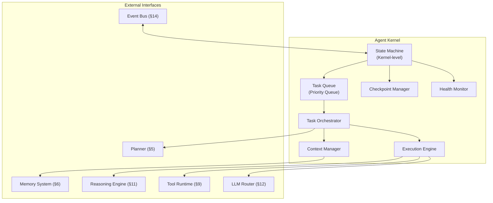
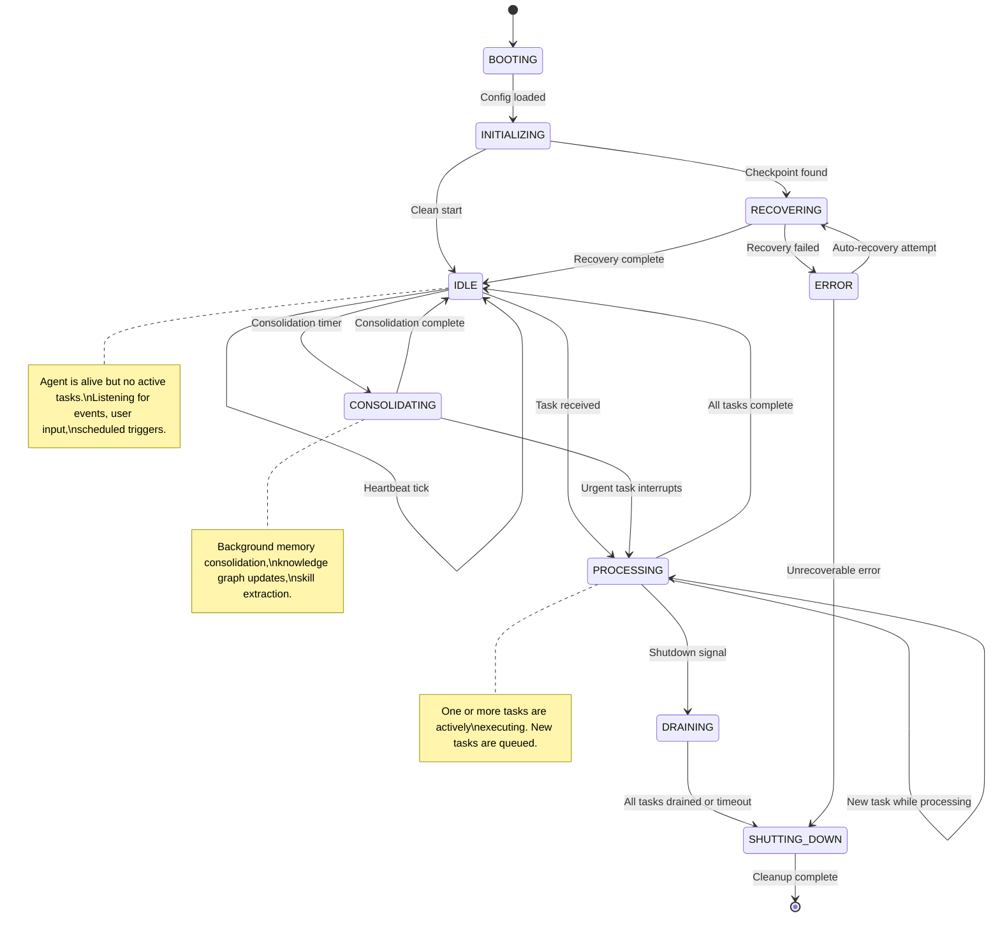
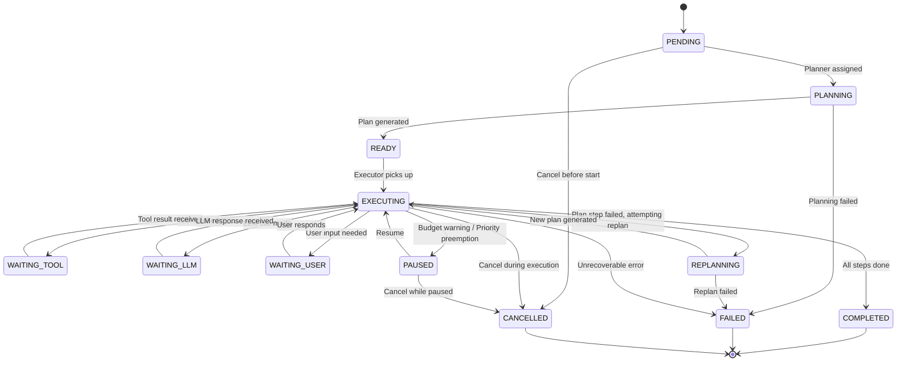
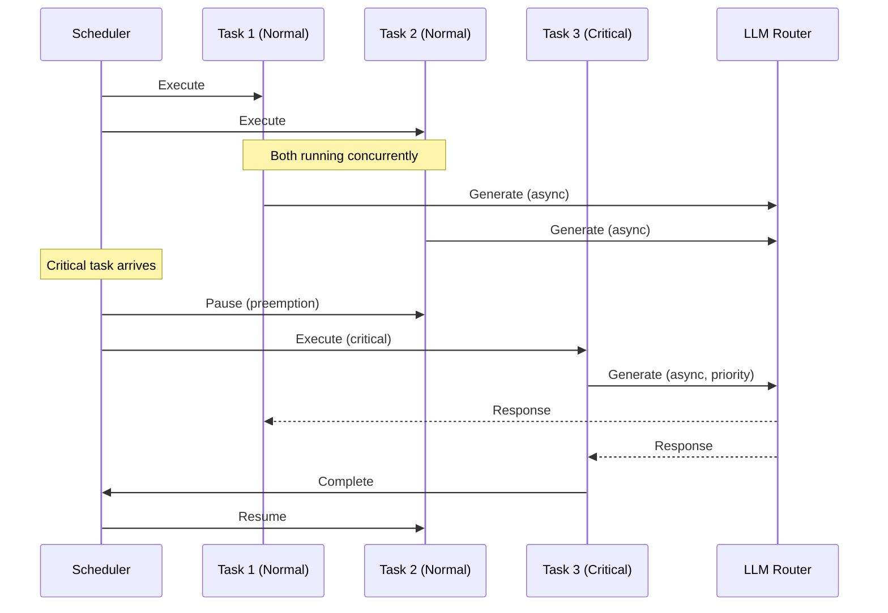
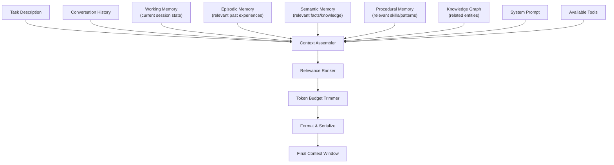
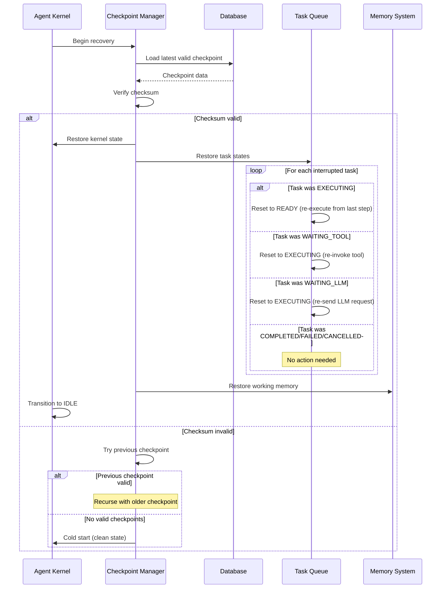

# §4 — Agent Kernel

## 4.1 Purpose

The Agent Kernel is the central runtime of FuckClaw. It is the equivalent of a microkernel in an operating system — it owns the execution lifecycle, manages state transitions, orchestrates tasks, and mediates between all other subsystems. No subsystem communicates directly with another; all coordination flows through the kernel or the event bus (§14) under the kernel's supervision.

**Why a kernel metaphor?** Because FuckClaw is not a script that runs and exits. It is a persistent process with multiple concurrent concerns (user requests, scheduled tasks, background consolidation, event reactions). These concerns must be scheduled, prioritized, pre-empted, and coordinated — exactly the role of an OS kernel.

## 4.2 Responsibilities

| Responsibility | Description |
|---------------|-------------|
| **Task Lifecycle** | Create, schedule, execute, pause, resume, cancel, and complete tasks |
| **State Management** | Maintain the global kernel state machine and per-task state machines |
| **Context Construction** | Assemble the context window for each LLM call from memory, knowledge, and current state |
| **Concurrency Control** | Manage concurrent task execution with resource budgets |
| **Priority Arbitration** | Determine which task runs next when multiple tasks compete |
| **Checkpoint/Recovery** | Persist kernel state for crash recovery |
| **Module Coordination** | Initialize, health-check, and coordinate all subsystem modules |
| **Event Routing** | Route events from the event bus to appropriate handlers |

## 4.3 Internal Architecture



## 4.4 Kernel State Machine

The kernel operates as a finite state machine with the following states:



### 4.4.1 State Definitions

```typescript
enum KernelState {
  /** Loading config, initializing DB connections, setting up event bus */
  BOOTING = 'booting',
  
  /** Loading modules, registering tools, connecting MCP servers */
  INITIALIZING = 'initializing',
  
  /** Replaying checkpoint, resuming interrupted tasks */
  RECOVERING = 'recovering',
  
  /** No active tasks. Listening for events. Low resource usage. */
  IDLE = 'idle',
  
  /** One or more tasks actively executing */
  PROCESSING = 'processing',
  
  /** Background maintenance: memory consolidation, indexing, skill extraction */
  CONSOLIDATING = 'consolidating',
  
  /** Shutdown requested. Completing/checkpointing active tasks. No new tasks accepted. */
  DRAINING = 'draining',
  
  /** Final cleanup. Closing connections. Flushing logs. */
  SHUTTING_DOWN = 'shutting_down',
  
  /** Unrecoverable error. Attempting recovery or shutting down. */
  ERROR = 'error',
}
```

### 4.4.2 State Transition Rules

```typescript
interface StateTransition {
  from: KernelState;
  to: KernelState;
  trigger: string;
  guard?: () => boolean;  // Condition that must be true for transition
  action?: () => void;    // Side effect executed during transition
}

const TRANSITIONS: StateTransition[] = [
  {
    from: KernelState.BOOTING,
    to: KernelState.INITIALIZING,
    trigger: 'config.loaded',
    action: () => initializeModules(),
  },
  {
    from: KernelState.INITIALIZING,
    to: KernelState.RECOVERING,
    trigger: 'checkpoint.found',
    guard: () => checkpointExists(),
    action: () => beginRecovery(),
  },
  {
    from: KernelState.IDLE,
    to: KernelState.PROCESSING,
    trigger: 'task.enqueued',
    guard: () => taskQueue.size > 0,
    action: () => startProcessing(),
  },
  {
    from: KernelState.PROCESSING,
    to: KernelState.IDLE,
    trigger: 'tasks.all_complete',
    guard: () => taskQueue.size === 0 && activeTasks.size === 0,
    action: () => maybeStartConsolidation(),
  },
  {
    from: KernelState.IDLE,
    to: KernelState.CONSOLIDATING,
    trigger: 'consolidation.timer',
    guard: () => shouldConsolidate(),
    action: () => startConsolidation(),
  },
  // ... additional transitions
];
```

## 4.5 Task Model

A **Task** is the fundamental unit of work in FuckClaw. Every action the kernel performs is wrapped in a task.

### 4.5.1 Task Structure

```typescript
interface Task {
  /** Unique identifier (ULID for time-sortable uniqueness) */
  id: string;
  
  /** Human-readable description */
  description: string;
  
  /** Where this task came from */
  source: TaskSource;
  
  /** Task priority (0 = highest, 100 = lowest) */
  priority: number;
  
  /** Current task state */
  state: TaskState;
  
  /** Parent task ID (for sub-tasks) */
  parentId?: string;
  
  /** Child task IDs */
  childIds: string[];
  
  /** The plan for this task (populated by Planner) */
  plan?: TaskPlan;
  
  /** Resource budget for this task */
  budget: TaskBudget;
  
  /** Execution context (assembled by Context Manager) */
  context?: ContextBundle;
  
  /** Results of completed steps */
  results: StepResult[];
  
  /** Error information if task failed */
  error?: TaskError;
  
  /** Timestamps */
  createdAt: number;
  startedAt?: number;
  completedAt?: number;
  
  /** Checkpoint data for recovery */
  checkpoint?: TaskCheckpoint;
  
  /** Tags for categorization and retrieval */
  tags: string[];
  
  /** Retry configuration */
  retry: RetryPolicy;
  
  /** Cancellation token */
  cancellation: AbortController;
}

type TaskSource = 
  | { type: 'user'; conversationId: string; messageId: string }
  | { type: 'event'; eventId: string; eventType: string }
  | { type: 'schedule'; scheduleId: string; scheduleName: string }
  | { type: 'agent'; agentId: string; parentTaskId: string }
  | { type: 'self'; reason: string }  // Self-initiated tasks (improvement, consolidation)
  | { type: 'plan'; parentTaskId: string; stepIndex: number };

interface TaskBudget {
  /** Maximum LLM tokens (input + output) */
  maxTokens: number;
  /** Maximum wall-clock time (ms) */
  maxDuration: number;
  /** Maximum number of tool invocations */
  maxToolCalls: number;
  /** Maximum number of LLM calls */
  maxLLMCalls: number;
  /** Maximum cost in USD */
  maxCost: number;
  /** Current consumption */
  consumed: {
    tokens: number;
    duration: number;
    toolCalls: number;
    llmCalls: number;
    cost: number;
  };
}
```

### 4.5.2 Task State Machine

Each task has its own state machine, independent of the kernel-level state machine:



```typescript
enum TaskState {
  PENDING = 'pending',         // Queued, not yet planned
  PLANNING = 'planning',       // Planner is decomposing
  READY = 'ready',             // Plan exists, waiting for executor
  EXECUTING = 'executing',     // Actively running
  WAITING_TOOL = 'waiting_tool', // Blocked on tool result
  WAITING_LLM = 'waiting_llm',  // Blocked on LLM response
  WAITING_USER = 'waiting_user', // Blocked on user input
  PAUSED = 'paused',           // Temporarily suspended
  REPLANNING = 'replanning',   // Adjusting plan after failure
  COMPLETED = 'completed',     // Successfully finished
  FAILED = 'failed',           // Unrecoverable failure
  CANCELLED = 'cancelled',     // Explicitly cancelled
}
```

## 4.6 Execution Loop

The kernel's execution loop is the heartbeat of FuckClaw. It runs on the main event loop with cooperative scheduling.

### 4.6.1 Loop Structure

```typescript
class ExecutionLoop {
  private readonly TICK_INTERVAL_MS = 100;  // 10 Hz tick rate
  private readonly MAX_CONCURRENT_TASKS = 4;
  
  async run(): Promise<void> {
    while (this.kernel.state !== KernelState.SHUTTING_DOWN) {
      const tickStart = performance.now();
      
      // Phase 1: Process incoming events
      await this.processEventQueue();
      
      // Phase 2: Check for new tasks
      await this.checkTaskSources();
      
      // Phase 3: Schedule ready tasks
      await this.scheduleReadyTasks();
      
      // Phase 4: Process active task steps
      await this.processActiveTasks();
      
      // Phase 5: Handle completed/failed tasks
      await this.processCompletedTasks();
      
      // Phase 6: Budget enforcement
      await this.enforceBudgets();
      
      // Phase 7: Health checks
      await this.runHealthChecks();
      
      // Phase 8: Checkpoint if needed
      await this.maybeCheckpoint();
      
      // Yield to event loop
      const elapsed = performance.now() - tickStart;
      if (elapsed < this.TICK_INTERVAL_MS) {
        await sleep(this.TICK_INTERVAL_MS - elapsed);
      }
    }
  }
}
```

### 4.6.2 Task Scheduling

The kernel uses a **priority queue with aging** to schedule tasks:

```typescript
class TaskScheduler {
  private queue: PriorityQueue<Task>;
  
  /**
   * Priority calculation:
   * - Base priority from task source (user: 0, event: 20, schedule: 40, self: 60)
   * - Adjusted by explicit priority field
   * - Aged: +1 priority every 10 seconds waiting (prevents starvation)
   * - Boosted: if task is a sub-task of an active high-priority task
   */
  calculateEffectivePriority(task: Task): number {
    const basePriority = SOURCE_PRIORITY[task.source.type];
    const agingBonus = Math.floor((Date.now() - task.createdAt) / 10000);
    const parentBoost = this.getParentBoost(task);
    
    return Math.max(0, task.priority + basePriority - agingBonus - parentBoost);
  }
  
  /**
   * Select next task to execute.
   * Respects MAX_CONCURRENT_TASKS limit.
   * Considers resource availability (memory, API rate limits).
   */
  selectNext(): Task | null {
    if (this.activeTasks.size >= this.MAX_CONCURRENT_TASKS) {
      return null;
    }
    
    // Find highest priority task that doesn't conflict with active tasks
    for (const task of this.queue) {
      if (!this.hasResourceConflict(task)) {
        return this.queue.dequeue(task);
      }
    }
    
    return null;
  }
  
  /**
   * Resource conflict detection.
   * Two tasks conflict if they:
   * - Write to the same file
   * - Use the same exclusive tool (e.g., browser)
   * - Exceed combined token budget
   */
  hasResourceConflict(candidate: Task): boolean {
    for (const active of this.activeTasks.values()) {
      if (this.filesOverlap(candidate, active)) return true;
      if (this.exclusiveToolConflict(candidate, active)) return true;
      if (this.budgetExceeded(candidate)) return true;
    }
    return false;
  }
}
```

### 4.6.3 Priority Levels

| Priority | Range | Source | Examples |
|----------|-------|--------|----------|
| **Critical** | 0-9 | User, system error | User's immediate request, crash recovery |
| **High** | 10-29 | User, important events | Follow-up to active conversation, CI failure |
| **Normal** | 30-49 | Events, scheduled | Webhook reaction, PR review, cron job |
| **Low** | 50-69 | Self-initiated, background | Memory consolidation, skill extraction |
| **Idle** | 70-100 | Maintenance | Knowledge graph optimization, cache cleanup |

## 4.7 Concurrency Model

### 4.7.1 Task Concurrency

Multiple tasks can execute concurrently, subject to:

1. **Concurrency limit**: Maximum 4 concurrent tasks (configurable)
2. **Resource locks**: Exclusive resources (browser, specific files) are locked
3. **Token budget**: Combined active tasks cannot exceed global token budget
4. **Priority preemption**: A critical task can pause lower-priority tasks



### 4.7.2 Cooperative vs Preemptive

Tasks are **cooperatively scheduled** by default — they yield at natural points (awaiting LLM responses, tool results). **Preemptive suspension** is used only for:

- Critical priority tasks needing resources
- Budget exhaustion (task has consumed its token budget)
- Shutdown/drain scenarios

Preemption works by setting the task's `AbortController` signal, which the execution engine checks between steps.

## 4.8 Context Manager

The Context Manager is responsible for assembling the context window for each LLM call. This is one of the most critical components — the quality of the context directly determines the quality of the LLM's output.

### 4.8.1 Context Assembly Pipeline



### 4.8.2 Context Budget Allocation

The context window is a scarce resource. The Context Manager allocates it as follows:

```typescript
interface ContextBudget {
  /** Total tokens available (model-dependent, e.g., 200K for Claude) */
  totalTokens: number;
  
  /** Fixed allocations (not adjustable) */
  systemPrompt: number;     // ~2000 tokens
  toolDefinitions: number;  // ~1000-5000 tokens depending on tool count
  responseReserve: number;  // ~8000 tokens reserved for output
  
  /** Dynamic allocations (ranked and trimmed) */
  conversationHistory: number;  // ~20% of remaining
  workingMemory: number;        // ~15% of remaining
  episodicMemory: number;       // ~20% of remaining
  semanticMemory: number;       // ~15% of remaining
  proceduralMemory: number;     // ~10% of remaining
  knowledgeGraph: number;       // ~10% of remaining
  taskContext: number;          // ~10% of remaining
}
```

### 4.8.3 Relevance Ranking

Each piece of context is scored for relevance before inclusion:

```typescript
interface ContextItem {
  content: string;
  tokens: number;
  relevanceScore: number;  // 0.0 - 1.0
  recencyScore: number;    // 0.0 - 1.0, decays over time
  sourceType: 'episodic' | 'semantic' | 'procedural' | 'graph' | 'conversation';
  sourceId: string;
}

function rankContextItems(items: ContextItem[], query: string): ContextItem[] {
  return items
    .map(item => ({
      ...item,
      // Combined score weights relevance highest, recency second
      combinedScore: item.relevanceScore * 0.6 + item.recencyScore * 0.3 + sourceTypeBonus(item.sourceType) * 0.1,
    }))
    .sort((a, b) => b.combinedScore - a.combinedScore);
}
```

## 4.9 Checkpoint and Recovery

### 4.9.1 Checkpoint Strategy

The kernel checkpoints its state to survive crashes. Checkpoints are taken:

1. **Periodically**: Every 60 seconds during active processing
2. **On state transitions**: Every kernel state change
3. **On task completion**: After each task completes
4. **On shutdown**: During graceful shutdown

```typescript
interface KernelCheckpoint {
  /** Checkpoint version for migration */
  version: number;
  
  /** Kernel state at checkpoint time */
  kernelState: KernelState;
  
  /** All task states */
  tasks: TaskCheckpoint[];
  
  /** Working memory snapshot */
  workingMemory: WorkingMemorySnapshot;
  
  /** Event bus cursor (last processed event ID) */
  eventCursor: string;
  
  /** Active conversation states */
  conversations: ConversationSnapshot[];
  
  /** Timestamp */
  timestamp: number;
  
  /** SHA-256 hash for integrity */
  checksum: string;
}

interface TaskCheckpoint {
  taskId: string;
  state: TaskState;
  planProgress: {
    currentStepIndex: number;
    completedSteps: number[];
    stepResults: Map<number, StepResult>;
  };
  contextSnapshot: string;  // Serialized context for resumption
  budget: TaskBudget;
}
```

### 4.9.2 Recovery Process



### 4.9.3 Failure Modes and Recovery

| Failure | Detection | Recovery Strategy |
|---------|-----------|-------------------|
| Process crash | OS-level (systemd/launchd restart) | Load latest checkpoint, resume tasks |
| Database corruption | Checksum validation failure | Fall back to previous checkpoint; rebuild from event log |
| LLM provider down | HTTP timeout / error response | LLM Router (§12) failover to alternative provider |
| Tool execution hang | Timeout watchdog | Kill tool process, mark step failed, replan |
| Memory exhaustion | Node.js heap monitoring | Emergency GC, pause low-priority tasks, alert operator |
| Event bus backup | Queue depth monitoring | Drop low-priority events, process critical only |
| Disk full | Write error detection | Alert operator, pause artifact generation |

## 4.10 Kernel API

The kernel exposes an internal API to other modules (not to external callers — external access goes through the Gateway §21):

```typescript
interface IAgentKernel {
  /** Lifecycle */
  boot(config: KernelConfig): Promise<void>;
  shutdown(deadline: number): Promise<void>;
  getState(): KernelState;
  
  /** Task management */
  submitTask(request: TaskRequest): Promise<Task>;
  cancelTask(taskId: string, reason: string): Promise<void>;
  pauseTask(taskId: string): Promise<void>;
  resumeTask(taskId: string): Promise<void>;
  getTask(taskId: string): Task | null;
  listTasks(filter: TaskFilter): Task[];
  
  /** Context */
  buildContext(task: Task): Promise<ContextBundle>;
  
  /** Event integration */
  onEvent(eventType: string, handler: EventHandler): void;
  emitEvent(event: KernelEvent): void;
  
  /** Health */
  health(): KernelHealth;
  metrics(): KernelMetrics;
}
```

## 4.11 Extensibility

The kernel is extended through:

1. **Task source plugins**: New sources of tasks (e.g., email, Slack, voice)
2. **Scheduling strategies**: Custom priority functions and scheduling algorithms
3. **Context providers**: Additional context sources injected into the context assembly pipeline
4. **Lifecycle hooks**: Pre/post hooks on task state transitions

```typescript
interface KernelPlugin {
  name: string;
  
  /** Called during kernel initialization */
  onInit?(kernel: IAgentKernel): Promise<void>;
  
  /** Provide additional context for task execution */
  contextProvider?(task: Task): Promise<ContextItem[]>;
  
  /** Custom priority calculation */
  priorityModifier?(task: Task, basePriority: number): number;
  
  /** Hook before task state transition */
  onTaskTransition?(task: Task, from: TaskState, to: TaskState): Promise<void>;
  
  /** Called during shutdown */
  onShutdown?(): Promise<void>;
}
```

## 4.12 Performance Considerations

| Metric | Target | Rationale |
|--------|--------|-----------|
| Tick rate | 10 Hz (100ms) | Fast enough for responsive task scheduling without CPU waste |
| Task creation overhead | < 1ms | Task creation should be negligible compared to execution |
| Context assembly | < 200ms | Must complete before LLM call; user shouldn't perceive delay |
| Checkpoint write | < 50ms | Must not block the execution loop |
| Memory usage (kernel) | < 100MB | Kernel process overhead; most memory is in LLM response buffers |
| Task queue capacity | 10,000 tasks | Support long backlogs without performance degradation |

## 4.13 Future Improvements

1. **Distributed kernel**: Multiple kernel instances coordinating via consensus (for multi-machine setups)
2. **Speculative execution**: Start likely next steps before current step completes
3. **Task migration**: Move tasks between different kernel instances
4. **Hot reload**: Reload kernel configuration without restart
5. **Adaptive scheduling**: ML-based priority adjustment learned from operator behavior patterns
