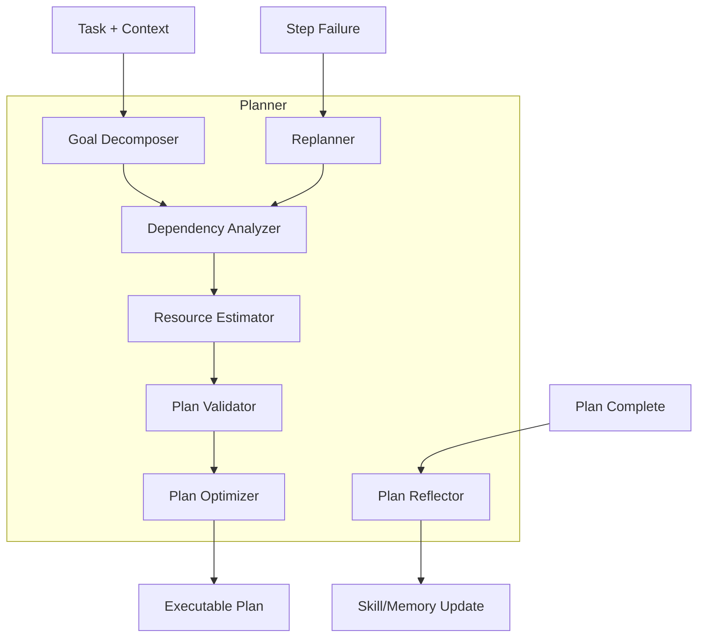
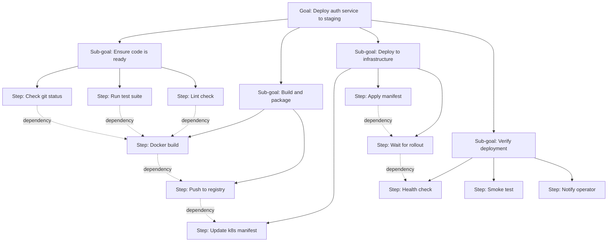
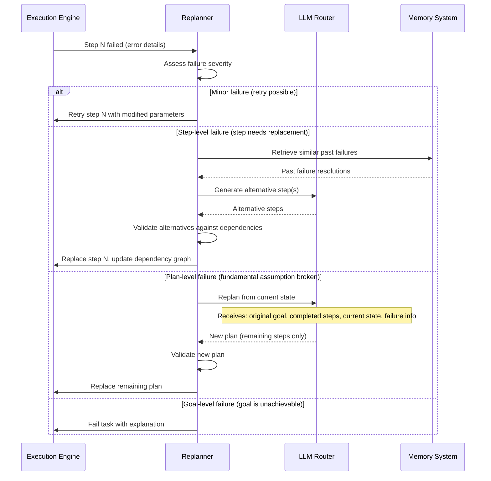

# §5 — Planner

## 5.1 Purpose

The Planner transforms high-level goals into executable task graphs. It is the system's capacity for **deliberate thought** — the difference between a reactive chatbot that responds to individual messages and a cognitive agent that pursues multi-step objectives.

**Why a dedicated Planner instead of inline LLM reasoning?** Because:

1. **Plans are data structures, not prose.** A plan is a directed acyclic graph (DAG) with typed nodes, dependencies, resource estimates, and checkpoints. Inline reasoning produces natural language that cannot be mechanically scheduled, checkpointed, or replanned.

2. **Plans survive context windows.** A complex task may require dozens of LLM calls. The plan persists across all of them. Without a plan, each LLM call must reconstruct the task decomposition from conversation history — wasteful and error-prone.

3. **Plans enable parallelism.** Independent sub-tasks in a plan can execute concurrently. Without explicit dependency modeling, the kernel must execute everything sequentially.

4. **Plans enable reflection.** After execution, the plan structure allows systematic comparison of expected vs. actual outcomes at each step.

## 5.2 Responsibilities

| Responsibility | Description |
|---------------|-------------|
| **Goal Decomposition** | Break high-level goals into sub-goals and atomic tasks |
| **Dependency Analysis** | Identify data dependencies, ordering constraints, and resource conflicts |
| **Resource Estimation** | Estimate token budget, time, and tool requirements for each step |
| **Plan Validation** | Verify plan is feasible given available tools, knowledge, and budget |
| **Replanning** | Generate revised plans when steps fail or new information emerges |
| **Reflection** | Evaluate plan quality post-execution for learning |

## 5.3 Internal Architecture



## 5.4 Plan Data Model

### 5.4.1 Plan Structure

```typescript
interface TaskPlan {
  /** Plan identifier */
  id: string;
  
  /** The high-level goal this plan addresses */
  goal: string;
  
  /** Plan version (incremented on replan) */
  version: number;
  
  /** Planning strategy used */
  strategy: PlanningStrategy;
  
  /** Root node of the goal hierarchy */
  rootGoal: GoalNode;
  
  /** Flattened list of executable steps (topologically sorted) */
  steps: PlanStep[];
  
  /** Dependency edges between steps */
  dependencies: Dependency[];
  
  /** Total resource estimates */
  estimatedBudget: TaskBudget;
  
  /** Confidence score (0.0 - 1.0) */
  confidence: number;
  
  /** Alternative plans considered */
  alternatives: AlternativePlan[];
  
  /** Planning rationale (why this plan was chosen) */
  rationale: string;
  
  /** Timestamps */
  createdAt: number;
  replannedAt?: number;
}

type PlanningStrategy = 
  | 'direct'           // Simple enough for single-step execution
  | 'sequential'       // Steps must execute in order
  | 'parallel'         // Independent steps can run concurrently
  | 'hierarchical'     // Multi-level goal decomposition
  | 'iterative'        // Repeated refinement (research, exploration)
  | 'conditional';     // Branching plan based on intermediate results
```

### 5.4.2 Goal Hierarchy

Goals form a tree. Each goal decomposes into sub-goals until reaching atomic tasks:

```typescript
interface GoalNode {
  /** Goal identifier */
  id: string;
  
  /** Natural language description */
  description: string;
  
  /** Goal type */
  type: GoalType;
  
  /** Completion criteria (machine-checkable when possible) */
  criteria: CompletionCriteria[];
  
  /** Sub-goals (empty for atomic goals) */
  children: GoalNode[];
  
  /** Decomposition strategy */
  decomposition: 'all' | 'any' | 'best_effort';
  
  /** State */
  state: GoalState;
}

type GoalType = 
  | 'achievement'    // Reach a specific state (e.g., "deploy service")
  | 'query'          // Answer a question (e.g., "find the bug")
  | 'maintenance'    // Ongoing (e.g., "keep tests passing")
  | 'exploration'    // Open-ended (e.g., "research options")
  | 'creation'       // Produce an artifact (e.g., "write documentation")
  | 'transformation' // Change existing artifact (e.g., "refactor module");

interface CompletionCriteria {
  /** Natural language description */
  description: string;
  
  /** Machine-checkable verification (optional) */
  verification?: {
    type: 'command';
    command: string;      // e.g., "npm test"
    expectedExit: number; // e.g., 0
  } | {
    type: 'file_exists';
    path: string;
  } | {
    type: 'file_contains';
    path: string;
    pattern: string;
  } | {
    type: 'llm_judge';
    prompt: string;
    threshold: number;   // 0.0 - 1.0
  };
}
```

### 5.4.3 Plan Steps

```typescript
interface PlanStep {
  /** Step identifier */
  id: string;
  
  /** Step index in execution order */
  index: number;
  
  /** Goal this step serves */
  goalId: string;
  
  /** What this step does */
  description: string;
  
  /** Step type determines execution strategy */
  type: StepType;
  
  /** Required inputs (from previous steps or context) */
  inputs: StepInput[];
  
  /** Expected outputs */
  outputs: StepOutput[];
  
  /** Resource estimates */
  estimate: StepEstimate;
  
  /** Execution state */
  state: StepState;
  
  /** Actual result (populated after execution) */
  result?: StepResult;
  
  /** Retry policy specific to this step */
  retryPolicy: RetryPolicy;
  
  /** Can this step be skipped if it fails? */
  optional: boolean;
  
  /** Checkpoint: should the kernel checkpoint after this step? */
  checkpoint: boolean;
}

type StepType =
  | { kind: 'tool_call'; tool: string; args: Record<string, unknown> }
  | { kind: 'llm_generation'; prompt: string; model?: string }
  | { kind: 'agent_delegation'; agentType: string; task: string }
  | { kind: 'conditional'; condition: string; thenSteps: string[]; elseSteps: string[] }
  | { kind: 'loop'; condition: string; bodySteps: string[]; maxIterations: number }
  | { kind: 'parallel_group'; stepIds: string[] }
  | { kind: 'human_input'; prompt: string }
  | { kind: 'wait'; event: string; timeout: number };

interface Dependency {
  /** Step that must complete first */
  from: string;
  /** Step that depends on the first */
  to: string;
  /** What is passed between steps */
  dataFlow?: {
    outputName: string;
    inputName: string;
  };
}
```

## 5.5 Hierarchical Planning

### 5.5.1 Decomposition Levels



### 5.5.2 Decomposition Algorithm

```
function decompose(goal, context, depth=0):
    if depth > MAX_DECOMPOSITION_DEPTH (5):
        return [atomic_step(goal)]
    
    // Ask LLM to decompose
    sub_goals = llm.generate(
        system: "You are a task planner. Decompose this goal into sub-goals.",
        context: [goal, available_tools, relevant_memory, similar_past_plans],
        output_format: structured GoalNode[]
    )
    
    for each sub_goal in sub_goals:
        if is_atomic(sub_goal):
            // Can be executed in a single tool call or LLM generation
            plan_steps.add(create_step(sub_goal))
        else:
            // Recursively decompose
            sub_steps = decompose(sub_goal, context, depth + 1)
            plan_steps.add_all(sub_steps)
    
    // Analyze dependencies between steps
    dependencies = analyze_dependencies(plan_steps)
    
    // Estimate resources
    for each step in plan_steps:
        step.estimate = estimate_resources(step, context)
    
    return PlanGraph(steps: plan_steps, dependencies: dependencies)
```

### 5.5.3 Atomicity Heuristics

A goal is **atomic** (does not need further decomposition) if:

1. It can be accomplished with a single tool call (e.g., "read file X")
2. It requires a single LLM generation without tool use (e.g., "summarize this text")
3. Its description matches a known procedural skill (§10) that encodes the steps
4. The LLM estimates it requires fewer than 3 actions

## 5.6 Dependency Graph

### 5.6.1 Dependency Types

| Type | Semantics | Example |
|------|-----------|---------|
| **Data** | Step B requires output from Step A | Test results → Deploy decision |
| **Order** | Step B must happen after Step A (no data flow) | Create file → Write to file |
| **Resource** | Steps A and B use the same exclusive resource | Both need the browser |
| **Conditional** | Step B only runs if Step A produces a specific result | Deploy only if tests pass |

### 5.6.2 Parallelization

The dependency graph directly determines parallelization opportunities:

```typescript
function identifyParallelGroups(steps: PlanStep[], deps: Dependency[]): PlanStep[][] {
  // Topological sort with level assignment
  const levels = topologicalLevelSort(steps, deps);
  
  // Steps at the same level can run in parallel
  // (they have no dependencies on each other)
  return levels;
}

// Example:
// Level 0: [check git, run tests, lint] — all parallel
// Level 1: [docker build] — depends on level 0
// Level 2: [push to registry] — depends on level 1
// Level 3: [update manifest, notify team] — parallel
```

## 5.7 Replanning

### 5.7.1 Replan Triggers

| Trigger | Example | Strategy |
|---------|---------|----------|
| Step failure | `npm test` exits with error | Replace failed step, adjust downstream |
| New information | File doesn't exist (assumed it did) | Regenerate plan from current state |
| Budget exhaustion | Token budget 80% consumed | Simplify remaining plan |
| User redirect | "Actually, deploy to production instead" | Replan from current state with new goal |
| Tool unavailable | Docker daemon not running | Replace Docker steps with alternative |
| Better approach discovered | Found a simpler method during execution | Regenerate remaining plan |

### 5.7.2 Replan Algorithm



### 5.7.3 Replan Budget

Replanning is not free — each replan costs tokens. The system limits replanning:

```typescript
interface ReplanPolicy {
  /** Maximum number of replans per task */
  maxReplans: number;  // default: 3
  
  /** Maximum token budget allocated to replanning */
  maxReplanTokens: number;  // default: 20% of task budget
  
  /** Cooldown between replans (prevent thrashing) */
  replanCooldownMs: number;  // default: 5000
  
  /** After this many consecutive failures, escalate to user */
  escalateAfterFailures: number;  // default: 2
}
```

## 5.8 Reflection and Self-Critique

After a plan completes (successfully or not), the Planner performs reflection:

### 5.8.1 Reflection Process

```typescript
interface PlanReflection {
  /** The plan that was executed */
  planId: string;
  
  /** Overall assessment */
  outcome: 'success' | 'partial_success' | 'failure';
  
  /** Accuracy of estimates vs actuals */
  estimateAccuracy: {
    tokenEstimate: number;  // estimated tokens
    tokenActual: number;    // actual tokens used
    timeEstimate: number;   // estimated ms
    timeActual: number;     // actual ms
    stepCountEstimate: number;
    stepCountActual: number;
  };
  
  /** Steps that failed and why */
  failures: {
    stepId: string;
    reason: string;
    wasRecoverable: boolean;
    resolution: string;
  }[];
  
  /** Steps that were unnecessary (could have been skipped) */
  unnecessarySteps: string[];
  
  /** Steps that were missing from the plan */
  missingSteps: string[];
  
  /** Lessons learned (extracted by LLM) */
  lessons: string[];
  
  /** Suggested skill to create (if a reusable pattern emerged) */
  suggestedSkill?: {
    name: string;
    pattern: string;
    steps: PlanStep[];
  };
}
```

### 5.8.2 Reflection → Learning Pipeline

```
Plan Reflection
    → Extract patterns (repeated step sequences)
    → Compare with known skills (§10)
    → If new pattern: suggest skill creation
    → Update estimation heuristics (§5.5.2)
    → Store lessons in procedural memory (§6.4)
    → Update knowledge graph (§8) with new entity relationships
```

## 5.9 Plan Persistence

Plans are persisted in the database for:

1. **Recovery**: Resume interrupted plans after restart
2. **Learning**: Historical plans train better future planning
3. **Auditing**: Trace what the agent planned and why
4. **Skill extraction**: Recurring plan patterns become skills

```sql
CREATE TABLE plans (
    id TEXT PRIMARY KEY,
    task_id TEXT NOT NULL REFERENCES tasks(id),
    version INTEGER NOT NULL DEFAULT 1,
    strategy TEXT NOT NULL,
    goal TEXT NOT NULL,
    plan_data JSON NOT NULL,      -- Full serialized plan
    confidence REAL NOT NULL,
    rationale TEXT,
    estimated_tokens INTEGER,
    actual_tokens INTEGER,
    created_at INTEGER NOT NULL,
    completed_at INTEGER,
    outcome TEXT,                  -- 'success', 'partial', 'failure'
    reflection JSON               -- Post-execution reflection
);

CREATE TABLE plan_steps (
    id TEXT PRIMARY KEY,
    plan_id TEXT NOT NULL REFERENCES plans(id),
    goal_id TEXT NOT NULL,
    step_index INTEGER NOT NULL,
    step_type TEXT NOT NULL,
    description TEXT NOT NULL,
    state TEXT NOT NULL,
    inputs JSON,
    outputs JSON,
    estimate JSON,
    result JSON,
    started_at INTEGER,
    completed_at INTEGER
);

CREATE TABLE plan_dependencies (
    plan_id TEXT NOT NULL REFERENCES plans(id),
    from_step TEXT NOT NULL REFERENCES plan_steps(id),
    to_step TEXT NOT NULL REFERENCES plan_steps(id),
    dep_type TEXT NOT NULL,       -- 'data', 'order', 'resource', 'conditional'
    data_flow JSON,
    PRIMARY KEY (plan_id, from_step, to_step)
);
```

## 5.10 Interfaces

```typescript
interface IPlanner {
  /** Generate a plan for a task */
  plan(task: Task, context: ContextBundle): Promise<TaskPlan>;
  
  /** Replan after a step failure */
  replan(plan: TaskPlan, failedStep: PlanStep, error: Error, context: ContextBundle): Promise<TaskPlan>;
  
  /** Reflect on a completed plan */
  reflect(plan: TaskPlan, results: StepResult[]): Promise<PlanReflection>;
  
  /** Estimate whether a goal can be achieved with available resources */
  feasibilityCheck(goal: string, budget: TaskBudget, context: ContextBundle): Promise<FeasibilityResult>;
  
  /** Get similar past plans for a goal */
  findSimilarPlans(goal: string, limit: number): Promise<TaskPlan[]>;
}
```

## 5.11 Failure Modes

| Failure | Impact | Mitigation |
|---------|--------|------------|
| LLM generates invalid plan structure | Plan cannot be parsed | Structured output with schema validation; retry with error feedback |
| Circular dependencies in plan | Deadlock during execution | Cycle detection in dependency graph before execution |
| Wildly inaccurate resource estimates | Budget exhaustion mid-plan | Conservative estimates + 30% buffer; replan on budget warnings |
| Infinite decomposition | Stack overflow, token waste | MAX_DECOMPOSITION_DEPTH limit (5 levels) |
| Replan loop (repeated failures) | Token waste, no progress | Replan budget limit; escalate to operator after N failures |
| Plan too large for context | Plan exceeds context window | Hierarchical plan summary; only load current sub-plan into context |

## 5.12 Future Improvements

1. **Monte Carlo Tree Search planning**: Explore multiple plan branches and select the most promising
2. **Plan templates**: Pre-built plan templates for common tasks (deploy, refactor, debug)
3. **Collaborative planning**: Multiple agents contribute to plan generation
4. **Causal reasoning**: Model causal relationships between steps for better replanning
5. **Probabilistic planning**: Assign success probabilities to steps and optimize expected outcome
6. **Plan visualization**: Interactive plan graph in the web UI
