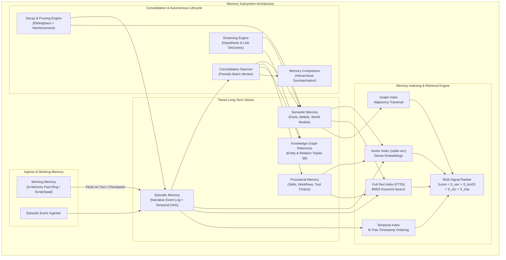
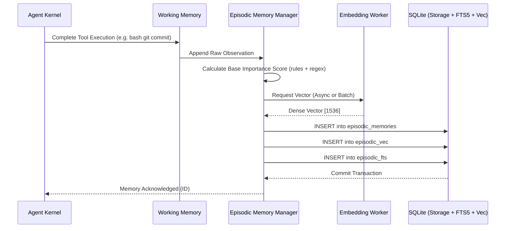
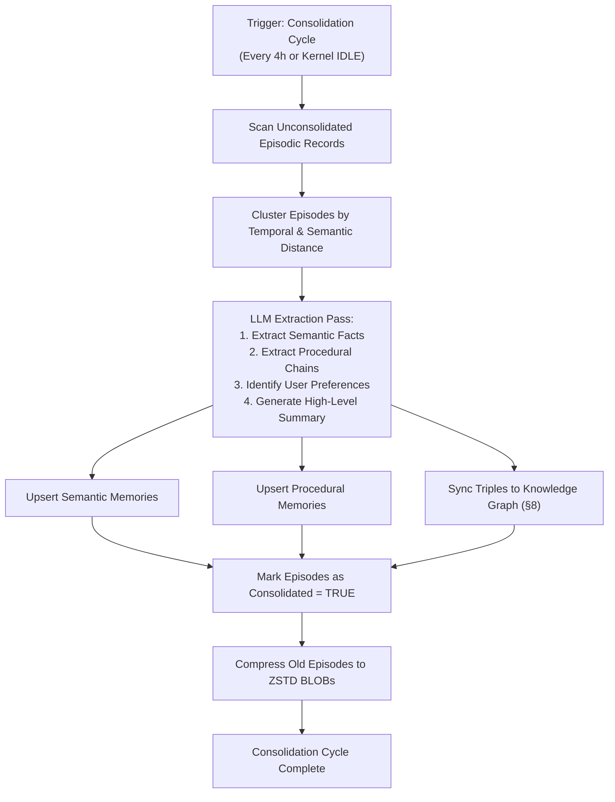

# §6 — Memory System

## 6.1 Purpose

The Memory System is the cognitive foundation of FuckClaw. It solves the fundamental limitation of contemporary LLMs: **statelessness**. An LLM without persistent, structured memory is an amnesiac genius — capable of brilliant reasoning in the immediate turn, but incapable of building context, accumulating knowledge, forming relationships, or learning from past mistakes.

### 6.1.1 Why a Multi-Type Memory Architecture?

The conventional approach in agent development is naive: embed everything into a single vector database, query by cosine similarity, and dump the top-k chunks into the context window. This approach fails catastrophically at scale for five specific reasons:

1. **Semantic collision without temporal grounding**: "What is my current deployment strategy?" matches every deployment discussion ever had, returning obsolete historical decisions alongside current ones with equal weight.
2. **Procedural knowledge is not conversational text**: Knowing *how* to execute a multi-step debugging workflow across 4 tools is structurally different from knowing a factual statement or recalling a conversation.
3. **Flat retrieval ignores cognitive horizons**: Humans do not query a single flat store. We maintain an immediate scratchpad (working memory), recall specific narrative events (episodic memory), maintain an active web of generalized facts (semantic memory), execute automated routines (procedural memory), and periodically compress/consolidate everything during sleep (consolidation/dreaming).
4. **Vector similarity measures topical relatedness, not utility or truth**: A memory that says "Postgres is our database" and a memory that says "We migrated from Postgres to SQLite" have near-identical vector embeddings, but opposite truth values.
5. **No concept of decay or reinforcement**: Important facts accessed 1,000 times should be retained indefinitely; trivial transient states should decay and be purged or compressed.

FuckClaw addresses this through a multi-tier, biologically-inspired memory architecture operating over typed stores with mathematical decay, active consolidation, semantic graph integration, and background dreaming cycles.

---

## 6.2 Architectural Overview



---

## 6.3 Memory Tiers & Taxonomy

| Memory Tier | Storage Medium | Primary Indexing | Latency Target | Lifespan | Typical Content |
|---|---|---|---|---|---|
| **Working Memory** | Process RAM (Heap) | Key-Value / Map | < 0.1ms | Turn to Session | Current task scratchpad, active plan state, variable bindings |
| **Episodic Memory** | SQLite + sqlite-vec | Timestamp, Vector, FTS5 | < 15ms | Weeks to Permanent | Raw turns, tool executions, observation traces, error logs |
| **Semantic Memory** | SQLite + Vector + Graph | Vector, FTS5, Triples | < 25ms | Permanent (evolves) | Verified facts, user preferences, codebase invariants |
| **Procedural Memory**| SQLite + AST/JSON | Vector, Skill Signature | < 10ms | Permanent (evolved) | Tool calling scripts, debugging heuristics, recovery pipelines |
| **Archival / Compressed** | SQLite (zstd compressed BLOBs) | Temporal, Entity ID | < 50ms | Indefinite | Rolled-up monthly summaries of past task executions |

---

## 6.4 Detailed Subsystem Specifications

### 6.4.1 Working Memory (Scratchpad & Active Context)

Working Memory is the short-term storage used by the Agent Kernel (§4) and Reasoning Engine (§11) during active execution. It is never accessed through vector similarity; it is directly mapped into the immediate LLM context window.

```typescript
interface WorkingMemory {
  sessionId: string;
  activeTaskId: string | null;
  scratchpad: Map<string, unknown>;
  variableBindings: Map<string, string | number | boolean | object>;
  currentTurnBuffer: ConversationTurn[];
  activePlanSummary: {
    planId: string;
    currentStepIndex: number;
    totalSteps: number;
    pendingToolCalls: string[];
  };
  volatileContextFlags: Set<string>;
  
  // Fast operations
  set(key: string, value: unknown, ttlTurns?: number): void;
  get<T>(key: string): T | undefined;
  appendTurn(turn: ConversationTurn): void;
  flushToEpisodic(): Promise<string[]>; // Returns inserted episodic memory IDs
  snapshot(): WorkingMemorySnapshot;
  restore(snapshot: WorkingMemorySnapshot): void;
}
```

Working memory is flushed into Episodic Memory upon every completed step, turn completion, or explicit kernel checkpoint. If the process crashes, working memory is reconstructed from the latest checkpoint (`§4.9`).

---

### 6.4.2 Episodic Memory (Experience Stream)

Episodic memory records what happened, when it happened, the exact tools used, outputs received, and emotional/confidence markers. It represents the raw chronological narrative stream.

```typescript
interface EpisodicMemoryRecord {
  id: string; // ULID
  timestamp: number; // Unix Epoch ms
  sessionId: string;
  taskId?: string;
  source: 'user_interaction' | 'tool_execution' | 'autonomous_event' | 'system_alert';
  actor: 'user' | 'agent' | 'system' | 'tool';
  summary: string; // Compact LLM-generated semantic summary
  content: string; // Full raw turn or observation trace
  toolCall?: {
    toolName: string;
    inputParams: Record<string, unknown>;
    outputResult: string;
    exitCode: number;
    durationMs: number;
  };
  emotionalValence?: number; // -1.0 (frustration/error) to +1.0 (success/praise)
  importanceScore: number; // 0.0 to 1.0 (LLM-assigned or rule-derived)
  accessCount: number;
  lastAccessedAt: number;
  consolidated: boolean; // True if digested into semantic/procedural memory
  decayFactor: number; // Current dynamic decay multiplier
  embedding: Float32Array; // 1536d or 768d dense vector
}
```

#### Episodic Data Pipeline


---

### 6.4.3 Semantic Memory (World Facts & Beliefs)

Semantic memory stores generalized, abstracted truths extracted from episodic experiences or ingested knowledge. It does not store *when* an event occurred as its primary identity; it stores *what is true*.

```typescript
interface SemanticMemoryRecord {
  id: string; // ULID
  subject: string; // e.g. "auth_service.database"
  predicate: string; // e.g. "uses_engine"
  object: string; // e.g. "PostgreSQL 16 with pgvector"
  statement: string; // Natural language assertion: "Auth service uses PostgreSQL 16 with pgvector on port 5432"
  confidence: number; // 0.0 to 1.0 (Bayesian updated)
  sourceEpisodicIds: string[]; // Provenance pointers
  validFrom: number; // Timestamp when fact became true
  validUntil: number | null; // Null if currently active; timestamp if invalidated
  supersededBy?: string; // ID of record that replaced this one
  contextConditions?: Record<string, string>; // e.g. { "environment": "production" }
  lastVerifiedAt: number;
  accessCount: number;
  embedding: Float32Array;
}
```

#### Truth Maintenance and Bayesian Belief Updates
When new evidence arrives that contradicts or confirms an existing semantic memory:
$$P(\text{Fact} \mid \text{Evidence}) = \frac{P(\text{Evidence} \mid \text{Fact}) \cdot P(\text{Fact})}{P(\text{Evidence})}$$

If a new observation explicitly refutes a fact (e.g., operator says "We migrated from PostgreSQL to SQLite"), the old record's `validUntil` is set to `Date.now()`, `supersededBy` points to the new record, and a bidirectional link is established.

---

### 6.4.4 Procedural Memory (How-To Knowledge & Workflows)

Procedural memory stores compiled routines, debugging playbooks, tool invocation sequences, and code repair strategies.

```typescript
interface ProceduralMemoryRecord {
  id: string;
  name: string; // e.g., "docker_service_debug_workflow"
  intentSignature: string; // e.g., "Diagnose why container fails health checks"
  preconditions: string[]; // ["docker daemon is running", "service has healthcheck configured"]
  executionGraph: {
    steps: {
      order: number;
      actionType: 'tool_call' | 'query' | 'verify';
      toolName?: string;
      paramTemplate?: Record<string, string>;
      expectedOutcome: string;
      fallbackStepOnFailure?: number;
    }[];
  };
  successRate: number; // Moving average: successes / total_executions
  executionCount: number;
  lastExecutedAt: number;
  embedding: Float32Array;
}
```

---

## 6.5 Mathematical Formulation of Retrieval & Decay

### 6.5.1 The Composite Retrieval Scoring Function

When querying memory for context assembly (§4.8), candidate records from all stores are retrieved via hybrid vector + keyword search and then scored by the composite function:

$$S(m, q) = w_v \cdot S_{\text{vec}}(m, q) + w_k \cdot S_{\text{bm25}}(m, q) + w_r \cdot S_{\text{recency}}(m) + w_i \cdot S_{\text{importance}}(m) + w_f \cdot S_{\text{frequency}}(m)$$

Where the weights satisfy $\sum w = 1.0$, typically tuned to:
- $w_v = 0.40$ (Dense Semantic Similarity)
- $w_k = 0.20$ (Lexical BM25 Keyword Match)
- $w_r = 0.15$ (Temporal Recency)
- $w_i = 0.15$ (Intrinsic Importance)
- $w_f = 0.10$ (Access Frequency / Reinforcement)

### 6.5.2 Ebbinghaus-Inspired Memory Decay Formula

Memories decay exponentially unless reinforced by recall or high intrinsic importance:

$$R(t) = S_{\text{base\_importance}} \cdot e^{-\lambda(m) \cdot (t - t_{\text{last\_accessed}})}$$

Where the decay rate $\lambda(m)$ is dynamically modulated by access frequency:

$$\lambda(m) = \frac{\lambda_0}{1 + \ln(1 + \text{access\_count})}$$

- $\lambda_0$: Base decay constant ($1.15 \times 10^{-7} \text{ s}^{-1} \approx 10\text{-day half-life for unaccessed items}$).
- As `access_count` increases, $\lambda(m)$ asymptotically approaches zero (permanent storage).
- Semantic facts with `confidence > 0.9` have $\lambda_0 = 0$ (no decay).

---

## 6.6 Memory Consolidation & Dreaming

### 6.6.1 Consolidation Daemon

Consolidation runs as a low-priority background task when the Agent Kernel is in `IDLE` or `CONSOLIDATING` state (§4.4).



### 6.6.2 The Dreaming Engine (Associative Synthesis)

During prolonged idle periods (e.g., night hours or >2 hours of zero operator activity), FuckClaw enters a **Dreaming State**. 

The Dreaming Engine deliberately executes divergent associative graph walks over the Semantic Memory and Knowledge Graph to find non-obvious correlations, contradictions, and potential system optimizations:

1. **Contradiction Auditing**: Scans active semantic memories for mutually incompatible statements ($A \land \neg A$) and queues a resolution task.
2. **Abductive Synthesis**: Connects disparate project lessons (e.g., "Project A solved Docker DNS failure with option X" + "Project B is experiencing Docker networking issues" $\to$ Suggests solution for Project B).
3. **Hypothesis Generation**: Synthesizes unprompted optimization proposals written to the workspace knowledge folder (`§7.5`).

---

## 6.7 Database Schemas (SQLite + sqlite-vec)

```sql
-- Main SQLite Schema for Memory Subsystem

-- 1. Episodic Memories
CREATE TABLE episodic_memories (
    id TEXT PRIMARY KEY, -- ULID
    session_id TEXT NOT NULL,
    task_id TEXT,
    timestamp INTEGER NOT NULL,
    source TEXT NOT NULL,
    actor TEXT NOT NULL,
    summary TEXT NOT NULL,
    content TEXT NOT NULL,
    tool_call_json TEXT,
    importance_score REAL NOT NULL DEFAULT 0.5,
    access_count INTEGER NOT NULL DEFAULT 0,
    last_accessed_at INTEGER NOT NULL,
    consolidated INTEGER NOT NULL DEFAULT 0,
    decay_factor REAL NOT NULL DEFAULT 1.0,
    created_at INTEGER NOT NULL
);

CREATE INDEX idx_episodic_time ON episodic_memories(timestamp DESC);
CREATE INDEX idx_episodic_session ON episodic_memories(session_id);
CREATE INDEX idx_episodic_consolidated ON episodic_memories(consolidated, timestamp);

-- FTS5 Full-Text Search for Episodic
CREATE VIRTUAL TABLE episodic_fts USING fts5(
    id UNINDEXED,
    summary,
    content,
    tokenize = 'porter unicode61'
);

-- sqlite-vec Vector Table for Episodic (1536-dim OpenAI or 768-dim Local)
CREATE VIRTUAL TABLE episodic_vec USING vec0(
    id TEXT PRIMARY KEY,
    embedding float[1536] distance_metric=cosine
);

-- 2. Semantic Memories (Facts and Beliefs)
CREATE TABLE semantic_memories (
    id TEXT PRIMARY KEY,
    subject TEXT NOT NULL,
    predicate TEXT NOT NULL,
    object TEXT NOT NULL,
    statement TEXT NOT NULL,
    confidence REAL NOT NULL DEFAULT 1.0,
    source_episodic_ids_json TEXT, -- JSON Array of ULIDs
    valid_from INTEGER NOT NULL,
    valid_until INTEGER,           -- NULL if currently valid
    superseded_by TEXT,
    context_json TEXT,             -- Arbitrary context key-value pairs
    last_verified_at INTEGER NOT NULL,
    access_count INTEGER NOT NULL DEFAULT 0,
    created_at INTEGER NOT NULL
);

CREATE INDEX idx_semantic_spo ON semantic_memories(subject, predicate);
CREATE INDEX idx_semantic_validity ON semantic_memories(valid_until);

CREATE VIRTUAL TABLE semantic_fts USING fts5(
    id UNINDEXED,
    statement,
    subject,
    object,
    tokenize = 'porter unicode61'
);

CREATE VIRTUAL TABLE semantic_vec USING vec0(
    id TEXT PRIMARY KEY,
    embedding float[1536] distance_metric=cosine
);

-- 3. Procedural Memories (Skills & Workflows)
CREATE TABLE procedural_memories (
    id TEXT PRIMARY KEY,
    name TEXT NOT NULL UNIQUE,
    intent_signature TEXT NOT NULL,
    preconditions_json TEXT NOT NULL,
    execution_graph_json TEXT NOT NULL,
    success_rate REAL NOT NULL DEFAULT 1.0,
    execution_count INTEGER NOT NULL DEFAULT 0,
    last_executed_at INTEGER NOT NULL,
    created_at INTEGER NOT NULL
);

CREATE VIRTUAL TABLE procedural_vec USING vec0(
    id TEXT PRIMARY KEY,
    embedding float[1536] distance_metric=cosine
);
```

---

## 6.8 TypeScript System Interface

```typescript
export interface IMemorySystem {
  // Working Memory
  readonly working: WorkingMemory;

  // Episodic Operations
  recordEpisode(episode: Omit<EpisodicMemoryRecord, 'id' | 'accessCount' | 'lastAccessedAt' | 'decayFactor'>): Promise<string>;
  getEpisode(id: string): Promise<EpisodicMemoryRecord | null>;
  queryEpisodic(query: MemoryQuery): Promise<ScoredMemoryRecord<EpisodicMemoryRecord>[]>;

  // Semantic Operations
  assertFact(fact: Omit<SemanticMemoryRecord, 'id' | 'accessCount' | 'lastVerifiedAt'>): Promise<string>;
  retractFact(factId: string, reason: string): Promise<void>;
  updateFact(factId: string, newStatement: string, newConfidence: number): Promise<string>;
  querySemantic(query: MemoryQuery): Promise<ScoredMemoryRecord<SemanticMemoryRecord>[]>;

  // Procedural Operations
  registerProcedure(procedure: Omit<ProceduralMemoryRecord, 'id' | 'executionCount' | 'successRate'>): Promise<string>;
  recordProcedureOutcome(procedureId: string, success: boolean): Promise<void>;
  queryProcedural(intent: string): Promise<ScoredMemoryRecord<ProceduralMemoryRecord>[]>;

  // Unified Hybrid Search
  searchHybrid(query: UnifiedMemoryQuery): Promise<UnifiedMemorySearchResult>;

  // Lifecycle Control
  runConsolidationCycle(): Promise<ConsolidationReport>;
  runDreamingCycle(): Promise<DreamingReport>;
  applyDecay(): Promise<{ prunedCount: number; compressedCount: number }>;
}

export interface MemoryQuery {
  text: string;
  limit?: number;
  minScore?: number;
  timeRange?: { from?: number; to?: number };
  filterTags?: string[];
  filterEntities?: string[];
}

export interface ScoredMemoryRecord<T> {
  record: T;
  score: number;
  breakdown: {
    vectorScore: number;
    keywordScore: number;
    recencyScore: number;
    importanceScore: number;
  };
}

export interface UnifiedMemorySearchResult {
  episodic: ScoredMemoryRecord<EpisodicMemoryRecord>[];
  semantic: ScoredMemoryRecord<SemanticMemoryRecord>[];
  procedural: ScoredMemoryRecord<ProceduralMemoryRecord>[];
  totalTokensEstimated: number;
}
```

---

## 6.9 Failure Modes and Mitigations

| Failure Mode | Root Cause | Impact | Mitigation Strategy |
|---|---|---|---|
| **Memory Hallucination Propagation** | Agent asserts erroneous fact into Semantic Memory during flawed execution | Subsequent runs treat invalid fact as axiomatic truth | Provenance tracking (`sourceEpisodicIds`). Bayesian confidence drops upon runtime tool errors referencing that fact. Automated contradiction checking during dreaming. |
| **Vector Drift** | Model used for embeddings is upgraded (e.g. text-embedding-3-small to newer model) | Cosine similarity across older vectors becomes garbage | Vector versioning in DB table metadata. Background re-indexing worker migrates vectors incrementally in batches without downtime. |
| **Context Window Saturation** | Memory retrieval injects too many verbose records into prompt | Token budget exceeded, cost spikes, reasoning degrades | Token-capped budget trimming in Context Manager (§4.8); dynamic hierarchical summarization of retrieved sets. |
| **SQLite WAL Lock Contention** | High-frequency episodic writes conflict with background consolidation worker | Database is locked errors (`SQLITE_BUSY`) | WAL mode enabled with `PRAGMA busy_timeout = 5000;`, dedicated read-only connection pool, write serialization via internal async queue. |

---

## 6.10 Performance Metrics & SLAs

- **Working Memory Read/Write**: $< 0.1\text{ ms}$ (Direct Heap)
- **Episodic Insert with Vector Generation**: $< 80\text{ ms}$ (Cloud embedding) / $< 10\text{ ms}$ (Local embedding)
- **Hybrid Multi-Tier Query**: $< 40\text{ ms}$ total execution for Top-20 ranking
- **Consolidation Cycle Throughput**: $> 500\text{ episodes/minute}$
- **Maximum SQLite Storage Footprint**: $\approx 1.5\text{ GB}$ per 100,000 dense memories with embeddings.
