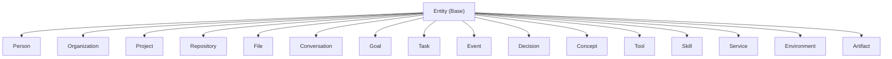
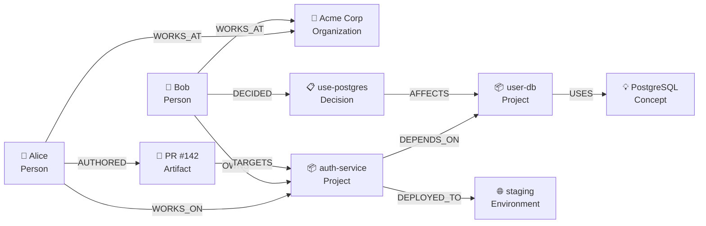
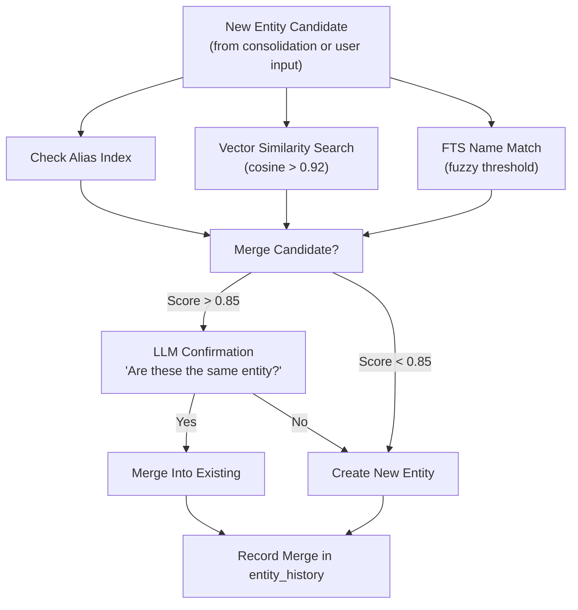
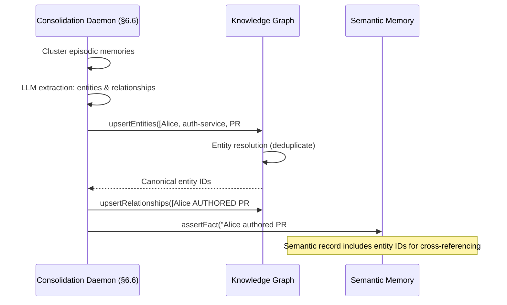

# §8 — Knowledge Graph

## 8.1 Purpose

The Knowledge Graph is FuckClaw's structured world model — a typed, directed, temporally-versioned graph of entities and relationships that the agent has observed, inferred, or been told about over its entire lifetime.

**Why a Knowledge Graph on top of Memory (§6)?**

Memory stores *what happened* (episodic), *what is true* (semantic), and *how to do things* (procedural). But memory records are fundamentally flat — individual records retrieved by similarity search. They do not model the **structure** of the world.

Consider: the agent knows that "Alice works at Acme Corp" (semantic memory) and "Acme Corp uses Kubernetes" (semantic memory) and "Alice opened PR #142 on the auth-service" (episodic memory). Without a graph, answering "Who at Acme Corp has touched the auth-service?" requires the LLM to reason over disconnected text fragments and hope it connects them. With a graph, this is a two-hop traversal:

```
Alice --[WORKS_AT]--> Acme Corp
Alice --[AUTHORED]--> PR #142
PR #142 --[TARGETS]--> auth-service
```

The Knowledge Graph provides:

1. **Structural queries**: "What depends on service X?" — graph traversal, not text search
2. **Contextual grounding**: When the agent encounters "auth-service," the graph instantly provides project metadata, team members, recent changes, deployment history, and architectural decisions
3. **Causal reasoning support**: Decision chains (Decision A led to Architecture B which caused Bug C) are naturally represented as graph paths
4. **Entity deduplication**: "Alice," "alice@acme.com," and "@alice-dev" are resolved to a single canonical entity node

## 8.2 Entity Model

### 8.2.1 Entity Type Hierarchy



### 8.2.2 Base Entity Schema

Every entity shares a common base:

```typescript
interface Entity {
  /** Globally unique entity ID (ULID) */
  id: string;
  
  /** Entity type discriminator */
  type: EntityType;
  
  /** Canonical display name */
  name: string;
  
  /** Alternative names / aliases for entity resolution */
  aliases: string[];
  
  /** Natural language description */
  description: string;
  
  /** Arbitrary typed properties */
  properties: Record<string, string | number | boolean | null>;
  
  /** Provenance: which memory records contributed to this entity */
  sourceMemoryIds: string[];
  
  /** Confidence that this entity actually exists (0.0–1.0) */
  confidence: number;
  
  /** Timestamps */
  createdAt: number;
  updatedAt: number;
  lastReferencedAt: number;
  
  /** Embedding for similarity search over entities */
  embedding: Float32Array;
}

type EntityType =
  | 'person'
  | 'organization'
  | 'project'
  | 'repository'
  | 'file'
  | 'conversation'
  | 'goal'
  | 'task'
  | 'event'
  | 'decision'
  | 'concept'
  | 'tool'
  | 'skill'
  | 'service'
  | 'environment'
  | 'artifact';
```

### 8.2.3 Type-Specific Property Schemas

Each entity type defines expected properties:

```typescript
// Person
interface PersonProperties {
  email?: string;
  github?: string;
  role?: string;
  team?: string;
  timezone?: string;
  communicationStyle?: string; // learned from interactions
  expertise?: string[];
}

// Project
interface ProjectProperties {
  path?: string;           // filesystem path
  repoUrl?: string;        // git remote
  language?: string;       // primary language
  frameworks?: string[];
  status?: 'active' | 'archived' | 'planned';
  buildCommand?: string;
  testCommand?: string;
  deployTarget?: string;
}

// Decision
interface DecisionProperties {
  context: string;         // why this decision was made
  alternatives: string[];  // options that were considered
  rationale: string;       // why this option was chosen
  outcome?: string;        // what happened as a result
  reversible: boolean;
  decidedAt: number;
  decidedBy?: string;      // entity ID of person
}

// Service
interface ServiceProperties {
  url?: string;
  port?: number;
  protocol?: string;
  healthEndpoint?: string;
  database?: string;
  deployedTo?: string;     // entity ID of environment
  version?: string;
}

// Concept
interface ConceptProperties {
  domain: string;          // e.g., "distributed-systems", "react", "security"
  definition: string;      // concise definition
  relatedUrls?: string[];
  learnedFrom?: string;   // how the agent learned this
}
```

## 8.3 Relationship Model

### 8.3.1 Relationship (Edge) Schema

```typescript
interface Relationship {
  /** Unique edge ID */
  id: string;
  
  /** Source entity ID */
  fromId: string;
  
  /** Target entity ID */
  toId: string;
  
  /** Relationship type (verb phrase) */
  type: RelationshipType;
  
  /** Edge weight / strength (0.0–1.0) */
  weight: number;
  
  /** Arbitrary edge properties */
  properties: Record<string, string | number | boolean | null>;
  
  /** Temporal validity */
  validFrom: number;
  validUntil: number | null; // null = currently active
  
  /** Provenance */
  sourceMemoryIds: string[];
  
  /** Confidence */
  confidence: number;
  
  createdAt: number;
  updatedAt: number;
}
```

### 8.3.2 Relationship Type Catalog

| Relationship Type | From → To | Example | Directionality |
|---|---|---|---|
| `WORKS_AT` | Person → Organization | Alice WORKS_AT Acme | Directed |
| `WORKS_ON` | Person → Project | Alice WORKS_ON auth-service | Directed |
| `OWNS` | Person → Project | Bob OWNS infrastructure | Directed |
| `MEMBER_OF` | Person → Organization | Charlie MEMBER_OF platform-team | Directed |
| `DEPENDS_ON` | Project → Project | auth-service DEPENDS_ON user-db | Directed |
| `DEPENDS_ON` | File → File | auth.ts DEPENDS_ON config.ts | Directed |
| `DEPLOYED_TO` | Service → Environment | auth-service DEPLOYED_TO staging | Directed |
| `PART_OF` | File → Project | auth.ts PART_OF auth-service | Directed |
| `AUTHORED` | Person → Artifact | Alice AUTHORED PR #142 | Directed |
| `DECIDED` | Person → Decision | Bob DECIDED use-postgres | Directed |
| `AFFECTS` | Decision → Project | use-postgres AFFECTS auth-service | Directed |
| `RELATED_TO` | Concept → Concept | OAuth RELATED_TO JWT | Bidirectional |
| `LEARNED_FROM` | Skill → Conversation | docker-debug LEARNED_FROM conv_01HQ | Directed |
| `BLOCKED_BY` | Task → Task | deploy-api BLOCKED_BY fix-auth | Directed |
| `CAUSED` | Event → Event | deploy-failure CAUSED rollback | Directed |
| `SUPERSEDES` | Decision → Decision | use-sqlite SUPERSEDES use-postgres | Directed |
| `USES` | Project → Tool | auth-service USES Docker | Directed |
| `ACHIEVES` | Task → Goal | fix-auth ACHIEVES secure-login | Directed |
| `CONTEXT_FOR` | Conversation → Decision | conv_01HQ CONTEXT_FOR use-postgres | Directed |

### 8.3.3 Relationship Visualization



## 8.4 Graph Storage (SQLite Adjacency-List Model)

### 8.4.1 Why SQLite Instead of Neo4j?

| Factor | SQLite | Neo4j |
|---|---|---|
| Deployment | Zero-config, embedded | Separate JVM process, 512MB+ heap |
| Operational cost | None | Database administration |
| Query language | SQL + recursive CTEs | Cypher |
| Graph traversal perf (< 1M nodes) | Excellent with proper indexes | Excellent |
| Graph traversal perf (> 10M nodes) | Degrades | Superior |
| ACID transactions | Built-in | Built-in |
| Integration | Same process, same DB file | Network protocol |

FuckClaw is a personal system. The knowledge graph will contain tens of thousands of entities, not millions. SQLite's recursive CTE performance is more than sufficient, and the operational simplicity of a single embedded database file is worth the theoretical performance ceiling sacrifice.

### 8.4.2 SQL Schema

```sql
-- Entities table
CREATE TABLE entities (
    id TEXT PRIMARY KEY,
    type TEXT NOT NULL,
    name TEXT NOT NULL,
    aliases_json TEXT NOT NULL DEFAULT '[]',
    description TEXT NOT NULL DEFAULT '',
    properties_json TEXT NOT NULL DEFAULT '{}',
    source_memory_ids_json TEXT NOT NULL DEFAULT '[]',
    confidence REAL NOT NULL DEFAULT 1.0,
    created_at INTEGER NOT NULL,
    updated_at INTEGER NOT NULL,
    last_referenced_at INTEGER NOT NULL
);

CREATE INDEX idx_entities_type ON entities(type);
CREATE INDEX idx_entities_name ON entities(name);
CREATE INDEX idx_entities_updated ON entities(updated_at DESC);

-- Full-text search over entities
CREATE VIRTUAL TABLE entities_fts USING fts5(
    id UNINDEXED,
    name,
    description,
    aliases_text, -- flattened aliases for FTS
    tokenize = 'porter unicode61'
);

-- Vector similarity over entities
CREATE VIRTUAL TABLE entities_vec USING vec0(
    id TEXT PRIMARY KEY,
    embedding float[1536] distance_metric=cosine
);

-- Relationships (edges)
CREATE TABLE relationships (
    id TEXT PRIMARY KEY,
    from_id TEXT NOT NULL REFERENCES entities(id) ON DELETE CASCADE,
    to_id TEXT NOT NULL REFERENCES entities(id) ON DELETE CASCADE,
    type TEXT NOT NULL,
    weight REAL NOT NULL DEFAULT 1.0,
    properties_json TEXT NOT NULL DEFAULT '{}',
    valid_from INTEGER NOT NULL,
    valid_until INTEGER,
    source_memory_ids_json TEXT NOT NULL DEFAULT '[]',
    confidence REAL NOT NULL DEFAULT 1.0,
    created_at INTEGER NOT NULL,
    updated_at INTEGER NOT NULL
);

CREATE INDEX idx_rel_from ON relationships(from_id, type);
CREATE INDEX idx_rel_to ON relationships(to_id, type);
CREATE INDEX idx_rel_type ON relationships(type);
CREATE INDEX idx_rel_valid ON relationships(valid_until);

-- Entity version history (append-only change log)
CREATE TABLE entity_history (
    id TEXT PRIMARY KEY,
    entity_id TEXT NOT NULL REFERENCES entities(id) ON DELETE CASCADE,
    changed_at INTEGER NOT NULL,
    change_type TEXT NOT NULL, -- 'created', 'updated', 'merged', 'deleted'
    previous_state_json TEXT,  -- full entity JSON before the change
    change_description TEXT,
    source_memory_id TEXT
);

CREATE INDEX idx_entity_history ON entity_history(entity_id, changed_at DESC);
```

## 8.5 Graph Queries (Recursive CTEs)

### 8.5.1 N-Hop Neighborhood Query

Find all entities within N hops of a given entity:

```sql
-- Find all entities within 2 hops of entity 'ent_auth_service'
WITH RECURSIVE reachable(entity_id, depth, path) AS (
    -- Base case: starting entity
    SELECT 'ent_auth_service', 0, 'ent_auth_service'
    
    UNION ALL
    
    -- Recursive case: follow edges in both directions
    SELECT 
        CASE 
            WHEN r.from_id = reachable.entity_id THEN r.to_id
            ELSE r.from_id
        END,
        reachable.depth + 1,
        reachable.path || ' -> ' || CASE 
            WHEN r.from_id = reachable.entity_id THEN r.to_id
            ELSE r.from_id
        END
    FROM reachable
    JOIN relationships r ON (
        r.from_id = reachable.entity_id OR r.to_id = reachable.entity_id
    )
    WHERE reachable.depth < 2  -- Max 2 hops
      AND r.valid_until IS NULL -- Only active relationships
      AND instr(reachable.path, CASE 
            WHEN r.from_id = reachable.entity_id THEN r.to_id
            ELSE r.from_id
          END) = 0  -- Prevent cycles
)
SELECT DISTINCT e.*, reachable.depth, reachable.path
FROM reachable
JOIN entities e ON e.id = reachable.entity_id
ORDER BY reachable.depth, e.type;
```

### 8.5.2 Decision Context Query

Find all context surrounding a decision:

```sql
-- Get decision context: who decided, what it affected, conversations that led to it
SELECT 
    d.name AS decision_name,
    json_extract(d.properties_json, '$.rationale') AS rationale,
    json_extract(d.properties_json, '$.alternatives') AS alternatives,
    decider.name AS decided_by,
    affected.name AS affects_project,
    context_conv.name AS source_conversation
FROM entities d
LEFT JOIN relationships r_decided ON r_decided.to_id = d.id AND r_decided.type = 'DECIDED'
LEFT JOIN entities decider ON decider.id = r_decided.from_id
LEFT JOIN relationships r_affects ON r_affects.from_id = d.id AND r_affects.type = 'AFFECTS'
LEFT JOIN entities affected ON affected.id = r_affects.to_id
LEFT JOIN relationships r_context ON r_context.to_id = d.id AND r_context.type = 'CONTEXT_FOR'
LEFT JOIN entities context_conv ON context_conv.id = r_context.from_id
WHERE d.id = ?;
```

## 8.6 Entity Resolution

Entity resolution prevents the graph from accumulating duplicate nodes for the same real-world entity.

### 8.6.1 Resolution Pipeline



### 8.6.2 Merge Strategy

When merging entity B into canonical entity A:

1. All relationships pointing to/from B are re-pointed to A
2. B's aliases are appended to A's aliases
3. B's properties are merged (A's values take precedence on conflict)
4. B's source memory IDs are appended to A's
5. B is soft-deleted (retained in history for audit)
6. A `entity_history` record is written with `change_type = 'merged'`

## 8.7 Temporal Versioning

Entities change over time. The Knowledge Graph tracks this through:

1. **`entity_history` table**: Append-only log of all changes to an entity
2. **`valid_from` / `valid_until` on relationships**: Temporal edges that expire when relationships end

This allows temporal queries like "What was the architecture of auth-service 3 months ago?" by reconstructing entity state from the history log.

```typescript
async function getEntityAtTime(entityId: string, timestamp: number): Promise<Entity | null> {
  // Get current entity
  const current = await db.get('SELECT * FROM entities WHERE id = ?', entityId);
  if (!current) return null;
  
  // Get all changes after the requested timestamp (in reverse order)
  const changes = await db.all(
    `SELECT * FROM entity_history 
     WHERE entity_id = ? AND changed_at > ? 
     ORDER BY changed_at DESC`,
    entityId, timestamp
  );
  
  // Apply changes in reverse to reconstruct historical state
  let state = current;
  for (const change of changes) {
    if (change.previous_state_json) {
      state = JSON.parse(change.previous_state_json);
    }
  }
  
  return state;
}
```

## 8.8 Interfaces

```typescript
export interface IKnowledgeGraph {
  // Entity CRUD
  createEntity(entity: Omit<Entity, 'id' | 'createdAt' | 'updatedAt'>): Promise<Entity>;
  getEntity(id: string): Promise<Entity | null>;
  updateEntity(id: string, updates: Partial<Entity>): Promise<Entity>;
  deleteEntity(id: string, reason: string): Promise<void>;
  
  // Entity Search
  searchEntities(query: string, types?: EntityType[], limit?: number): Promise<Entity[]>;
  findSimilarEntities(embedding: Float32Array, threshold?: number): Promise<Entity[]>;
  resolveEntity(candidate: Partial<Entity>): Promise<Entity | null>; // Find existing match
  
  // Relationship CRUD
  createRelationship(rel: Omit<Relationship, 'id' | 'createdAt' | 'updatedAt'>): Promise<Relationship>;
  endRelationship(id: string): Promise<void>; // Sets validUntil = now
  
  // Graph Queries
  getNeighbors(entityId: string, depth?: number, types?: RelationshipType[]): Promise<GraphNeighborhood>;
  findPath(fromId: string, toId: string, maxDepth?: number): Promise<GraphPath | null>;
  getSubgraph(entityIds: string[]): Promise<Subgraph>;
  
  // Temporal Queries
  getEntityAtTime(entityId: string, timestamp: number): Promise<Entity | null>;
  getRelationshipsAtTime(entityId: string, timestamp: number): Promise<Relationship[]>;
  
  // Bulk Operations
  upsertEntities(entities: Partial<Entity>[]): Promise<Entity[]>;
  upsertRelationships(rels: Partial<Relationship>[]): Promise<Relationship[]>;
  
  // Statistics
  stats(): Promise<GraphStats>;
}

interface GraphNeighborhood {
  center: Entity;
  entities: Entity[];
  relationships: Relationship[];
  depth: number;
}

interface GraphPath {
  entities: Entity[];
  relationships: Relationship[];
  totalWeight: number;
}

interface Subgraph {
  entities: Entity[];
  relationships: Relationship[];
}

interface GraphStats {
  entityCount: number;
  relationshipCount: number;
  entityCountByType: Record<EntityType, number>;
  relationshipCountByType: Record<string, number>;
  averageDegree: number;
  mostConnectedEntities: { entity: Entity; degree: number }[];
}
```

## 8.9 Integration with Memory System (§6)

The Knowledge Graph and Memory System are tightly coupled but architecturally separate:



**Key principle**: Semantic Memory stores the *textual assertion* (for retrieval by embedding similarity). The Knowledge Graph stores the *structured triple* (for traversal queries). Both reference each other via IDs.

## 8.10 Failure Modes

| Failure | Impact | Mitigation |
|---|---|---|
| Entity resolution false positive (merges distinct entities) | Corrupted graph | Merge is reversible via `entity_history`; confidence threshold + LLM confirmation gate |
| Orphaned relationships (entity deleted but edges remain) | Stale graph edges | `ON DELETE CASCADE` foreign keys; periodic integrity check job |
| Graph explosion (too many low-confidence entities) | Query performance degrades | Pruning job removes entities with `confidence < 0.3` and `lastReferencedAt > 90 days ago` |
| Recursive CTE timeout on deep traversals | Query hangs | Hard depth limit (default 5); query timeout (500ms) |

## 8.11 Future Improvements

1. **Graph Neural Network embeddings**: Train GNN on the knowledge graph to produce topology-aware entity embeddings that capture graph structure, not just textual description
2. **Automated ontology extraction**: Discover entity types and relationship types from usage patterns instead of hardcoding them
3. **Federated graph**: Connect FuckClaw's knowledge graph with external knowledge bases (Wikidata, company wikis) via graph federation queries
4. **Visual graph explorer**: Interactive D3.js/Cytoscape graph visualization in the web frontend (§22) allowing the operator to browse the agent's world model
5. **Causal inference**: Use graph structure to support counterfactual reasoning ("What would have happened if we chose SQLite instead of Postgres?")
