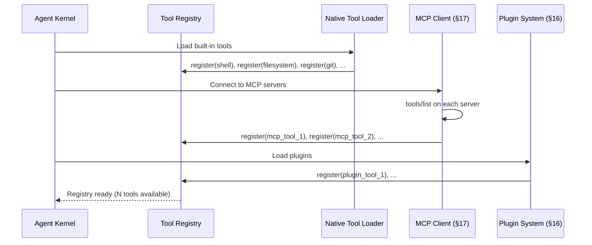
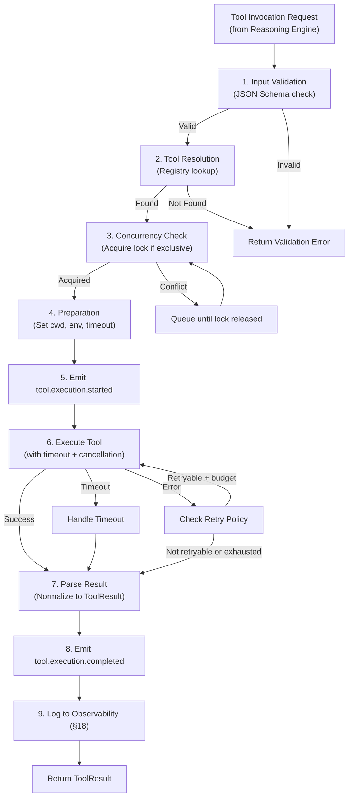
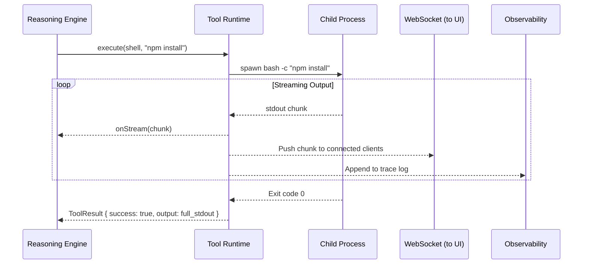

# §9 — Tool Runtime

## 9.1 Purpose

The Tool Runtime is the agent's hands — the subsystem that translates reasoning decisions into concrete actions on the external world. Every interaction the agent has with its environment (filesystem, shell, APIs, browsers, databases, Docker, Git) is mediated through the Tool Runtime.

**Why a unified Tool Runtime instead of ad-hoc integrations?**

Without a unified abstraction, each tool integration becomes a snowflake — different error handling, different result formats, different timeout logic, different retry semantics. The Tool Runtime provides a single execution pipeline that guarantees: every tool call is validated, logged, timed, retried on transient failure, and its result normalized into a consistent schema. This uniformity is what makes the Reasoning Engine (§11) tool-agnostic — it does not need to know whether it is calling a shell command or an MCP server.

## 9.2 Tool Abstraction

### 9.2.1 Unified Tool Definition

```typescript
interface ToolDefinition {
  /** Unique tool identifier */
  name: string;
  
  /** Human-readable description (included in LLM context for tool selection) */
  description: string;
  
  /** JSON Schema for the tool's input parameters */
  inputSchema: JSONSchema;
  
  /** Where this tool comes from */
  source: ToolSource;
  
  /** Execution characteristics */
  characteristics: ToolCharacteristics;
  
  /** The actual executor function */
  execute: (params: Record<string, unknown>, context: ToolContext) => Promise<ToolResult>;
}

type ToolSource =
  | { type: 'native'; module: string }
  | { type: 'mcp'; serverName: string; serverUri: string }
  | { type: 'plugin'; pluginId: string }
  | { type: 'skill'; skillId: string }  // Skill-generated composite tool
  | { type: 'rest'; endpoint: string }
  | { type: 'cli'; binary: string };

interface ToolCharacteristics {
  /** Is this tool read-only or does it mutate state? */
  mutates: boolean;
  
  /** Can multiple instances of this tool run concurrently? */
  concurrency: 'unlimited' | 'serialized' | 'exclusive';
  
  /** Does the tool produce streaming output? */
  streaming: boolean;
  
  /** Expected execution time range */
  typicalDurationMs: { min: number; max: number };
  
  /** Default timeout (ms) */
  timeoutMs: number;
  
  /** Default retry policy */
  retryPolicy: RetryPolicy;
  
  /** Does this tool require network access? */
  requiresNetwork: boolean;
  
  /** Token cost estimate for result (helps context budgeting) */
  estimatedOutputTokens: number;
}
```

### 9.2.2 Tool Context

Every tool invocation receives a context object providing access to shared state:

```typescript
interface ToolContext {
  /** The task that triggered this tool call */
  taskId: string;
  
  /** Working directory for file operations */
  cwd: string;
  
  /** Environment variables available to the tool */
  env: Record<string, string>;
  
  /** Cancellation signal */
  signal: AbortSignal;
  
  /** Streaming callback for real-time output */
  onStream?: (chunk: string) => void;
  
  /** Progress callback */
  onProgress?: (progress: { current: number; total: number; message: string }) => void;
  
  /** Access to the event bus for tool-emitted events */
  emitEvent: (event: ToolEvent) => void;
}
```

### 9.2.3 Tool Result

```typescript
interface ToolResult {
  /** Did the tool succeed? */
  success: boolean;
  
  /** Primary output (text content for LLM consumption) */
  output: string;
  
  /** Structured data output (optional, for programmatic consumption) */
  data?: Record<string, unknown>;
  
  /** Error information if failed */
  error?: {
    code: string;
    message: string;
    category: ErrorCategory;
    retryable: boolean;
    details?: unknown;
  };
  
  /** Generated artifacts (files, images, etc.) */
  artifacts?: ArtifactReference[];
  
  /** Execution metadata */
  metadata: {
    durationMs: number;
    exitCode?: number;
    stdout?: string;
    stderr?: string;
    bytesTransferred?: number;
  };
}

type ErrorCategory =
  | 'timeout'
  | 'auth'
  | 'not_found'
  | 'validation'
  | 'rate_limit'
  | 'network'
  | 'permission'
  | 'internal'
  | 'user_cancelled';
```

## 9.3 Tool Registry

The Tool Registry is a runtime-mutable catalog of all available tools:

```typescript
interface IToolRegistry {
  /** Register a tool */
  register(tool: ToolDefinition): void;
  
  /** Unregister a tool */
  unregister(name: string): void;
  
  /** Get a tool by name */
  get(name: string): ToolDefinition | null;
  
  /** List all registered tools */
  list(filter?: { source?: ToolSource['type']; mutates?: boolean }): ToolDefinition[];
  
  /** Get tool definitions formatted for LLM consumption */
  getToolSchemas(): LLMToolSchema[];
  
  /** Check if a tool is available (binary exists, server is reachable, etc.) */
  healthCheck(name: string): Promise<ToolHealth>;
}
```

Tools are registered from multiple sources during kernel initialization:



## 9.4 Native Tools

### 9.4.1 Shell Tool

```typescript
const shellTool: ToolDefinition = {
  name: 'shell',
  description: 'Execute a shell command in bash. Supports streaming output, custom working directory, timeout, and environment variables.',
  inputSchema: {
    type: 'object',
    properties: {
      command: { type: 'string', description: 'The bash command to execute' },
      cwd: { type: 'string', description: 'Working directory (optional)' },
      timeout: { type: 'number', description: 'Timeout in ms (default: 60000)' },
      env: { type: 'object', description: 'Additional environment variables' },
    },
    required: ['command'],
  },
  source: { type: 'native', module: 'tools/shell' },
  characteristics: {
    mutates: true,
    concurrency: 'unlimited',
    streaming: true,
    typicalDurationMs: { min: 100, max: 60000 },
    timeoutMs: 60000,
    retryPolicy: { maxRetries: 0, backoffMs: 0 }, // No retries for shell
    requiresNetwork: false,
    estimatedOutputTokens: 500,
  },
  execute: async (params, ctx) => {
    const child = spawn('bash', ['-c', params.command as string], {
      cwd: (params.cwd as string) || ctx.cwd,
      env: { ...process.env, ...ctx.env, ...(params.env as Record<string, string>) },
      signal: ctx.signal,
    });
    
    let stdout = '';
    let stderr = '';
    
    child.stdout.on('data', (chunk: Buffer) => {
      const text = chunk.toString();
      stdout += text;
      ctx.onStream?.(text);
    });
    
    child.stderr.on('data', (chunk: Buffer) => {
      stderr += chunk.toString();
    });
    
    const exitCode = await new Promise<number>((resolve, reject) => {
      child.on('close', resolve);
      child.on('error', reject);
    });
    
    return {
      success: exitCode === 0,
      output: stdout || stderr,
      error: exitCode !== 0 ? {
        code: `EXIT_${exitCode}`,
        message: stderr || `Process exited with code ${exitCode}`,
        category: 'internal' as ErrorCategory,
        retryable: false,
      } : undefined,
      metadata: { durationMs: 0, exitCode, stdout, stderr },
    };
  },
};
```

### 9.4.2 Filesystem Tool

```typescript
const filesystemTool: ToolDefinition = {
  name: 'filesystem',
  description: 'Read, write, edit, delete, search, and list files and directories.',
  inputSchema: {
    type: 'object',
    properties: {
      operation: {
        type: 'string',
        enum: ['read', 'write', 'edit', 'delete', 'list', 'search', 'exists', 'stat', 'mkdir', 'glob'],
      },
      path: { type: 'string' },
      content: { type: 'string', description: 'For write/edit operations' },
      pattern: { type: 'string', description: 'For search/glob operations' },
      recursive: { type: 'boolean', description: 'For list/search/delete operations' },
    },
    required: ['operation', 'path'],
  },
  source: { type: 'native', module: 'tools/filesystem' },
  characteristics: {
    mutates: true, // depends on operation, but conservatively true
    concurrency: 'unlimited',
    streaming: false,
    typicalDurationMs: { min: 1, max: 5000 },
    timeoutMs: 30000,
    retryPolicy: { maxRetries: 1, backoffMs: 100 },
    requiresNetwork: false,
    estimatedOutputTokens: 200,
  },
  execute: async (params, ctx) => { /* implementation */ },
};
```

### 9.4.3 Full Native Tool Catalog

| Tool Name | Operations | Concurrency | Streaming | Typical Latency |
|---|---|---|---|---|
| `shell` | Execute bash commands | Unlimited | ✅ | 100ms–60s |
| `filesystem` | Read, write, edit, delete, search, glob, stat, mkdir | Unlimited | ❌ | 1ms–5s |
| `git` | Clone, commit, push, pull, diff, branch, log, stash, merge | Serialized per repo | ❌ | 100ms–120s |
| `python` | Execute Python scripts, manage virtualenvs, pip install | Unlimited | ✅ | 100ms–300s |
| `browser` | Navigate, screenshot, click, fill, extract, evaluate JS | Exclusive (1 browser) | ❌ | 500ms–30s |
| `docker` | Build, run, exec, compose up/down, logs, inspect | Serialized | ✅ | 1s–600s |
| `database` | Execute SQL (SQLite, Postgres), list tables, describe schema | Unlimited (read) / Serialized (write) | ❌ | 10ms–30s |
| `http` | GET, POST, PUT, DELETE, PATCH with headers and body | Unlimited | ✅ | 100ms–30s |
| `search` | Web search via configured API (SearXNG, Brave, Google) | Unlimited | ❌ | 500ms–5s |

## 9.5 Tool Execution Pipeline

Every tool invocation passes through a standardized pipeline:



## 9.6 Error Handling & Retries

### 9.6.1 Error Classification

```typescript
function classifyError(error: unknown, tool: ToolDefinition): ErrorCategory {
  if (error instanceof AbortError) return 'user_cancelled';
  if (error instanceof TimeoutError) return 'timeout';
  
  const message = String(error);
  
  if (/ECONNREFUSED|ENOTFOUND|ENETUNREACH/i.test(message)) return 'network';
  if (/401|403|unauthorized|forbidden/i.test(message)) return 'auth';
  if (/404|not found/i.test(message)) return 'not_found';
  if (/429|rate.limit|too many requests/i.test(message)) return 'rate_limit';
  if (/EACCES|EPERM|permission denied/i.test(message)) return 'permission';
  
  return 'internal';
}
```

### 9.6.2 Retry Policy

```typescript
interface RetryPolicy {
  maxRetries: number;
  backoffMs: number;        // Initial backoff
  backoffMultiplier: number; // Exponential multiplier (default: 2)
  maxBackoffMs: number;     // Cap on backoff time
  jitterMs: number;         // Random jitter added to each retry
  retryableCategories: ErrorCategory[]; // Which error types to retry
}

const DEFAULT_RETRY_POLICY: RetryPolicy = {
  maxRetries: 2,
  backoffMs: 1000,
  backoffMultiplier: 2,
  maxBackoffMs: 30000,
  jitterMs: 500,
  retryableCategories: ['timeout', 'network', 'rate_limit', 'internal'],
};
```

### 9.6.3 Retry Execution

```typescript
async function executeWithRetry(
  tool: ToolDefinition,
  params: Record<string, unknown>,
  ctx: ToolContext,
): Promise<ToolResult> {
  const policy = tool.characteristics.retryPolicy;
  let lastError: ToolResult['error'];
  
  for (let attempt = 0; attempt <= policy.maxRetries; attempt++) {
    if (attempt > 0) {
      const backoff = Math.min(
        policy.backoffMs * Math.pow(policy.backoffMultiplier, attempt - 1),
        policy.maxBackoffMs,
      ) + Math.random() * policy.jitterMs;
      
      await sleep(backoff);
    }
    
    const result = await tool.execute(params, ctx);
    
    if (result.success) return result;
    
    if (!result.error?.retryable || !policy.retryableCategories.includes(result.error.category)) {
      return result; // Non-retryable error
    }
    
    lastError = result.error;
    ctx.emitEvent({ type: 'tool.retry', tool: tool.name, attempt, error: lastError });
  }
  
  return {
    success: false,
    output: `Tool ${tool.name} failed after ${policy.maxRetries + 1} attempts`,
    error: lastError,
    metadata: { durationMs: 0 },
  };
}
```

## 9.7 Streaming

Long-running tools (shell, docker build, python) produce output incrementally. The Tool Runtime supports streaming via the `onStream` callback in `ToolContext`:



## 9.8 Interfaces

```typescript
export interface IToolRuntime {
  readonly registry: IToolRegistry;
  
  /** Execute a tool by name with parameters */
  execute(toolName: string, params: Record<string, unknown>, context: ToolContext): Promise<ToolResult>;
  
  /** Execute a tool with streaming output */
  executeStreaming(toolName: string, params: Record<string, unknown>, context: ToolContext): AsyncIterable<string>;
  
  /** Cancel a running tool execution */
  cancel(executionId: string): Promise<void>;
  
  /** Get the status of a running tool execution */
  status(executionId: string): ToolExecutionStatus | null;
  
  /** List currently running tool executions */
  listActive(): ToolExecutionStatus[];
}
```

## 9.9 Failure Modes

| Failure | Impact | Mitigation |
|---|---|---|
| Tool binary not found | Tool unavailable | Health check at registration; graceful degradation with error message |
| Zombie child process | Resource leak | Process reaper monitors child PIDs; kills orphans after parent timeout |
| Infinite output (stdout flood) | Memory exhaustion | Output buffer cap (10MB default); truncation with warning |
| Tool modifies agent workspace | Corrupted state | Workspace snapshot before high-risk tool chains (§7.6) |
| MCP server disconnects mid-call | Partial result | MCP reconnection with exponential backoff; retry from scratch |

## 9.10 Future Improvements

1. **Tool learning**: Track success/failure rates per tool per context. Automatically suggest alternative tools when primary tool has low success rate.
2. **Tool composition**: Define composite tools as DAGs of atomic tools (e.g., "deploy" = git pull → test → docker build → push → kubectl apply).
3. **Sandboxed execution mode**: Optional gVisor/Firecracker sandbox for untrusted tool execution (e.g., running user-submitted code).
4. **Tool generation**: LLM generates new tool definitions from natural language descriptions of APIs (given OpenAPI specs or documentation).
5. **Cost tracking**: Track API costs per tool invocation for budget management.
