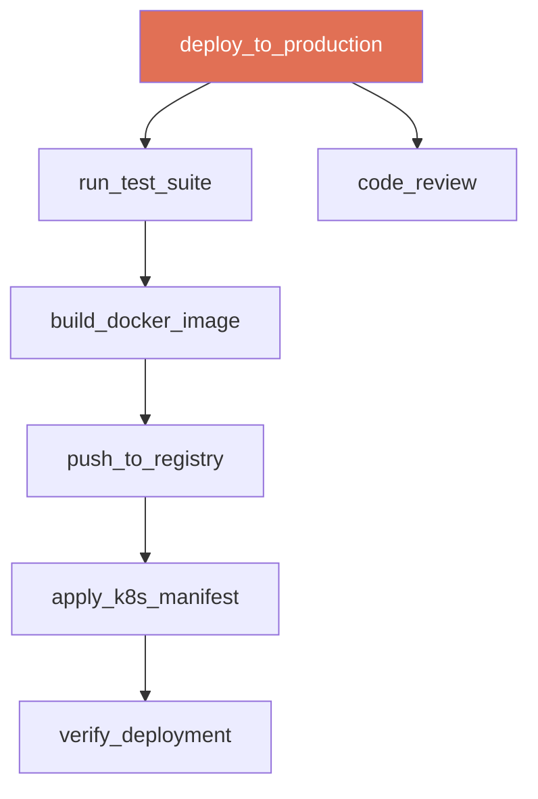
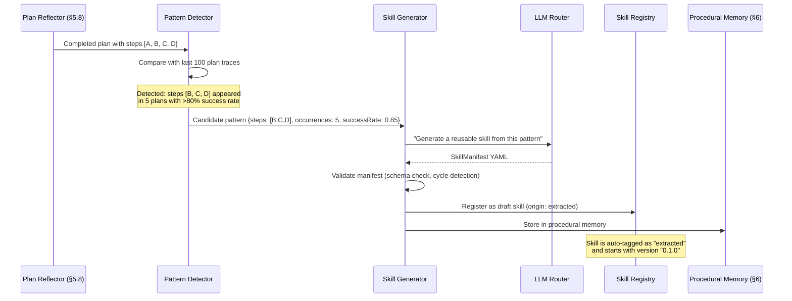

# §10 — Skills

## 10.1 Purpose

A **Tool** is an atomic, stateless action — "run this shell command," "read this file," "query this database." A **Skill** is a learned, multi-step procedure that composes tools, reasoning, and domain knowledge into a reusable capability.

| Dimension | Tool | Skill |
|---|---|---|
| Granularity | Single action | Multi-step workflow |
| State | Stateless | Maintains intermediate state |
| Knowledge | None (pure function) | Encodes domain expertise |
| Learning | Fixed implementation | Improves over time |
| Origin | Developer-defined | Extracted from experience or developer-defined |
| Example | `shell("npm test")` | `debug_failing_test(test_name)` → read error → check recent changes → identify root cause → apply fix → verify |

**Why Skills matter**: Without skills, the agent must re-derive every multi-step procedure from scratch every time. With a "debug Kubernetes pod crash" skill, the agent instantly recalls the proven sequence: check pod events → read logs → inspect resource limits → check image tag → verify config maps. Without it, the agent might waste tokens exploring irrelevant hypotheses.

## 10.2 Skill Definition

### 10.2.1 Skill Manifest

```typescript
interface SkillManifest {
  /** Unique skill identifier */
  id: string;
  
  /** Human-readable name */
  name: string;
  
  /** Version (semver) */
  version: string;
  
  /** Natural language description of what this skill does */
  description: string;
  
  /** When should this skill be triggered? (used by Reasoning Engine for skill selection) */
  triggerPatterns: string[];
  
  /** Input parameters */
  inputs: SkillInput[];
  
  /** Expected outputs */
  outputs: SkillOutput[];
  
  /** Tools this skill requires */
  requiredTools: string[];
  
  /** Steps to execute */
  steps: SkillStep[];
  
  /** System prompt augmentation when this skill is active */
  systemPromptAugment?: string;
  
  /** Execution statistics */
  stats: SkillStats;
  
  /** Origin */
  origin: 'builtin' | 'extracted' | 'marketplace' | 'user_defined';
  
  /** Tags for categorization */
  tags: string[];
}

interface SkillInput {
  name: string;
  type: 'string' | 'number' | 'boolean' | 'file_path' | 'code' | 'any';
  description: string;
  required: boolean;
  default?: unknown;
}

interface SkillOutput {
  name: string;
  type: string;
  description: string;
}

interface SkillStep {
  /** Step identifier */
  id: string;
  
  /** What to do */
  action: SkillAction;
  
  /** Condition for executing this step (evaluated at runtime) */
  condition?: string;
  
  /** How to handle failure */
  onFailure: 'abort' | 'skip' | 'retry' | 'fallback';
  
  /** Fallback step if this one fails */
  fallbackStepId?: string;
}

type SkillAction =
  | { type: 'tool_call'; tool: string; argsTemplate: Record<string, string> }
  | { type: 'llm_reason'; prompt: string; outputVar: string }
  | { type: 'sub_skill'; skillId: string; inputMapping: Record<string, string> }
  | { type: 'conditional'; condition: string; thenSteps: string[]; elseSteps: string[] }
  | { type: 'loop'; overVar: string; bodySteps: string[] };

interface SkillStats {
  totalExecutions: number;
  successCount: number;
  failureCount: number;
  averageDurationMs: number;
  averageTokenCost: number;
  lastExecutedAt: number;
  successRate: number; // Computed: successCount / totalExecutions
}
```

### 10.2.2 Example Skill: `code_review`

```yaml
# ~/.fuckclaw/skills/code_review.yaml
id: skill_code_review
name: code_review
version: "1.2.0"
description: >
  Review a code diff for bugs, style issues, security vulnerabilities,
  and architectural concerns. Uses project-specific patterns from memory.
origin: builtin
tags: [code, review, quality]

triggerPatterns:
  - "review this code"
  - "review PR"
  - "check this diff"
  - "code review"

inputs:
  - name: diff
    type: string
    description: "Git diff content or PR reference"
    required: true
  - name: project
    type: string
    description: "Project name for context"
    required: false

outputs:
  - name: review
    type: string
    description: "Structured review with findings"

requiredTools: [git, filesystem]

steps:
  - id: get_context
    action:
      type: llm_reason
      prompt: |
        Analyze this diff and identify:
        1. What files are changed
        2. What the intent appears to be
        3. What areas need careful review
        Diff: {{diff}}
      outputVar: analysis
    onFailure: abort

  - id: check_patterns
    action:
      type: tool_call
      tool: filesystem
      argsTemplate:
        operation: search
        path: "{{project_path}}"
        pattern: "{{identified_pattern}}"
    condition: "analysis.identified_patterns.length > 0"
    onFailure: skip

  - id: retrieve_memory
    action:
      type: llm_reason
      prompt: |
        Based on the analysis, retrieve relevant:
        - Past review feedback for this project
        - Known anti-patterns
        - Coding standards
        Context: {{analysis}}
      outputVar: memory_context
    onFailure: skip

  - id: generate_review
    action:
      type: llm_reason
      prompt: |
        Generate a comprehensive code review.
        Diff: {{diff}}
        Analysis: {{analysis}}
        Historical patterns: {{memory_context}}
        
        For each finding, provide:
        - Severity (critical/warning/suggestion)
        - File and line reference
        - Description of the issue
        - Suggested fix
      outputVar: review
    onFailure: abort
```

## 10.3 Skill Composition

Skills can invoke other skills as sub-steps, forming a **skill DAG**:



**Cycle detection**: The Skill Engine validates that skill composition graphs are acyclic at registration time. A skill cannot (directly or transitively) invoke itself.

## 10.4 Skill Versioning

Skills evolve over time. The Skill Engine tracks versions:

```
skills/
└── code_review/
    ├── v1.0.0.yaml    # Original version
    ├── v1.1.0.yaml    # Added memory retrieval step
    ├── v1.2.0.yaml    # Improved prompt templates
    └── current -> v1.2.0.yaml  # Symlink to active version
```

**A/B testing**: When a new skill version is created, the engine can run both versions on a percentage of invocations and compare success rates before promoting the new version.

## 10.5 Automatic Skill Generation

This is one of FuckClaw's most powerful capabilities. The system watches for repeated multi-step patterns in plan executions and proposes new skills:



### 10.5.1 Pattern Detection Algorithm

```typescript
interface PatternCandidate {
  stepSequence: string[];  // Sequence of tool/action names
  occurrences: number;     // How many times this sequence appeared
  successRate: number;     // Success rate across occurrences
  averageDuration: number;
  contextSimilarity: number; // How similar were the contexts when this pattern appeared?
}

function detectPatterns(recentPlans: CompletedPlan[], minOccurrences: number = 3): PatternCandidate[] {
  // Extract all sub-sequences of length 2-8 from completed plans
  const subsequences = new Map<string, PatternCandidate>();
  
  for (const plan of recentPlans) {
    const steps = plan.steps.filter(s => s.state === 'completed').map(s => s.type.kind + ':' + s.description);
    
    for (let len = 2; len <= Math.min(8, steps.length); len++) {
      for (let start = 0; start <= steps.length - len; start++) {
        const subseq = steps.slice(start, start + len);
        const key = subseq.join(' → ');
        
        if (!subsequences.has(key)) {
          subsequences.set(key, { stepSequence: subseq, occurrences: 0, successRate: 0, averageDuration: 0, contextSimilarity: 0 });
        }
        
        const candidate = subsequences.get(key)!;
        candidate.occurrences++;
      }
    }
  }
  
  // Filter: must appear at least minOccurrences times with >70% success rate
  return Array.from(subsequences.values())
    .filter(c => c.occurrences >= minOccurrences && c.successRate > 0.7)
    .sort((a, b) => b.occurrences * b.successRate - a.occurrences * a.successRate);
}
```

## 10.6 Skill Learning

Skills improve over time through a feedback loop:

1. **Execution tracking**: Every skill invocation records success/failure, duration, and token cost
2. **Prompt refinement**: If a skill's success rate drops below 70%, the system triggers a prompt revision cycle — the LLM analyzes failure cases and rewrites the skill's prompts
3. **Step optimization**: If a step is consistently skipped (condition never true) or consistently fails, the skill is revised to remove or replace it
4. **Parameter tuning**: Default parameter values are adjusted based on historical best-performing values

```typescript
async function maybeRefineSkill(skill: SkillManifest): Promise<SkillManifest | null> {
  if (skill.stats.totalExecutions < 10) return null; // Not enough data
  if (skill.stats.successRate > 0.85) return null;    // Good enough
  
  // Analyze recent failures
  const failures = await getRecentSkillFailures(skill.id, 20);
  
  // Ask LLM to propose improvements
  const refinedManifest = await llm.generate({
    system: 'You are a skill optimization engine. Analyze failure patterns and propose skill improvements.',
    prompt: `Skill: ${JSON.stringify(skill)}\n\nRecent failures:\n${failures.map(f => f.errorMessage).join('\n')}\n\nPropose a revised skill manifest that addresses these failures.`,
    outputSchema: SkillManifestSchema,
  });
  
  return refinedManifest;
}
```

## 10.7 Skill Marketplace

The Skill Marketplace enables sharing skills between FuckClaw instances:

| Component | Description |
|---|---|
| **Registry** | Central HTTPS registry (like npm) hosting skill manifests |
| **Publishing** | `fuckclaw skill publish <name>` uploads a skill to the registry |
| **Discovery** | `fuckclaw skill search <query>` searches by description/tags |
| **Installation** | `fuckclaw skill install <name>` downloads and registers a skill |
| **Versioning** | Skills follow semver; install pins to major version by default |
| **Trust** | Skills are reviewed (manual or automated) before listing |

## 10.8 Interfaces

```typescript
export interface ISkillEngine {
  /** Register a skill from manifest */
  register(manifest: SkillManifest): Promise<void>;
  
  /** Execute a skill */
  execute(skillId: string, inputs: Record<string, unknown>, context: ToolContext): Promise<SkillExecutionResult>;
  
  /** Find skills matching an intent */
  matchSkills(intent: string, limit?: number): Promise<ScoredSkill[]>;
  
  /** List all registered skills */
  list(filter?: { origin?: string; tags?: string[] }): SkillManifest[];
  
  /** Get execution statistics */
  getStats(skillId: string): SkillStats;
  
  /** Trigger skill refinement cycle */
  refine(skillId: string): Promise<SkillManifest | null>;
  
  /** Detect and propose new skills from recent plan executions */
  detectPatterns(): Promise<PatternCandidate[]>;
  
  /** Generate a skill from a detected pattern */
  generateSkill(pattern: PatternCandidate): Promise<SkillManifest>;
}

interface ScoredSkill {
  skill: SkillManifest;
  relevanceScore: number;
  successRate: number;
}

interface SkillExecutionResult {
  success: boolean;
  outputs: Record<string, unknown>;
  stepsExecuted: number;
  stepsSkipped: number;
  stepsFailed: number;
  durationMs: number;
  tokenCost: number;
}
```

## 10.9 Storage Layout

```text
~/.fuckclaw/skills/
├── builtin/                 # Ships with FuckClaw
│   ├── code_review/
│   │   └── v1.2.0.yaml
│   ├── research/
│   ├── debug/
│   ├── deploy/
│   └── write_document/
├── extracted/               # Automatically generated from patterns
│   ├── fix_docker_dns/
│   │   └── v0.1.0.yaml
│   └── setup_react_project/
│       └── v0.2.0.yaml
├── marketplace/             # Installed from marketplace
│   └── k8s_troubleshoot/
│       └── v2.1.0.yaml
└── user/                    # Manually defined by operator
    └── custom_deploy/
        └── v1.0.0.yaml
```

## 10.10 Failure Modes

| Failure | Impact | Mitigation |
|---|---|---|
| Skill step invokes unavailable tool | Skill execution fails | Pre-flight check verifies `requiredTools` before execution |
| Extracted skill is too specific | Low reuse rate | Pattern detection requires `contextSimilarity > 0.6` across occurrences |
| Skill cycle (A invokes B invokes A) | Stack overflow | Cycle detection at registration time; max recursion depth (5) at runtime |
| Skill prompt degrades with model update | Success rate drops | Continuous monitoring; auto-refinement triggers at <70% success rate |

## 10.11 Future Improvements

1. **Visual skill editor**: Web UI for visually composing skill DAGs
2. **Skill inheritance**: Skills can extend other skills, overriding specific steps
3. **Cross-instance learning**: Federated skill improvement across opted-in FuckClaw instances (differential privacy preserved)
4. **Skill benchmarking**: Automated benchmark suites to measure skill quality across synthetic scenarios
5. **Natural language skill definition**: "Create a skill that deploys to Vercel after running tests" → auto-generated manifest
