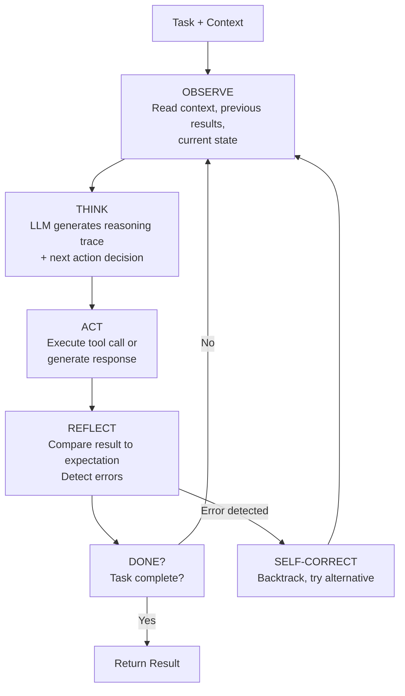
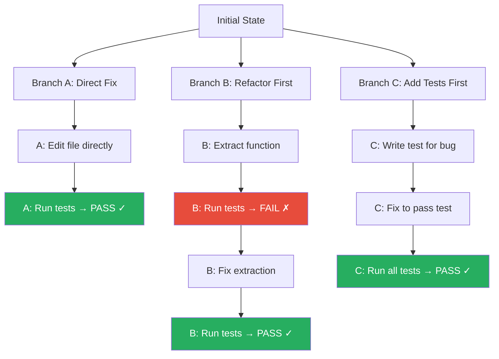
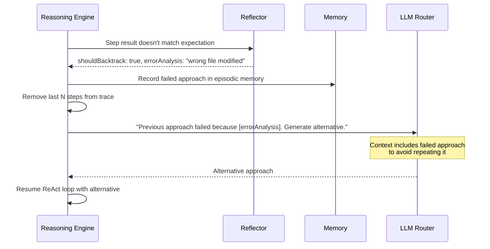

# §11 — Reasoning Engine

## 11.1 Purpose

The Reasoning Engine is the cognitive core of FuckClaw — the subsystem that takes a context-enriched prompt and produces a sequence of reasoning steps, tool invocations, and decisions that advance a task toward completion.

It is not a thin wrapper around an LLM `generate()` call. It implements a **structured reasoning loop** with:

- Multi-turn observe-think-act cycles (ReAct)
- Optional tree search over alternative reasoning paths
- Self-reflection and verification after each action
- Dynamic strategy selection based on task complexity
- Budget-aware reasoning (use cheaper models for simple sub-steps)
- Full trace recording for observability and learning

## 11.2 Reasoning Strategies

The Reasoning Engine selects a strategy based on task characteristics:

| Strategy | When Used | Description | Token Cost |
|---|---|---|---|
| **Direct** | Simple factual questions, single-tool actions | Single LLM call, optional tool use | Low |
| **ReAct Loop** | Standard multi-step tasks | Iterative observe → reason → act cycle | Medium |
| **Tree Search** | Complex problems with uncertain approaches | Explore multiple reasoning branches, select best | High |
| **Delegation** | Sub-tasks requiring specialized agents | Hand off to a specialized agent (§15) | Variable |
| **Retrieval-Augmented** | Knowledge-heavy questions | Heavy memory/knowledge retrieval before reasoning | Medium |
| **Iterative Refinement** | Creative/writing tasks | Generate → self-critique → revise loop | Medium-High |

### 11.2.1 Strategy Selection

```typescript
async function selectStrategy(task: Task, context: ContextBundle): Promise<ReasoningStrategy> {
  // Heuristic-based fast path
  if (task.plan && task.plan.steps.length === 1) return 'direct';
  if (task.source.type === 'agent') return 'react'; // Sub-tasks use standard loop
  
  // LLM-based classification for complex cases
  const classification = await llm.generate({
    model: 'fast',  // Use cheap model for meta-reasoning
    system: 'Classify this task into a reasoning strategy.',
    prompt: `Task: ${task.description}\nContext summary: ${context.summary}\n\nStrategies: direct, react, tree_search, delegation, retrieval_augmented, iterative_refinement`,
    outputSchema: { type: 'object', properties: { strategy: { type: 'string' }, rationale: { type: 'string' } } },
  });
  
  return classification.strategy as ReasoningStrategy;
}
```

## 11.3 The ReAct Loop

The primary reasoning pattern is **ReAct** (Reason + Act):



### 11.3.1 ReAct Implementation

```typescript
class ReActExecutor {
  private readonly MAX_ITERATIONS = 25;
  
  async execute(task: Task, context: ContextBundle): Promise<ReasoningResult> {
    const trace: ReasoningStep[] = [];
    let iterations = 0;
    
    while (iterations < this.MAX_ITERATIONS) {
      iterations++;
      
      // 1. OBSERVE: Build the current prompt
      const prompt = this.buildPrompt(task, context, trace);
      
      // 2. THINK + ACT: LLM generates reasoning + action
      const response = await this.llmRouter.generate({
        messages: prompt,
        tools: this.getAvailableTools(task),
        model: this.selectModel(task, iterations),
      });
      
      // 3. Record reasoning trace
      const step: ReasoningStep = {
        iteration: iterations,
        thought: response.reasoning,
        action: response.toolCall || response.textResponse,
        timestamp: Date.now(),
      };
      
      // 4. If the LLM decided to use a tool, execute it
      if (response.toolCall) {
        const toolResult = await this.toolRuntime.execute(
          response.toolCall.name,
          response.toolCall.args,
          this.createToolContext(task),
        );
        
        step.observation = toolResult;
        
        // 5. REFLECT: Check for errors
        if (!toolResult.success) {
          step.reflection = await this.reflect(task, step, trace);
          
          if (step.reflection.shouldBacktrack) {
            // Self-correction: try alternative approach
            trace.push(step);
            context = await this.backtrack(task, context, trace, step.reflection);
            continue;
          }
        }
      }
      
      // 6. Check if task is complete
      if (response.isComplete) {
        trace.push(step);
        return {
          success: true,
          output: response.finalAnswer,
          trace,
          iterations,
          tokensUsed: this.countTokens(trace),
        };
      }
      
      trace.push(step);
      
      // Budget check
      if (this.budgetExceeded(task, trace)) {
        return {
          success: false,
          output: 'Budget exceeded. Partial results available.',
          trace,
          iterations,
          tokensUsed: this.countTokens(trace),
        };
      }
    }
    
    return {
      success: false,
      output: `Max iterations (${this.MAX_ITERATIONS}) reached without completing task.`,
      trace,
      iterations,
      tokensUsed: this.countTokens(trace),
    };
  }
}
```

## 11.4 Tree Search

For complex problems where the optimal approach is uncertain, the Reasoning Engine explores multiple reasoning branches:



### 11.4.1 Beam Search Implementation

```typescript
interface BeamSearchConfig {
  /** Number of branches to explore in parallel */
  beamWidth: number;  // default: 3
  
  /** Maximum depth per branch */
  maxDepth: number;   // default: 5
  
  /** Scoring function for branch quality */
  scoreFn: (branch: ReasoningStep[]) => number;
  
  /** When to stop exploring */
  earlyStop: (branch: ReasoningStep[]) => boolean;
}

async function beamSearch(task: Task, context: ContextBundle, config: BeamSearchConfig): Promise<ReasoningResult> {
  // Generate initial candidate approaches
  const initialBranches = await generateApproaches(task, context, config.beamWidth);
  
  let activeBranches = initialBranches.map(approach => ({
    steps: [approach],
    score: 0,
    context: { ...context },
  }));
  
  for (let depth = 0; depth < config.maxDepth; depth++) {
    const nextBranches = [];
    
    for (const branch of activeBranches) {
      if (config.earlyStop(branch.steps)) {
        nextBranches.push(branch); // Keep completed branches
        continue;
      }
      
      // Expand this branch by one step
      const nextStep = await executeOneStep(task, branch.context, branch.steps);
      const expandedBranch = {
        steps: [...branch.steps, nextStep],
        score: config.scoreFn([...branch.steps, nextStep]),
        context: updateContext(branch.context, nextStep),
      };
      
      nextBranches.push(expandedBranch);
    }
    
    // Prune to top beamWidth branches
    activeBranches = nextBranches
      .sort((a, b) => b.score - a.score)
      .slice(0, config.beamWidth);
  }
  
  // Return the best branch
  const best = activeBranches[0];
  return {
    success: true,
    output: extractFinalAnswer(best.steps),
    trace: best.steps,
    iterations: best.steps.length,
    tokensUsed: countTokens(best.steps),
    alternativesExplored: activeBranches.length,
  };
}
```

## 11.5 Reflection & Self-Correction

After each action, the engine evaluates the result:

```typescript
interface Reflection {
  /** Did the action produce the expected result? */
  expectedOutcome: boolean;
  
  /** What actually happened? */
  actualOutcomeDescription: string;
  
  /** Should we backtrack and try a different approach? */
  shouldBacktrack: boolean;
  
  /** If backtracking, what went wrong? */
  errorAnalysis?: string;
  
  /** If continuing, any adjustments to the plan? */
  planAdjustment?: string;
  
  /** Confidence in current approach (0.0-1.0) */
  confidence: number;
}

async function reflect(task: Task, step: ReasoningStep, history: ReasoningStep[]): Promise<Reflection> {
  // Use a cheaper/faster model for reflection
  const reflection = await llm.generate({
    model: 'fast',
    system: `You are a self-reflection engine. Evaluate whether the last action advanced the task.`,
    prompt: `
Task: ${task.description}
Last action: ${JSON.stringify(step.action)}
Result: ${JSON.stringify(step.observation)}
History: ${history.map(s => s.thought).join('\n')}

Evaluate:
1. Did this produce the expected result?
2. Should we backtrack and try a different approach?
3. How confident are you in the current trajectory?`,
    outputSchema: ReflectionSchema,
  });
  
  return reflection;
}
```

### 11.5.1 Backtracking

When reflection indicates a wrong approach:



## 11.6 Prompt Construction

The Reasoning Engine constructs prompts with a layered architecture:

```
┌─────────────────────────────────────────────────┐
│ Layer 1: System Identity                         │
│ "You are FuckClaw, a personal AI operating       │
│  system. You have persistent memory and full     │
│  tool access..."                                 │
├─────────────────────────────────────────────────┤
│ Layer 2: Active Skill Augmentation               │
│ (injected by Skill Engine when a skill is active)│
├─────────────────────────────────────────────────┤
│ Layer 3: Retrieved Context                       │
│ - Relevant episodic memories                     │
│ - Relevant semantic facts                        │
│ - Knowledge graph neighborhood                   │
│ - Active procedural skills                       │
├─────────────────────────────────────────────────┤
│ Layer 4: Task Description                        │
│ "The user has asked: ..."                        │
├─────────────────────────────────────────────────┤
│ Layer 5: Plan Context (if active)                │
│ "Current plan step 3 of 7: ..."                  │
├─────────────────────────────────────────────────┤
│ Layer 6: Reasoning History                       │
│ Previous thought/action/observation steps        │
├─────────────────────────────────────────────────┤
│ Layer 7: Tool Definitions                        │
│ Available tools with JSON schemas                │
└─────────────────────────────────────────────────┘
```

## 11.7 Execution Budget

The Reasoning Engine tracks resource consumption and adapts:

```typescript
interface ExecutionBudget {
  maxTokens: number;
  maxIterations: number;
  maxToolCalls: number;
  maxDurationMs: number;
  maxCostUsd: number;
  
  consumed: {
    tokens: number;
    iterations: number;
    toolCalls: number;
    durationMs: number;
    costUsd: number;
  };
}

function shouldDowngradeModel(budget: ExecutionBudget): boolean {
  const tokenRatio = budget.consumed.tokens / budget.maxTokens;
  const costRatio = budget.consumed.costUsd / budget.maxCostUsd;
  
  // If >60% of budget consumed, switch to cheaper model for remaining steps
  return tokenRatio > 0.6 || costRatio > 0.6;
}
```

**Model cascading**: The engine starts with the most capable model (e.g., Claude Opus) for initial reasoning and planning, then cascades to cheaper models (Sonnet, Haiku) for routine tool calls and simple follow-up steps. This optimizes cost without sacrificing quality on the critical thinking steps.

## 11.8 Reasoning Traces

Every reasoning step is recorded as a structured trace for observability (§18) and learning (§23):

```typescript
interface ReasoningTrace {
  traceId: string;
  taskId: string;
  strategy: ReasoningStrategy;
  steps: ReasoningStep[];
  
  totalTokens: number;
  totalCost: number;
  totalDurationMs: number;
  iterations: number;
  
  outcome: 'success' | 'failure' | 'partial' | 'budget_exceeded';
  
  /** Self-evaluation of reasoning quality (post-hoc) */
  qualityScore?: number;
}

interface ReasoningStep {
  iteration: number;
  timestamp: number;
  
  /** The LLM's chain-of-thought reasoning */
  thought: string;
  
  /** The action taken (tool call or text response) */
  action: ToolCallAction | TextAction;
  
  /** The result of the action */
  observation?: ToolResult | string;
  
  /** Self-reflection on this step */
  reflection?: Reflection;
  
  /** Model used for this step */
  model: string;
  
  /** Tokens consumed by this step */
  tokensUsed: { input: number; output: number };
  
  /** Cost of this step */
  costUsd: number;
}
```

## 11.9 Interfaces

```typescript
export interface IReasoningEngine {
  /** Execute reasoning for a task */
  reason(task: Task, context: ContextBundle): Promise<ReasoningResult>;
  
  /** Select the best reasoning strategy for a task */
  selectStrategy(task: Task, context: ContextBundle): Promise<ReasoningStrategy>;
  
  /** Generate a reflection on a completed step */
  reflect(task: Task, step: ReasoningStep, history: ReasoningStep[]): Promise<Reflection>;
  
  /** Get the full reasoning trace for a task */
  getTrace(taskId: string): Promise<ReasoningTrace | null>;
  
  /** Abort reasoning for a task */
  abort(taskId: string): Promise<void>;
}

interface ReasoningResult {
  success: boolean;
  output: string;
  trace: ReasoningStep[];
  iterations: number;
  tokensUsed: number;
  costUsd: number;
  strategy: ReasoningStrategy;
  alternativesExplored?: number;
}
```

## 11.10 Failure Modes

| Failure | Impact | Mitigation |
|---|---|---|
| Reasoning loop (agent repeats same action) | Token waste, no progress | Loop detection: if same tool+args called 3 times, force alternative |
| LLM hallucination in reasoning | Wrong conclusions, bad tool args | Verification step after each action; structured output schemas |
| Context window overflow during reasoning | Truncated history, lost context | Progressive summarization of old reasoning steps |
| Model degradation during cascade | Quality drops too much on cheap model | Minimum model tier for critical steps (planning, reflection) |
| Infinite self-correction | Keeps backtracking without progress | Max backtrack count (3); escalate to user after limit |

## 11.11 Future Improvements

1. **Learned reasoning strategies**: Train a classifier on past reasoning traces to predict optimal strategy for new tasks
2. **Parallel hypothesis testing**: Test multiple tool calls concurrently when they are independent
3. **Reasoning cache**: Cache reasoning patterns for common sub-problems (e.g., "parse JSON from shell output" is always the same pattern)
4. **External verifiers**: Plug in formal verification tools (type checkers, linters, test runners) as automated reflection sources
5. **Multi-model deliberation**: Use two different LLMs to reason independently, then synthesize their conclusions for higher reliability
