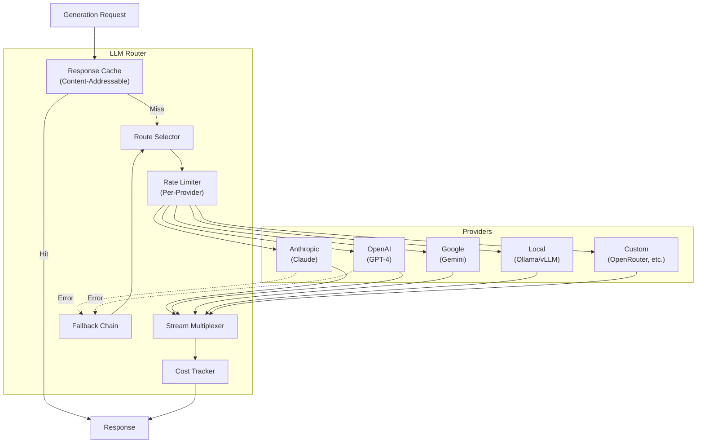
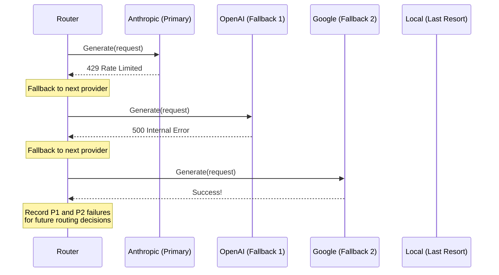

# §12 — LLM Router

## 12.1 Purpose

The LLM Router is the subsystem that mediates all interactions between FuckClaw and cloud LLM providers. It is **not** a simple API client. It is an intelligent routing layer that selects the optimal model for each request based on task complexity, cost constraints, latency requirements, and provider availability.

**Why cloud-first?** Frontier models (Claude Sonnet/Opus, GPT-4o, Gemini Pro) dramatically outperform local models for the kind of complex, multi-step reasoning FuckClaw requires. Local models are supported as fallbacks for offline/low-cost scenarios, but they are not the default.

## 12.2 Architecture



## 12.3 Provider Configuration

```typescript
interface ProviderConfig {
  /** Provider identifier */
  id: string;
  
  /** Provider type */
  type: 'anthropic' | 'openai' | 'google' | 'ollama' | 'openrouter' | 'custom_openai';
  
  /** API base URL */
  baseUrl: string;
  
  /** API key (resolved from config/env) */
  apiKey: string;
  
  /** Available models */
  models: ModelConfig[];
  
  /** Rate limits */
  rateLimits: {
    requestsPerMinute: number;
    tokensPerMinute: number;
    requestsPerDay?: number;
  };
  
  /** Is this provider enabled? */
  enabled: boolean;
  
  /** Priority (lower = preferred) */
  priority: number;
}

interface ModelConfig {
  /** Model ID as used by the provider API */
  id: string;
  
  /** Human-readable name */
  name: string;
  
  /** Model tier (determines routing decisions) */
  tier: ModelTier;
  
  /** Context window size (tokens) */
  contextWindow: number;
  
  /** Maximum output tokens */
  maxOutputTokens: number;
  
  /** Cost per million input tokens (USD) */
  inputCostPerMillion: number;
  
  /** Cost per million output tokens (USD) */
  outputCostPerMillion: number;
  
  /** Supports tool/function calling? */
  supportsTools: boolean;
  
  /** Supports structured output (JSON mode)? */
  supportsStructuredOutput: boolean;
  
  /** Supports streaming? */
  supportsStreaming: boolean;
  
  /** Supports vision (image input)? */
  supportsVision: boolean;
  
  /** Extended thinking / reasoning? */
  supportsExtendedThinking: boolean;
}

type ModelTier =
  | 'frontier'    // Claude Opus, GPT-4, Gemini Ultra — most capable, most expensive
  | 'standard'    // Claude Sonnet, GPT-4o — good balance of capability and cost
  | 'fast'        // Claude Haiku, GPT-4o-mini, Gemini Flash — cheap, fast, less capable
  | 'local';      // Ollama/vLLM models — free but least capable
```

## 12.4 Model Selection

### 12.4.1 Automatic Model Selection

The router selects the optimal model based on task characteristics:

```typescript
interface GenerationRequest {
  /** Messages (system + user + assistant turns) */
  messages: Message[];
  
  /** Tool definitions (if any) */
  tools?: LLMToolSchema[];
  
  /** Structured output schema (if any) */
  outputSchema?: JSONSchema;
  
  /** Routing hints */
  routing?: {
    /** Preferred model tier */
    preferredTier?: ModelTier;
    
    /** Explicit model override (bypasses routing) */
    model?: string;
    
    /** Maximum cost for this request (USD) */
    maxCost?: number;
    
    /** Latency requirement */
    latency?: 'low' | 'normal' | 'high_ok';
    
    /** Task complexity estimate */
    complexity?: 'trivial' | 'simple' | 'moderate' | 'complex' | 'frontier';
    
    /** Requires extended thinking? */
    needsThinking?: boolean;
  };
  
  /** Streaming callback */
  onStream?: (chunk: string) => void;
  
  /** Temperature */
  temperature?: number;
  
  /** Max output tokens */
  maxTokens?: number;
}
```

### 12.4.2 Routing Algorithm

```typescript
function selectModel(request: GenerationRequest): { provider: ProviderConfig; model: ModelConfig } {
  // 1. If explicit model specified, use it
  if (request.routing?.model) {
    return resolveExplicitModel(request.routing.model);
  }
  
  // 2. Determine required capabilities
  const requirements = {
    tools: (request.tools?.length ?? 0) > 0,
    structuredOutput: !!request.outputSchema,
    streaming: !!request.onStream,
    vision: request.messages.some(m => hasImageContent(m)),
    thinking: request.routing?.needsThinking ?? false,
    contextSize: countTokens(request.messages),
  };
  
  // 3. Filter models that meet requirements
  const candidates = allModels.filter(m =>
    (!requirements.tools || m.supportsTools) &&
    (!requirements.structuredOutput || m.supportsStructuredOutput) &&
    (!requirements.streaming || m.supportsStreaming) &&
    (!requirements.vision || m.supportsVision) &&
    (!requirements.thinking || m.supportsExtendedThinking) &&
    m.contextWindow >= requirements.contextSize + (request.maxTokens ?? 4096)
  );
  
  // 4. Score candidates
  const scored = candidates.map(model => ({
    model,
    score: scoreModel(model, request),
  }));
  
  // 5. Select highest scoring
  scored.sort((a, b) => b.score - a.score);
  return scored[0];
}

function scoreModel(model: ModelConfig, request: GenerationRequest): number {
  const tier = request.routing?.preferredTier ?? complexityToTier(request.routing?.complexity);
  
  let score = 0;
  
  // Tier match (highest weight)
  if (model.tier === tier) score += 100;
  else if (tierDistance(model.tier, tier) === 1) score += 50;
  
  // Cost efficiency
  const estimatedCost = estimateCost(model, request);
  if (request.routing?.maxCost && estimatedCost > request.routing.maxCost) {
    return -1; // Disqualified
  }
  score += (1 - estimatedCost / 1.0) * 30; // Cheaper is better (normalized to $1 max)
  
  // Provider priority
  const provider = getProvider(model);
  score += (10 - provider.priority) * 5;
  
  // Rate limit headroom
  const headroom = getRateLimitHeadroom(provider);
  score += headroom * 10;
  
  // Latency preference
  if (request.routing?.latency === 'low' && model.tier === 'fast') score += 20;
  
  return score;
}
```

### 12.4.3 Complexity-to-Tier Mapping

| Complexity | Default Tier | Examples |
|---|---|---|
| `trivial` | `fast` | Classify a string, extract JSON, yes/no question |
| `simple` | `fast` | Summarize short text, generate a commit message |
| `moderate` | `standard` | Code review, multi-step tool use, research |
| `complex` | `standard` | Architecture design, debugging, long document |
| `frontier` | `frontier` | Novel problem solving, complex reasoning chains |

## 12.5 Cost Optimization

### 12.5.1 Response Cache

The LLM Router maintains a content-addressable cache of responses:

```typescript
interface CacheEntry {
  key: string;  // sha256(provider + model + temperature + messages_hash)
  response: GenerationResponse;
  createdAt: number;
  ttl: number;  // Time-to-live in seconds
  hitCount: number;
}

// Cache behavior:
// - temperature === 0: cache indefinitely (deterministic)
// - temperature > 0: cache for 1 hour (may want different response)
// - tool calls present: never cache (tool results may differ)
// - streaming requests: cache the full response for non-streaming replays
```

### 12.5.2 Cost Tracking

```typescript
interface CostTracker {
  /** Track cost of a completed request */
  record(entry: CostEntry): void;
  
  /** Get cost summary for a time period */
  summary(from: number, to: number): CostSummary;
  
  /** Check if budget limit is approaching */
  checkBudget(): BudgetStatus;
}

interface CostEntry {
  requestId: string;
  taskId: string;
  provider: string;
  model: string;
  inputTokens: number;
  outputTokens: number;
  cost: number;  // USD
  timestamp: number;
}

interface CostSummary {
  totalCost: number;
  byProvider: Record<string, number>;
  byModel: Record<string, number>;
  byTask: Record<string, number>;
  tokenCount: { input: number; output: number };
}
```

### 12.5.3 Budget Limits

```typescript
interface BudgetConfig {
  /** Maximum daily spend (USD) */
  dailyLimit: number;  // e.g., 10.00
  
  /** Maximum monthly spend (USD) */
  monthlyLimit: number;  // e.g., 100.00
  
  /** Maximum per-task spend (USD) */
  perTaskLimit: number;  // e.g., 2.00
  
  /** Warning threshold (percentage of limit) */
  warningThreshold: number;  // e.g., 0.8
  
  /** Action when limit reached */
  onLimitReached: 'block' | 'downgrade' | 'warn';
}
```

## 12.6 Fallback Chain

When a provider fails (rate limit, outage, error), the router automatically fails over:



```typescript
const DEFAULT_FALLBACK_CHAIN: ModelTier[] = [
  'standard',   // Try standard tier first (cost/capability balance)
  'frontier',   // Upgrade to frontier if standard fails
  'fast',       // Downgrade to fast if frontier fails
  'local',      // Last resort: local model
];
```

## 12.7 Streaming

The router supports token-by-token streaming for real-time UI updates:

```typescript
async function* generateStreaming(request: GenerationRequest): AsyncGenerator<StreamChunk> {
  const { provider, model } = selectModel(request);
  
  const stream = await provider.createStream(model, request);
  
  let fullResponse = '';
  let inputTokens = 0;
  let outputTokens = 0;
  
  for await (const chunk of stream) {
    if (chunk.type === 'text_delta') {
      fullResponse += chunk.text;
      yield { type: 'text', text: chunk.text };
    } else if (chunk.type === 'tool_call') {
      yield { type: 'tool_call', toolCall: chunk.toolCall };
    } else if (chunk.type === 'usage') {
      inputTokens = chunk.inputTokens;
      outputTokens = chunk.outputTokens;
    }
  }
  
  // Record cost
  costTracker.record({
    provider: provider.id,
    model: model.id,
    inputTokens,
    outputTokens,
    cost: calculateCost(model, inputTokens, outputTokens),
    timestamp: Date.now(),
  });
  
  yield { type: 'done', fullResponse, usage: { inputTokens, outputTokens } };
}
```

## 12.8 Interfaces

```typescript
export interface ILLMRouter {
  /** Generate a response (non-streaming) */
  generate(request: GenerationRequest): Promise<GenerationResponse>;
  
  /** Generate a response with streaming */
  generateStreaming(request: GenerationRequest): AsyncGenerator<StreamChunk>;
  
  /** Get available models */
  listModels(filter?: { tier?: ModelTier; capability?: string }): ModelConfig[];
  
  /** Get cost summary */
  getCosts(from: number, to: number): CostSummary;
  
  /** Check provider health */
  providerHealth(): Record<string, ProviderHealth>;
  
  /** Count tokens for a message set */
  countTokens(messages: Message[]): number;
}

interface GenerationResponse {
  /** Generated text */
  text: string;
  
  /** Tool calls (if any) */
  toolCalls?: ToolCallResult[];
  
  /** Structured output (if schema was provided) */
  structured?: Record<string, unknown>;
  
  /** Token usage */
  usage: { inputTokens: number; outputTokens: number };
  
  /** Which model was actually used */
  model: string;
  provider: string;
  
  /** Cost of this request */
  cost: number;
  
  /** Finish reason */
  finishReason: 'stop' | 'tool_use' | 'max_tokens' | 'content_filter';
}
```

## 12.9 Failure Modes

| Failure | Impact | Mitigation |
|---|---|---|
| All providers down simultaneously | Agent cannot reason | Local model fallback (degraded capability) |
| API key expired/revoked | Provider unusable | Health check on boot; clear error message |
| Context window exceeded | Request rejected | Token counting before send; automatic context trimming |
| Cost budget exhausted | Agent stops | Configurable: block, downgrade to cheaper model, or warn and continue |
| Streaming connection dropped | Partial response | Retry with full prompt (idempotent); resume from partial response if possible |

## 12.10 Future Improvements

1. **Learned routing**: Train a model selector on historical request/quality data to predict optimal model per task
2. **Prompt caching integration**: Use Anthropic's prompt caching for system prompts that remain constant across requests
3. **Batched requests**: Group small independent requests into batch API calls for cost savings
4. **Model benchmarking**: Periodically run quality benchmarks on available models to update tier classifications
5. **Multi-model consensus**: For critical decisions, query multiple models and use majority vote
