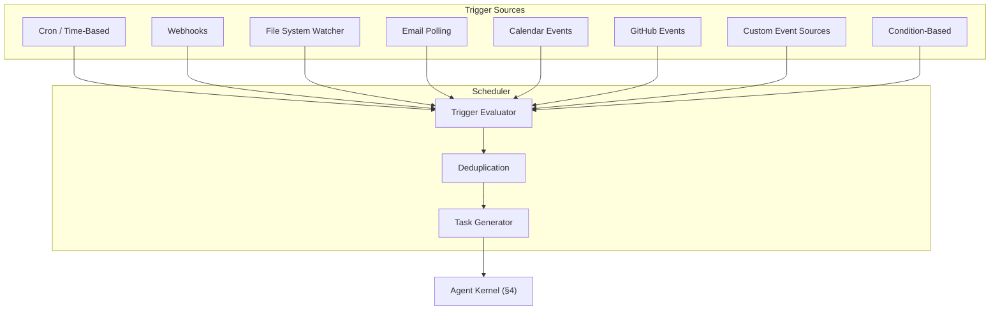

# §13 — Scheduler

## 13.1 Purpose

The Scheduler transforms FuckClaw from a reactive assistant into a proactive autonomous agent. It is responsible for triggering tasks based on time, external events, system conditions, and observed patterns — without requiring human prompts.

## 13.2 Trigger Types



### 13.2.1 Trigger Definition

```typescript
interface ScheduleTrigger {
  id: string;
  name: string;
  enabled: boolean;
  
  /** What fires this trigger */
  source: TriggerSource;
  
  /** What task to create when triggered */
  taskTemplate: {
    description: string;
    priority: number;
    budget: Partial<TaskBudget>;
    tags: string[];
  };
  
  /** Condition that must be true (in addition to the source firing) */
  guard?: string;
  
  /** Deduplication: don't fire if an identical task is already running */
  deduplicate: boolean;
  
  /** Maximum concurrent executions of this trigger */
  maxConcurrent: number;
  
  /** Statistics */
  stats: {
    totalFired: number;
    lastFired: number;
    lastResult: 'success' | 'failure' | null;
  };
}

type TriggerSource =
  | { type: 'cron'; expression: string; timezone: string }
  | { type: 'interval'; intervalMs: number }
  | { type: 'webhook'; path: string; method: 'GET' | 'POST'; secret?: string }
  | { type: 'file_watch'; paths: string[]; events: ('create' | 'modify' | 'delete')[] }
  | { type: 'email'; account: string; filter: EmailFilter }
  | { type: 'calendar'; calendarId: string; minutesBefore: number }
  | { type: 'github'; repo: string; events: string[] }
  | { type: 'event_bus'; eventType: string; filter?: Record<string, unknown> }
  | { type: 'condition'; expression: string; checkIntervalMs: number };
```

## 13.3 Built-in Schedules

| Schedule | Trigger | Task | Default Priority |
|---|---|---|---|
| **Memory Consolidation** | Every 4 hours or on idle | Run consolidation daemon (§6.6) | 70 (idle) |
| **Workspace Snapshot** | Daily at 03:00 | Create data/config snapshot (§7.6) | 80 (idle) |
| **Cache Cleanup** | Daily at 04:00 | Evict stale LLM/embedding cache | 90 (idle) |
| **Knowledge Decay** | Weekly | Apply Ebbinghaus decay to episodic memories (§6.5) | 75 (idle) |
| **Health Check** | Every 5 minutes | Verify provider connectivity, DB integrity | 60 (low) |
| **Dreaming Cycle** | After 2h idle | Run associative synthesis (§6.6.2) | 85 (idle) |
| **Log Rotation** | Daily at 00:00 | Rotate and compress log files | 90 (idle) |

## 13.4 Webhook Server

The Scheduler exposes HTTP endpoints for external triggers:

```typescript
// Webhook registration creates a unique endpoint:
// POST /api/webhooks/:triggerId

// Example: GitHub webhook
app.post('/api/webhooks/gh_pr_review', async (req, res) => {
  const trigger = scheduler.getTrigger('gh_pr_review');
  
  // Verify webhook signature
  if (trigger.source.secret) {
    const valid = verifySignature(req.headers['x-hub-signature-256'], req.body, trigger.source.secret);
    if (!valid) return res.status(401).send('Invalid signature');
  }
  
  // Emit event to event bus
  eventBus.emit('scheduler.webhook.received', {
    triggerId: trigger.id,
    payload: req.body,
    headers: req.headers,
  });
  
  // Create task
  const task = await kernel.submitTask({
    description: trigger.taskTemplate.description,
    source: { type: 'schedule', scheduleId: trigger.id, scheduleName: trigger.name },
    priority: trigger.taskTemplate.priority,
    context: { webhookPayload: req.body },
  });
  
  res.status(200).json({ taskId: task.id });
});
```

## 13.5 File Watching

```typescript
class FileWatcherTrigger {
  private watcher: FSWatcher;
  
  async start(trigger: ScheduleTrigger & { source: { type: 'file_watch' } }): Promise<void> {
    this.watcher = chokidar.watch(trigger.source.paths, {
      persistent: true,
      ignoreInitial: true,
      // Debounce: don't fire for every save in rapid succession
      awaitWriteFinish: { stabilityThreshold: 1000, pollInterval: 100 },
      ignored: ['**/node_modules/**', '**/.git/**', '**/dist/**'],
    });
    
    const handler = debounce((eventType: string, path: string) => {
      if (trigger.source.events.includes(eventType as any)) {
        eventBus.emit('scheduler.file.changed', {
          triggerId: trigger.id,
          eventType,
          path,
          timestamp: Date.now(),
        });
      }
    }, 2000); // 2-second debounce
    
    this.watcher.on('add', (path) => handler('create', path));
    this.watcher.on('change', (path) => handler('modify', path));
    this.watcher.on('unlink', (path) => handler('delete', path));
  }
}
```

## 13.6 Cron Engine

Uses `cron-parser` for expression parsing and a tick-based evaluation loop:

```typescript
class CronEngine {
  private schedules: Map<string, { trigger: ScheduleTrigger; nextRun: Date }> = new Map();
  
  async tick(): Promise<void> {
    const now = new Date();
    
    for (const [id, entry] of this.schedules) {
      if (!entry.trigger.enabled) continue;
      if (now >= entry.nextRun) {
        // Fire!
        await this.fire(entry.trigger);
        
        // Calculate next run
        const interval = cronParser.parseExpression(entry.trigger.source.expression, {
          currentDate: now,
          tz: entry.trigger.source.timezone,
        });
        entry.nextRun = interval.next().toDate();
      }
    }
  }
}
```

## 13.7 Persistence

Schedules are persisted so they survive restarts:

```sql
CREATE TABLE schedules (
    id TEXT PRIMARY KEY,
    name TEXT NOT NULL,
    enabled INTEGER NOT NULL DEFAULT 1,
    trigger_json TEXT NOT NULL,
    task_template_json TEXT NOT NULL,
    guard_expression TEXT,
    deduplicate INTEGER NOT NULL DEFAULT 1,
    max_concurrent INTEGER NOT NULL DEFAULT 1,
    total_fired INTEGER NOT NULL DEFAULT 0,
    last_fired_at INTEGER,
    last_result TEXT,
    created_at INTEGER NOT NULL,
    updated_at INTEGER NOT NULL
);

CREATE TABLE schedule_history (
    id TEXT PRIMARY KEY,
    schedule_id TEXT NOT NULL REFERENCES schedules(id),
    fired_at INTEGER NOT NULL,
    task_id TEXT,
    result TEXT,  -- 'success', 'failure', 'skipped'
    error_message TEXT
);
```

## 13.8 Interfaces

```typescript
export interface IScheduler {
  /** Create a new scheduled trigger */
  create(trigger: Omit<ScheduleTrigger, 'id' | 'stats'>): Promise<ScheduleTrigger>;
  
  /** Enable/disable a trigger */
  setEnabled(triggerId: string, enabled: boolean): Promise<void>;
  
  /** Delete a trigger */
  delete(triggerId: string): Promise<void>;
  
  /** List all triggers */
  list(filter?: { enabled?: boolean; type?: string }): ScheduleTrigger[];
  
  /** Get trigger execution history */
  history(triggerId: string, limit?: number): Promise<ScheduleHistoryEntry[]>;
  
  /** Manually fire a trigger (for testing) */
  fireManually(triggerId: string): Promise<string>;
  
  /** Get next scheduled execution times */
  upcoming(limit?: number): Promise<{ trigger: ScheduleTrigger; nextRun: Date }[]>;
}
```

## 13.9 Failure Modes

| Failure | Impact | Mitigation |
|---|---|---|
| Cron fires during heavy load | Resource contention | Priority system ensures user tasks preempt cron tasks |
| Webhook flood (DDoS) | System overwhelmed | Rate limiting per trigger (max 60/min); deduplication |
| File watcher exhausts inotify handles | No more file events | Limit watched paths; fallback to polling |
| Missed cron tick (system was down) | Scheduled task not run | On boot, check for missed triggers and fire catch-up tasks |
| Infinite trigger loop | System overwhelmed | Max fire rate per trigger; circuit breaker after 10 fires/minute |

## 13.10 Future Improvements

1. **Smart scheduling**: Learn operator's active hours and schedule background tasks during off-hours
2. **Predictive triggers**: Fire tasks proactively based on predicted events (e.g., "deploy is likely needed tomorrow based on commit velocity")
3. **Calendar integration**: Deep iCal/Google Calendar integration for meeting preparation, agenda generation
4. **Email triage**: Auto-categorize and draft responses to incoming emails
5. **RSS/Atom feeds**: Monitor technical blogs and news feeds for relevant updates
