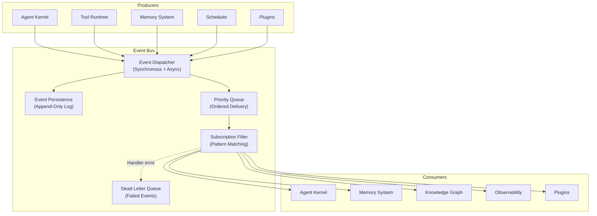

# §14 — Event Bus

## 14.1 Purpose

The Event Bus is the nervous system of FuckClaw — the internal communication backbone that decouples all subsystems. No module calls another module's methods directly. Instead, modules emit events and subscribe to events they care about.

**Why not direct function calls?**

1. **Loose coupling**: The Memory System does not import the Knowledge Graph. It emits `memory.consolidated` events; the Knowledge Graph subscribes and updates itself. Either can be replaced independently.
2. **Auditability**: Every event is logged, creating a complete causal history of everything that happened in the system.
3. **Extensibility**: Plugins can subscribe to any event without modifying core modules.
4. **Replay**: The event log enables replaying system behavior for debugging.
5. **Reactive composition**: New behaviors emerge from combining existing event streams.

## 14.2 Architecture



## 14.3 Event Schema

```typescript
interface SystemEvent {
  /** Globally unique event ID (ULID — time-sortable) */
  id: string;
  
  /** Hierarchical event type (dot-separated namespace) */
  type: string;
  
  /** Event payload */
  data: Record<string, unknown>;
  
  /** Source module that emitted this event */
  source: string;
  
  /** Correlation ID (links related events across a task execution) */
  correlationId?: string;
  
  /** Causation ID (the event that caused this one) */
  causationId?: string;
  
  /** Priority (0 = highest) */
  priority: EventPriority;
  
  /** Timestamp */
  timestamp: number;
  
  /** Metadata */
  metadata?: Record<string, string>;
}

enum EventPriority {
  CRITICAL = 0,   // System errors, shutdown signals
  HIGH = 10,      // User-initiated actions, task completions
  NORMAL = 20,    // Standard operational events
  LOW = 30,       // Background operations, metrics
  DEBUG = 40,     // Verbose debugging events (may be filtered)
}
```

## 14.4 Event Type Taxonomy

Events follow a hierarchical naming convention: `{module}.{entity}.{action}`.

| Event Type | Source | Description |
|---|---|---|
| `kernel.state.changed` | Agent Kernel | Kernel state machine transition |
| `kernel.task.created` | Agent Kernel | New task submitted |
| `kernel.task.completed` | Agent Kernel | Task finished (success or failure) |
| `kernel.task.state_changed` | Agent Kernel | Task state transition |
| `tool.execution.started` | Tool Runtime | Tool invocation began |
| `tool.execution.completed` | Tool Runtime | Tool invocation finished |
| `tool.execution.error` | Tool Runtime | Tool invocation failed |
| `memory.episode.created` | Memory System | New episodic memory recorded |
| `memory.consolidation.started` | Memory System | Consolidation cycle began |
| `memory.consolidation.completed` | Memory System | Consolidation cycle finished |
| `memory.fact.asserted` | Memory System | New semantic fact stored |
| `memory.fact.retracted` | Memory System | Semantic fact invalidated |
| `knowledge.entity.created` | Knowledge Graph | New entity added |
| `knowledge.entity.merged` | Knowledge Graph | Entities merged |
| `knowledge.relationship.created` | Knowledge Graph | New relationship added |
| `scheduler.trigger.fired` | Scheduler | Scheduled trigger activated |
| `scheduler.webhook.received` | Scheduler | External webhook received |
| `llm.request.started` | LLM Router | LLM API call initiated |
| `llm.request.completed` | LLM Router | LLM API call finished |
| `llm.cost.recorded` | LLM Router | Cost entry logged |
| `reasoning.step.completed` | Reasoning Engine | One reasoning step finished |
| `reasoning.reflection.triggered` | Reasoning Engine | Self-reflection initiated |
| `skill.execution.started` | Skill Engine | Skill invocation began |
| `skill.pattern.detected` | Skill Engine | New pattern candidate found |
| `plugin.loaded` | Plugin System | Plugin initialized |
| `plugin.error` | Plugin System | Plugin threw an error |
| `workspace.file.changed` | Workspace | File system change detected |
| `system.ready` | Kernel | System fully initialized |
| `system.shutdown` | Kernel | Graceful shutdown initiated |
| `system.error` | Any | Unhandled error |

## 14.5 Subscription Model

```typescript
interface EventSubscription {
  /** Subscriber identifier */
  subscriberId: string;
  
  /** Event type pattern (supports wildcards) */
  pattern: string;  // e.g., "tool.execution.*", "memory.*", "kernel.task.completed"
  
  /** Handler function */
  handler: (event: SystemEvent) => Promise<void>;
  
  /** Should this handler block the event pipeline? */
  blocking: boolean;  // true = synchronous, false = fire-and-forget
  
  /** Maximum handler execution time */
  timeoutMs: number;
  
  /** Filter: only receive events matching this predicate */
  filter?: (event: SystemEvent) => boolean;
  
  /** Priority: lower = called first */
  priority: number;
}

// Pattern matching examples:
// "tool.execution.completed" — exact match
// "tool.execution.*"         — all tool execution events
// "tool.*"                   — all tool events
// "*.error"                  — all error events from any module
// "*"                        — all events (use sparingly)
```

### 14.5.1 Registration API

```typescript
class EventBus {
  subscribe(subscription: EventSubscription): () => void; // Returns unsubscribe function
  
  emit(event: Omit<SystemEvent, 'id' | 'timestamp'>): string; // Returns event ID
  
  // Convenience methods
  on(pattern: string, handler: (event: SystemEvent) => Promise<void>): () => void;
  once(pattern: string, handler: (event: SystemEvent) => Promise<void>): () => void;
  
  // Query persisted events
  query(filter: EventQuery): Promise<SystemEvent[]>;
  
  // Replay events from a point in time
  replay(fromEventId: string, toEventId?: string): AsyncIterable<SystemEvent>;
}
```

## 14.6 Event Persistence

All events are persisted to an append-only log in SQLite:

```sql
CREATE TABLE events (
    id TEXT PRIMARY KEY,           -- ULID
    type TEXT NOT NULL,
    data_json TEXT NOT NULL,
    source TEXT NOT NULL,
    correlation_id TEXT,
    causation_id TEXT,
    priority INTEGER NOT NULL DEFAULT 20,
    timestamp INTEGER NOT NULL,
    metadata_json TEXT
);

CREATE INDEX idx_events_type ON events(type, timestamp DESC);
CREATE INDEX idx_events_correlation ON events(correlation_id);
CREATE INDEX idx_events_timestamp ON events(timestamp DESC);
CREATE INDEX idx_events_source ON events(source, timestamp DESC);
```

### 14.6.1 Retention Policy

| Event Priority | Retention | Rationale |
|---|---|---|
| CRITICAL | Indefinite | System errors must be auditable forever |
| HIGH | 90 days | User-initiated actions are important history |
| NORMAL | 30 days | Operational events compress well |
| LOW | 7 days | Background operations are transient |
| DEBUG | 24 hours | Verbose debugging is ephemeral |

A background job runs daily to purge events beyond their retention window.

## 14.7 Dead Letter Queue

When a handler throws an error or times out, the event is moved to the Dead Letter Queue (DLQ):

```typescript
interface DeadLetterEntry {
  event: SystemEvent;
  subscriberId: string;
  error: string;
  failedAt: number;
  retryCount: number;
  maxRetries: number;  // default: 3
}
```

DLQ entries are retried with exponential backoff (1s, 4s, 16s). After max retries, the entry is logged and discarded.

## 14.8 Dispatch Semantics

The Event Bus supports two dispatch modes:

1. **Blocking (synchronous)**: The `emit()` call waits for all blocking subscribers to complete before returning. Used when event ordering matters (e.g., checkpoint events must complete before shutdown proceeds).

2. **Non-blocking (asynchronous)**: The `emit()` call returns immediately. Handlers are queued and executed in priority order. Used for most events.

```typescript
async emit(event: SystemEvent): Promise<void> {
  // Persist event
  await this.persistEvent(event);
  
  // Find matching subscriptions
  const subs = this.matchSubscriptions(event.type);
  
  // Execute blocking subscribers first (in priority order)
  const blockingSubs = subs.filter(s => s.blocking).sort((a, b) => a.priority - b.priority);
  for (const sub of blockingSubs) {
    try {
      await withTimeout(sub.handler(event), sub.timeoutMs);
    } catch (error) {
      await this.sendToDeadLetter(event, sub, error);
    }
  }
  
  // Queue non-blocking subscribers
  const asyncSubs = subs.filter(s => !s.blocking);
  for (const sub of asyncSubs) {
    this.asyncQueue.push({ event, subscription: sub });
  }
}
```

## 14.9 Failure Modes

| Failure | Impact | Mitigation |
|---|---|---|
| Handler throws error | Event not processed by that subscriber | Dead Letter Queue with retry |
| Event flood | Memory pressure, subscriber lag | Backpressure: drop LOW/DEBUG events when queue depth > 10,000 |
| Circular events (A emits B, B emits A) | Infinite loop | Cycle detection via causation chain; max depth of 10 |
| SQLite write bottleneck | Event persistence lag | WAL mode; batch writes (flush every 100ms or 100 events) |
| Subscriber too slow | Blocks pipeline | Timeout enforcement; auto-demote to non-blocking after 3 timeouts |

## 14.10 Future Improvements

1. **Event sourcing**: Full event-sourcing architecture where system state is reconstructable from the event log
2. **Complex event processing (CEP)**: Pattern matching over event streams (e.g., "if 3 tool failures within 1 minute, trigger circuit breaker")
3. **External event bridge**: Publish events to external systems (webhooks, Kafka, NATS) for integration
4. **Event schema registry**: Formal schema definitions for each event type with validation
5. **Time-travel debugging**: Replay events from any point in time to reproduce system behavior
