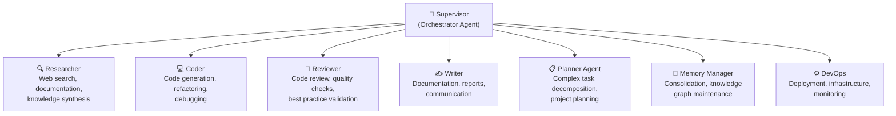
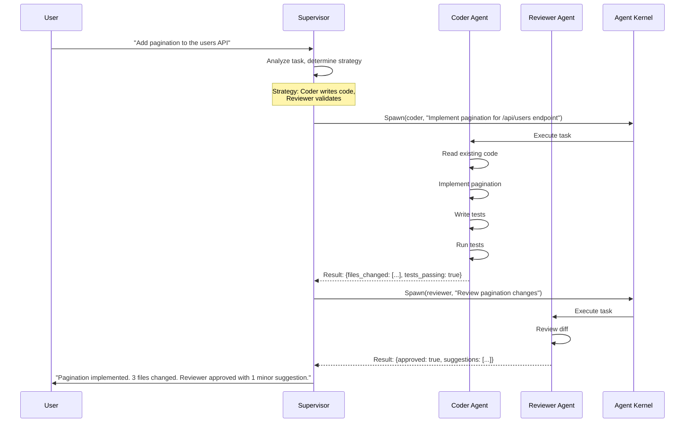

# §15 — Multi-Agent Architecture

## 15.1 Purpose

FuckClaw is not a single monolithic agent. It is an **agent supervisor** that orchestrates a pool of specialized agents, each optimized for a specific cognitive role. The supervisor delegates sub-tasks to the best-suited agent, manages inter-agent communication, and synthesizes results.

**Why multi-agent instead of one big agent?**

1. **Specialization**: A code reviewer agent has different system prompts, tools, and memory retrieval patterns than a research agent. Specialization improves quality.
2. **Parallelism**: Independent sub-tasks can be delegated to different agents running concurrently (§4.7).
3. **Context isolation**: Each agent gets a focused context window instead of one agent trying to hold everything in context simultaneously.
4. **Cost optimization**: Simple sub-tasks can use cheaper models while complex ones use frontier models.

## 15.2 Agent Roles



### 15.2.1 Agent Specifications

```typescript
interface AgentSpec {
  /** Agent type identifier */
  type: string;
  
  /** Role description */
  role: string;
  
  /** Specialized system prompt */
  systemPrompt: string;
  
  /** Which tools this agent has access to */
  allowedTools: string[] | 'all';
  
  /** Default model tier */
  defaultModelTier: ModelTier;
  
  /** Memory retrieval specialization */
  memoryFocus: {
    /** Which memory types to prioritize */
    priorityTypes: ('episodic' | 'semantic' | 'procedural')[];
    /** Custom retrieval query augmentation */
    retrievalPrompt?: string;
  };
  
  /** Maximum concurrent instances */
  maxInstances: number;
  
  /** Maximum budget per invocation */
  maxBudget: Partial<TaskBudget>;
}

const AGENT_SPECS: Record<string, AgentSpec> = {
  supervisor: {
    type: 'supervisor',
    role: 'Orchestrate task execution, delegate to specialized agents, synthesize results',
    systemPrompt: `You are the Supervisor agent of FuckClaw. Your role is to:
1. Analyze incoming tasks and determine the best execution strategy
2. Delegate sub-tasks to specialized agents
3. Monitor agent progress and handle failures
4. Synthesize results into a coherent response
You do NOT execute tasks directly — you delegate and coordinate.`,
    allowedTools: ['shell', 'filesystem'], // Limited tools — delegates most work
    defaultModelTier: 'standard',
    memoryFocus: { priorityTypes: ['episodic', 'semantic'] },
    maxInstances: 1,
    maxBudget: { maxTokens: 50000, maxCost: 1.0 },
  },
  
  researcher: {
    type: 'researcher',
    role: 'Search the web, read documentation, synthesize research findings',
    systemPrompt: `You are a Research agent. Your role is to:
1. Search the web and documentation for relevant information
2. Read and analyze sources critically
3. Synthesize findings into structured research briefs
4. Cite sources and assess reliability
Always verify claims from multiple sources.`,
    allowedTools: ['search', 'http', 'browser', 'filesystem'],
    defaultModelTier: 'standard',
    memoryFocus: { priorityTypes: ['semantic'], retrievalPrompt: 'research context' },
    maxInstances: 3,
    maxBudget: { maxTokens: 100000, maxCost: 2.0 },
  },
  
  coder: {
    type: 'coder',
    role: 'Write, modify, debug, and refactor code',
    systemPrompt: `You are a Coder agent. Your role is to:
1. Write clean, tested, production-quality code
2. Debug issues by analyzing errors and tracing code paths
3. Refactor code for clarity and performance
4. Follow project conventions discovered from existing code
Always run tests after changes.`,
    allowedTools: 'all',
    defaultModelTier: 'standard',
    memoryFocus: { priorityTypes: ['procedural', 'semantic'] },
    maxInstances: 2,
    maxBudget: { maxTokens: 200000, maxCost: 5.0 },
  },
  
  reviewer: {
    type: 'reviewer',
    role: 'Review code, documents, and plans for quality and correctness',
    systemPrompt: `You are a Reviewer agent. Your role is to:
1. Critically evaluate code changes for bugs, style, and security
2. Check for known anti-patterns from project history
3. Verify test coverage and edge cases
4. Provide actionable feedback with specific suggestions
Be thorough but constructive.`,
    allowedTools: ['filesystem', 'git', 'shell'],
    defaultModelTier: 'standard',
    memoryFocus: { priorityTypes: ['semantic', 'procedural'] },
    maxInstances: 2,
    maxBudget: { maxTokens: 80000, maxCost: 1.0 },
  },
  
  memory_manager: {
    type: 'memory_manager',
    role: 'Maintain and optimize the memory and knowledge systems',
    systemPrompt: `You are the Memory Manager agent. Your role is to:
1. Consolidate episodic memories into semantic and procedural knowledge
2. Maintain the Knowledge Graph — resolve entities, prune stale data
3. Run dreaming cycles to discover cross-domain connections
4. Optimize memory retrieval quality
You operate in the background during idle periods.`,
    allowedTools: ['filesystem'],
    defaultModelTier: 'fast',
    memoryFocus: { priorityTypes: ['episodic', 'semantic', 'procedural'] },
    maxInstances: 1,
    maxBudget: { maxTokens: 50000, maxCost: 0.5 },
  },
};
```

## 15.3 Delegation Protocol

### 15.3.1 Delegation Flow



### 15.3.2 Delegation Data Structure

```typescript
interface AgentDelegation {
  /** Unique delegation ID */
  id: string;
  
  /** Parent task ID */
  parentTaskId: string;
  
  /** Agent type to delegate to */
  agentType: string;
  
  /** Task description for the agent */
  task: string;
  
  /** Input context to provide */
  context: {
    /** Relevant files */
    files?: string[];
    /** Relevant memory records */
    memoryIds?: string[];
    /** Custom context data */
    data?: Record<string, unknown>;
  };
  
  /** Expected output format */
  expectedOutput?: {
    schema?: JSONSchema;
    description?: string;
  };
  
  /** Resource budget */
  budget: Partial<TaskBudget>;
  
  /** Timeout */
  timeoutMs: number;
  
  /** Result */
  result?: AgentResult;
  
  /** State */
  state: 'pending' | 'executing' | 'completed' | 'failed' | 'cancelled';
}

interface AgentResult {
  success: boolean;
  output: string;
  structuredData?: Record<string, unknown>;
  artifacts?: ArtifactReference[];
  tokensUsed: number;
  costUsd: number;
  durationMs: number;
}
```

## 15.4 Inter-Agent Communication

Agents communicate through the Event Bus (§14), not direct messaging:

```typescript
// Coder agent emits progress events
eventBus.emit({
  type: 'agent.coder.progress',
  source: 'coder',
  correlationId: delegationId,
  data: {
    phase: 'testing',
    message: 'Running test suite',
    progress: { current: 3, total: 5 },
  },
});

// Supervisor subscribes to agent events
eventBus.on('agent.*.progress', async (event) => {
  // Update task tracking
  // Decide if intervention is needed
});

eventBus.on('agent.*.completed', async (event) => {
  // Collect result, potentially spawn follow-up agents
});
```

## 15.5 Shared Context

Agents within the same task execution share context through:

1. **Working Memory (§6.4.1)**: Agents in the same task can read/write to the task's working memory
2. **Filesystem**: Agents share the workspace filesystem — one agent's file changes are visible to others
3. **Event Bus**: Real-time progress updates via events

**What agents do NOT share**: Each agent has its own LLM context window. Agent A's reasoning trace is not automatically visible to Agent B. The Supervisor must explicitly pass relevant context between agents.

## 15.6 Concurrency & Resource Management

```typescript
class AgentPool {
  private instances: Map<string, AgentInstance[]> = new Map();
  
  async spawn(agentType: string, delegation: AgentDelegation): Promise<AgentInstance> {
    const spec = AGENT_SPECS[agentType];
    
    // Check concurrency limit
    const active = this.instances.get(agentType)?.filter(a => a.state === 'executing') ?? [];
    if (active.length >= spec.maxInstances) {
      // Queue until a slot opens
      return this.waitForSlot(agentType, delegation);
    }
    
    // Create agent instance
    const instance: AgentInstance = {
      id: generateULID(),
      spec,
      delegation,
      state: 'executing',
      startedAt: Date.now(),
      reasoningEngine: new ReActExecutor(spec),
    };
    
    this.instances.get(agentType)?.push(instance) ?? this.instances.set(agentType, [instance]);
    
    return instance;
  }
}
```

## 15.7 Interfaces

```typescript
export interface IAgentOrchestrator {
  /** Delegate a task to a specialized agent */
  delegate(delegation: Omit<AgentDelegation, 'id' | 'state'>): Promise<AgentResult>;
  
  /** Delegate multiple tasks in parallel */
  delegateParallel(delegations: Omit<AgentDelegation, 'id' | 'state'>[]): Promise<AgentResult[]>;
  
  /** Get the status of a delegation */
  status(delegationId: string): AgentDelegation | null;
  
  /** Cancel a delegation */
  cancel(delegationId: string): Promise<void>;
  
  /** List active agents */
  listActive(): AgentInstance[];
  
  /** Register a custom agent type */
  registerAgentType(spec: AgentSpec): void;
}
```

## 15.8 Failure Modes

| Failure | Impact | Mitigation |
|---|---|---|
| Agent exceeds budget | Runaway cost | Hard budget enforcement; abort agent on budget breach |
| Agent deadlock (waiting for resource held by another agent) | Task hangs | Deadlock detection via resource lock graph; timeout breaks deadlock |
| Supervisor delegates to wrong agent type | Sub-optimal execution | Strategy review step; let agent self-report if task mismatches its role |
| Agent produces incorrect result | Bad output propagates | Reviewer agent validates Coder agent output; Supervisor cross-checks |
| All instances of an agent type are busy | Delegation queued | Priority queue with aging; max queue depth with rejection |

## 15.9 Future Improvements

1. **Agent self-creation**: The Supervisor creates new specialized agent types on-the-fly for novel task categories
2. **Agent reputation system**: Track per-agent success rates and route to higher-performing agents
3. **Debate protocol**: Two agents argue opposing positions; Supervisor synthesizes the best conclusion
4. **Agent specialization learning**: Agents fine-tune their system prompts based on task feedback
5. **External agent integration**: Delegate to remote agents running on other machines via MCP or HTTP
