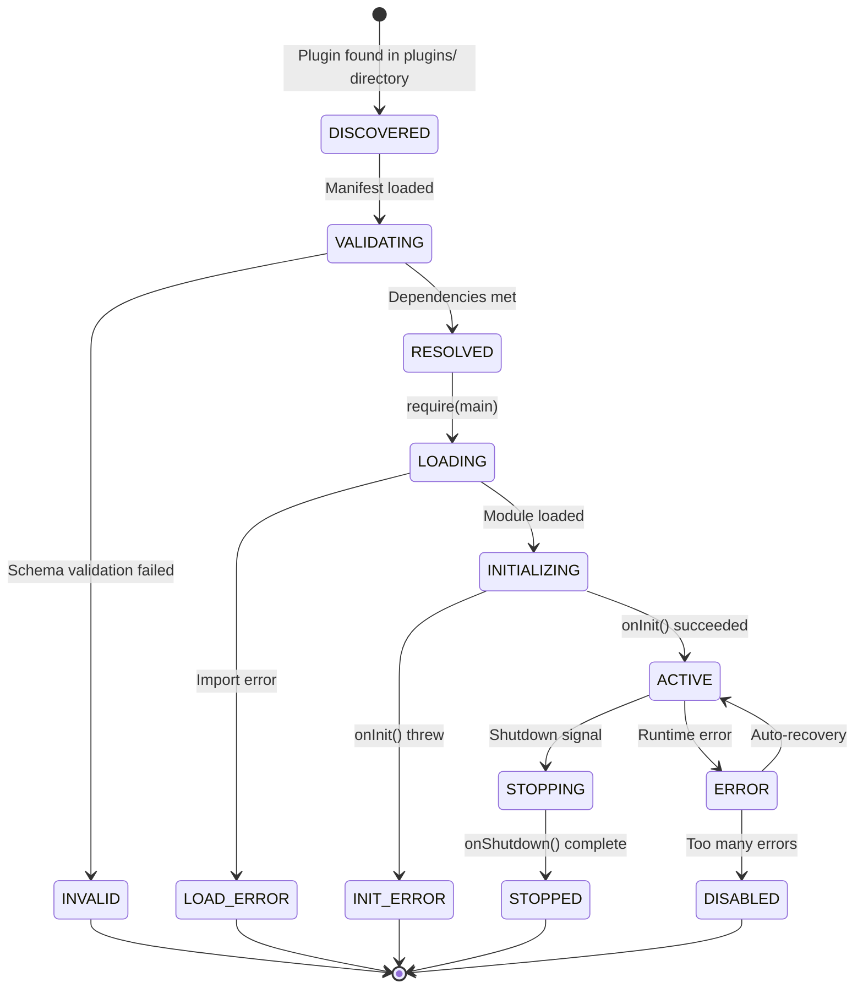

# §16 — Plugin System

## 16.1 Purpose

The Plugin System enables third-party and operator-defined extensions to FuckClaw without modifying core code. Plugins can add tools, skills, memory backends, LLM providers, event handlers, UI components, and scheduler triggers.

## 16.2 Plugin Manifest

Every plugin is a directory containing a `plugin.json` manifest:

```typescript
interface PluginManifest {
  /** Unique plugin identifier (npm-style naming) */
  id: string;  // e.g., "fuckclaw-plugin-github"
  
  /** Display name */
  name: string;
  
  /** Version (semver) */
  version: string;
  
  /** Description */
  description: string;
  
  /** Author */
  author: { name: string; email?: string; url?: string };
  
  /** Entry point (relative to plugin directory) */
  main: string;  // e.g., "dist/index.js"
  
  /** What this plugin provides */
  capabilities: PluginCapability[];
  
  /** What this plugin requires from FuckClaw */
  requirements: {
    /** Minimum FuckClaw version */
    minVersion: string;
    /** Required core tools */
    tools?: string[];
    /** Required other plugins */
    plugins?: string[];
  };
  
  /** Configuration schema */
  configSchema?: JSONSchema;
  
  /** Lifecycle hooks */
  hooks?: string[];  // e.g., ['onInit', 'onShutdown', 'onTaskCreated']
}

type PluginCapability =
  | { type: 'tool'; tools: string[] }
  | { type: 'skill'; skills: string[] }
  | { type: 'provider'; providers: string[] }
  | { type: 'memory_backend'; backends: string[] }
  | { type: 'event_handler'; events: string[] }
  | { type: 'scheduler_trigger'; triggers: string[] }
  | { type: 'ui_component'; components: string[] };
```

## 16.3 Plugin SDK

Plugins are written against a stable SDK interface:

```typescript
// @fuckclaw/plugin-sdk

export interface PluginContext {
  /** Plugin configuration (validated against configSchema) */
  config: Record<string, unknown>;
  
  /** Event bus for emitting/subscribing */
  eventBus: IEventBus;
  
  /** Tool registry for registering new tools */
  toolRegistry: IToolRegistry;
  
  /** Skill engine for registering skills */
  skillEngine: ISkillEngine;
  
  /** Memory system for custom queries */
  memory: IMemorySystem;
  
  /** Knowledge graph for entity operations */
  knowledgeGraph: IKnowledgeGraph;
  
  /** Logger */
  logger: ILogger;
  
  /** Plugin data directory (for plugin-specific state) */
  dataDir: string;
}

export interface Plugin {
  /** Called when plugin is loaded */
  onInit(ctx: PluginContext): Promise<void>;
  
  /** Called on graceful shutdown */
  onShutdown?(ctx: PluginContext): Promise<void>;
  
  /** Called when a task is created (optional hook) */
  onTaskCreated?(task: Task, ctx: PluginContext): Promise<void>;
  
  /** Called when a task completes (optional hook) */
  onTaskCompleted?(task: Task, result: TaskResult, ctx: PluginContext): Promise<void>;
  
  /** Health check */
  healthCheck?(ctx: PluginContext): Promise<{ healthy: boolean; message?: string }>;
}
```

### 16.3.1 Example Plugin: GitHub Integration

```typescript
// plugins/fuckclaw-plugin-github/src/index.ts
import type { Plugin, PluginContext } from '@fuckclaw/plugin-sdk';

const githubPlugin: Plugin = {
  async onInit(ctx) {
    const token = ctx.config.githubToken as string;
    
    // Register tools
    ctx.toolRegistry.register({
      name: 'github_create_issue',
      description: 'Create a GitHub issue',
      inputSchema: {
        type: 'object',
        properties: {
          repo: { type: 'string' },
          title: { type: 'string' },
          body: { type: 'string' },
          labels: { type: 'array', items: { type: 'string' } },
        },
        required: ['repo', 'title'],
      },
      source: { type: 'plugin', pluginId: 'fuckclaw-plugin-github' },
      characteristics: { mutates: true, concurrency: 'unlimited', streaming: false, /* ... */ },
      execute: async (params) => {
        const response = await fetch(`https://api.github.com/repos/${params.repo}/issues`, {
          method: 'POST',
          headers: { Authorization: `token ${token}`, 'Content-Type': 'application/json' },
          body: JSON.stringify({ title: params.title, body: params.body, labels: params.labels }),
        });
        const issue = await response.json();
        return { success: response.ok, output: `Created issue #${issue.number}: ${issue.html_url}`, metadata: { durationMs: 0 } };
      },
    });
    
    // Subscribe to webhook events
    ctx.eventBus.on('scheduler.webhook.received', async (event) => {
      if (event.data.triggerId?.toString().startsWith('gh_')) {
        ctx.logger.info('GitHub webhook received', event.data);
      }
    });
  },
};

export default githubPlugin;
```

## 16.4 Plugin Lifecycle



## 16.5 Plugin Discovery & Installation

```bash
# Discovery: scan plugins directory
~/.fuckclaw/plugins/
├── registry/
│   ├── fuckclaw-plugin-github/
│   │   ├── plugin.json
│   │   ├── dist/
│   │   │   └── index.js
│   │   └── node_modules/
│   └── fuckclaw-plugin-slack/
│       └── ...
└── enabled/
    ├── fuckclaw-plugin-github -> ../registry/fuckclaw-plugin-github
    └── fuckclaw-plugin-slack -> ../registry/fuckclaw-plugin-slack

# Installation via CLI
fuckclaw plugin install fuckclaw-plugin-github
fuckclaw plugin enable fuckclaw-plugin-github
fuckclaw plugin disable fuckclaw-plugin-github
fuckclaw plugin list
```

## 16.6 Dependency Injection

Plugins receive dependencies through the `PluginContext` object — they never import core modules directly. This:

1. Ensures API stability (context interface is versioned)
2. Prevents plugins from accessing internal state
3. Enables testing with mock contexts
4. Allows the core to evolve without breaking plugins

## 16.7 Plugin Marketplace

| Feature | Description |
|---|---|
| **Registry** | HTTPS registry hosting plugin manifests and tarballs |
| **Search** | Full-text search over plugin names, descriptions, tags |
| **Versioning** | Semver with compatibility ranges |
| **Reviews** | Community ratings and reviews |
| **Security scan** | Automated static analysis of plugin code before listing |
| **Auto-update** | Background check for plugin updates; apply with operator consent |

## 16.8 Interfaces

```typescript
export interface IPluginSystem {
  /** Discover plugins in the plugins directory */
  discover(): Promise<PluginManifest[]>;
  
  /** Load and initialize a plugin */
  load(pluginId: string): Promise<void>;
  
  /** Unload a plugin */
  unload(pluginId: string): Promise<void>;
  
  /** Enable a plugin */
  enable(pluginId: string): Promise<void>;
  
  /** Disable a plugin */
  disable(pluginId: string): Promise<void>;
  
  /** Install from marketplace */
  install(pluginId: string, version?: string): Promise<void>;
  
  /** List loaded plugins */
  list(): PluginStatus[];
  
  /** Get plugin health */
  health(pluginId: string): Promise<{ healthy: boolean; message?: string }>;
}

interface PluginStatus {
  manifest: PluginManifest;
  state: 'active' | 'disabled' | 'error' | 'loading';
  loadedAt?: number;
  errorCount: number;
  lastError?: string;
}
```

## 16.9 Failure Modes

| Failure | Impact | Mitigation |
|---|---|---|
| Plugin crashes during init | Plugin not loaded | Catch error, mark as INIT_ERROR, continue without plugin |
| Plugin event handler throws | Event delivery interrupted | Error boundary per handler; DLQ (§14.7) |
| Plugin causes memory leak | System degradation | Per-plugin heap monitoring; auto-disable after threshold |
| Malicious plugin | System compromise | Code scanning before marketplace listing; operator reviews |
| Plugin dependency conflict | Load failure | Isolated `node_modules` per plugin; no shared dependency tree |

## 16.10 Future Improvements

1. **Plugin sandboxing**: Run plugins in isolated V8 contexts or worker threads for safety
2. **Hot reload**: Reload plugin code without restarting the kernel
3. **Plugin marketplace UI**: Browse, install, and configure plugins from the web dashboard
4. **Plugin analytics**: Usage statistics, performance metrics per plugin
5. **Plugin composition**: Plugins that depend on and extend other plugins
