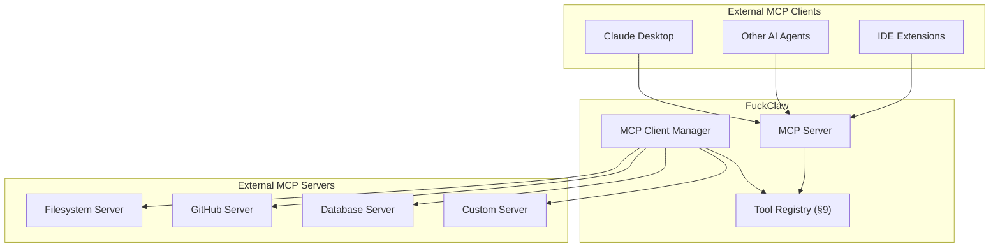
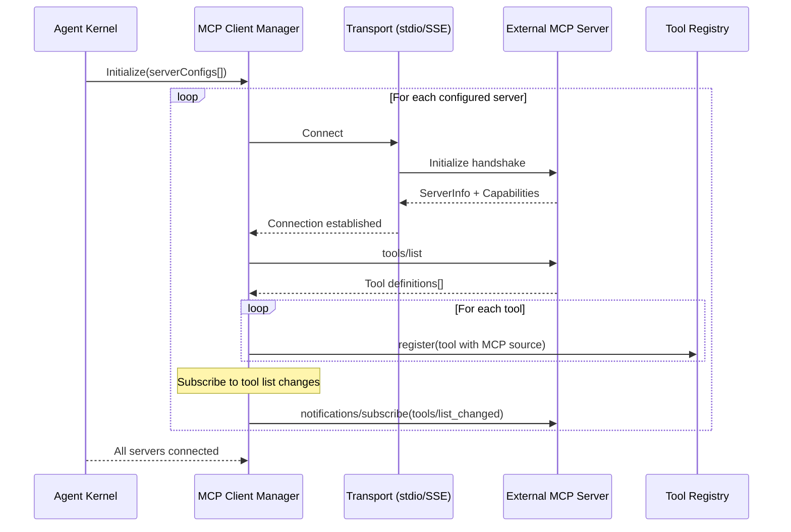

# §17 — MCP Integration

## 17.1 Purpose

The Model Context Protocol (MCP) is an open standard for connecting AI agents to external tools and data sources. FuckClaw implements both an **MCP Client** (consuming tools from external MCP servers) and an **MCP Server** (exposing FuckClaw's capabilities to other agents).

## 17.2 Architecture



## 17.3 MCP Client

The MCP Client connects to external MCP servers and registers their tools in the Tool Registry.

### 17.3.1 Server Configuration

```typescript
interface MCPServerConfig {
  /** Server identifier */
  id: string;
  
  /** Display name */
  name: string;
  
  /** Transport type */
  transport: MCPTransport;
  
  /** Auto-connect on boot? */
  autoConnect: boolean;
  
  /** Reconnect on disconnect? */
  autoReconnect: boolean;
  
  /** Maximum reconnect attempts */
  maxReconnectAttempts: number;
  
  /** Tool name prefix (avoid collisions) */
  toolPrefix?: string;  // e.g., "github_" → tools become "github_create_issue"
  
  /** Environment variables to pass to stdio servers */
  env?: Record<string, string>;
}

type MCPTransport =
  | { type: 'stdio'; command: string; args: string[] }
  | { type: 'sse'; url: string; headers?: Record<string, string> }
  | { type: 'streamable_http'; url: string; headers?: Record<string, string> };
```

### 17.3.2 Client Lifecycle



### 17.3.3 Tool Invocation via MCP

When the Reasoning Engine (§11) invokes an MCP-sourced tool:

```typescript
async function executeMCPTool(
  serverConfig: MCPServerConfig,
  toolName: string,
  args: Record<string, unknown>,
): Promise<ToolResult> {
  const client = this.connections.get(serverConfig.id);
  if (!client) throw new Error(`MCP server ${serverConfig.id} not connected`);
  
  const result = await client.callTool({
    name: toolName,
    arguments: args,
  });
  
  // Normalize MCP result to FuckClaw ToolResult
  return {
    success: !result.isError,
    output: result.content
      .filter(c => c.type === 'text')
      .map(c => c.text)
      .join('\n'),
    data: result.content.find(c => c.type === 'resource')?.resource,
    error: result.isError ? {
      code: 'MCP_ERROR',
      message: result.content.map(c => c.text).join('\n'),
      category: 'internal',
      retryable: true,
    } : undefined,
    metadata: { durationMs: 0 },
  };
}
```

## 17.4 MCP Server

FuckClaw can also act as an MCP server, exposing its tools, knowledge, and memory to external clients.

### 17.4.1 Exposed Capabilities

```typescript
const fcServer = new MCPServer({
  name: 'fuckclaw',
  version: '1.0.0',
  capabilities: {
    tools: { listChanged: true },
    resources: { subscribe: true, listChanged: true },
    prompts: {},
  },
});

// Expose FuckClaw tools as MCP tools
fcServer.setRequestHandler('tools/list', async () => {
  const tools = toolRegistry.list()
    .filter(t => t.source.type === 'native') // Only expose native tools
    .map(t => ({
      name: `fc_${t.name}`,
      description: t.description,
      inputSchema: t.inputSchema,
    }));
  
  return { tools };
});

// Expose knowledge as MCP resources
fcServer.setRequestHandler('resources/list', async () => {
  const projects = await workspace.listProjects();
  const resources = projects.map(p => ({
    uri: `fuckclaw://projects/${p.id}`,
    name: p.name,
    description: `Project: ${p.name} (${p.language})`,
    mimeType: 'application/json',
  }));
  
  return { resources };
});

// Expose memory search as MCP prompts
fcServer.setRequestHandler('prompts/list', async () => ({
  prompts: [{
    name: 'memory_search',
    description: 'Search FuckClaw memory for relevant context',
    arguments: [{ name: 'query', description: 'Search query', required: true }],
  }],
}));
```

### 17.4.2 Server Transport Configuration

```toml
# In fuckclaw.toml
[mcp.server]
enabled = true

# Stdio (for Claude Desktop integration)
[mcp.server.stdio]
enabled = true

# SSE/HTTP (for network access)
[mcp.server.http]
enabled = true
port = 3142
path = "/mcp"
```

## 17.5 Discovery

### 17.5.1 Automatic Server Discovery

FuckClaw can discover MCP servers from multiple sources:

```typescript
async function discoverMCPServers(): Promise<MCPServerConfig[]> {
  const servers: MCPServerConfig[] = [];
  
  // 1. From fuckclaw.toml config
  servers.push(...config.mcp.servers);
  
  // 2. From Claude Desktop config (if present)
  const claudeConfig = await readClaudeDesktopConfig();
  if (claudeConfig?.mcpServers) {
    for (const [name, serverDef] of Object.entries(claudeConfig.mcpServers)) {
      servers.push({
        id: `claude_${name}`,
        name,
        transport: { type: 'stdio', command: serverDef.command, args: serverDef.args },
        autoConnect: true,
        autoReconnect: true,
        maxReconnectAttempts: 5,
        env: serverDef.env,
      });
    }
  }
  
  // 3. From installed plugins that provide MCP servers
  const plugins = pluginSystem.list().filter(p =>
    p.manifest.capabilities.some(c => c.type === 'tool' && c.tools.includes('mcp'))
  );
  
  return servers;
}
```

## 17.6 Interfaces

```typescript
export interface IMCPManager {
  /** Connect to an MCP server */
  connect(config: MCPServerConfig): Promise<void>;
  
  /** Disconnect from an MCP server */
  disconnect(serverId: string): Promise<void>;
  
  /** List connected servers */
  listServers(): MCPServerStatus[];
  
  /** List tools from a specific server */
  listTools(serverId: string): ToolDefinition[];
  
  /** Start the FuckClaw MCP server */
  startServer(config: MCPServerTransportConfig): Promise<void>;
  
  /** Stop the FuckClaw MCP server */
  stopServer(): Promise<void>;
}

interface MCPServerStatus {
  config: MCPServerConfig;
  state: 'connected' | 'connecting' | 'disconnected' | 'error';
  toolCount: number;
  lastError?: string;
  connectedAt?: number;
}
```

## 17.7 Failure Modes

| Failure | Impact | Mitigation |
|---|---|---|
| MCP server process crashes (stdio) | Tools from that server unavailable | Auto-restart with exponential backoff; graceful degradation |
| Network disconnect (SSE/HTTP) | Tools from that server unavailable | Reconnect with backoff; cache last-known tool list |
| Tool schema mismatch | Tool invocation fails | Schema validation before invocation; report error clearly |
| Server returns invalid MCP response | Parse error | Strict schema validation; error boundary per server |
| Too many MCP servers | Slow tool list, context bloat | Limit exposed tools per server; lazy tool loading |

## 17.8 Future Improvements

1. **MCP server marketplace**: Browse and install community MCP servers from a registry
2. **Dynamic tool filtering**: Only expose relevant MCP tools based on current task context
3. **MCP resource caching**: Cache frequently-accessed MCP resources to reduce latency
4. **MCP sampling support**: Implement the MCP sampling capability for LLM-in-the-loop MCP servers
5. **Federated agent network**: Multiple FuckClaw instances communicating via MCP for distributed task execution
