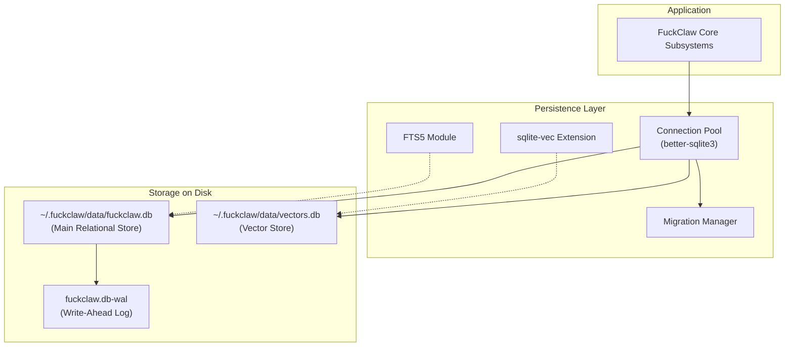

# §20 — Persistence Layer

## 20.1 Purpose

The Persistence Layer manages all persistent state in FuckClaw. It provides ACID transactions, embedded vector storage, full-text search, and relational data modeling through a unified interface.

## 20.2 Storage Engine Architecture

FuckClaw uses **SQLite** as its primary storage engine, supplemented with extensions:



### 20.2.1 Why SQLite?

| Requirement | SQLite Solution |
|---|---|
| Zero operational overhead | Embedded, single-file database |
| ACID guarantees | Write-Ahead Logging (WAL) mode |
| Full-text search | Native FTS5 module |
| Vector similarity search | `sqlite-vec` extension (cosine, L2, dot product) |
| High concurrency | Multiple concurrent readers, serialized writes |
| Low latency | In-process C-bindings, zero network latency |

## 20.3 Database Layout

The persistence layer separates relational data and high-dimensional vector embeddings into two database files to optimize cache management and prevent large vector BLOBs from polluting the main relational cache.

### 20.3.1 Main Database (`fuckclaw.db`)

Houses all structured entities, system logs, plans, schedules, and relationships:

- `tasks` & `plans` & `plan_steps` (§4, §5)
- `episodic_memories`, `semantic_memories`, `procedural_memories` (§6)
- `entities`, `relationships`, `entity_history` (§8)
- `schedules`, `schedule_history` (§13)
- `events` (§14)
- `audit_log` (§18)
- `schema_migrations`

### 20.3.2 Vector Database (`vectors.db`)

Houses high-dimensional float arrays managed by `sqlite-vec`:

- `episodic_vec`
- `semantic_vec`
- `procedural_vec`
- `entities_vec`

## 20.4 Connection & Concurrency Model

SQLite's single-writer architecture is managed via a dedicated connection pool:

```typescript
class DatabaseConnectionPool {
  private writer: Database.Database; // Single exclusive writer connection
  private readers: Database.Database[] = []; // Pool of read-only connections
  
  constructor(dbPath: string, maxReaders = 4) {
    // Open write connection
    this.writer = new Database(dbPath, { timeout: 5000 });
    this.configurePragmas(this.writer);
    
    // Open read connections
    for (let i = 0; i < maxReaders; i++) {
      const reader = new Database(dbPath, { readonly: true, timeout: 5000 });
      this.configurePragmas(reader);
      this.readers.push(reader);
    }
  }
  
  private configurePragmas(db: Database.Database) {
    db.pragma('journal_mode = WAL');
    db.pragma('synchronous = NORMAL');
    db.pragma('foreign_keys = ON');
    db.pragma('temp_store = MEMORY');
    db.pragma('cache_size = -64000'); // 64MB cache
  }
  
  async write<T>(fn: (db: Database.Database) => T): Promise<T> {
    // Executes inside a transaction on the single writer connection
    return this.writer.transaction(fn)();
  }
  
  async read<T>(fn: (db: Database.Database) => T): Promise<T> {
    const reader = this.getAvailableReader();
    return fn(reader);
  }
}
```

## 20.5 Migration Manager

Database schemas evolve over time. The Migration Manager applies incremental, reversible SQL migration scripts:

```typescript
interface Migration {
  version: number;
  name: string;
  up: (db: Database.Database) => void;
  down: (db: Database.Database) => void;
}
```

Migrations are executed sequentially on boot inside a transaction.

## 20.6 Optional Scaling: PostgreSQL + pgvector

For setups where SQLite reaches its physical limitations (e.g., >100GB of storage or massive concurrent background tasks), FuckClaw provides an optional PostgreSQL driver:

```typescript
interface IPersistenceDriver {
  query<T>(sql: string, params?: unknown[]): Promise<T[]>;
  execute(sql: string, params?: unknown[]): Promise<{ rowsAffected: number }>;
  transaction<T>(fn: (trx: ITransaction) => Promise<T>): Promise<T>;
  vectorSearch(table: string, embedding: Float32Array, limit: number): Promise<VectorSearchResult[]>;
}
```

The driver interface abstracts away the underlying database engine, allowing seamless switching between SQLite and PostgreSQL via configuration (`§19`).

## 20.7 Backup and Recovery

1. **Online Backups**: SQLite's Online Backup API (`db.backup()`) is used to create consistent snapshots without blocking read/write traffic.
2. **Snapshot Archiving**: Backups are compressed with ZSTD and stored in `~/.fuckclaw/snapshots/` (§7.6).

## 20.8 Interfaces

```typescript
export interface IPersistenceLayer {
  /** Main relational database */
  readonly main: IPersistenceDriver;
  
  /** Vector database */
  readonly vectors: IPersistenceDriver;
  
  /** Run migrations */
  migrate(): Promise<void>;
  
  /** Create a consistent backup */
  backup(destinationPath: string): Promise<void>;
  
  /** Verify database integrity */
  integrityCheck(): Promise<{ ok: boolean; errors: string[] }>;
  
  /** Close all database connections */
  close(): Promise<void>;
}
```

## 20.9 Failure Modes

| Failure | Impact | Mitigation |
|---|---|---|
| Database lock timeout (`SQLITE_BUSY`) | Task fails | Single-writer connection pool; `PRAGMA busy_timeout = 5000;` |
| WAL file grows excessively | Disk space usage, slow reads | Automated WAL checkpointing (`PRAGMA wal_checkpoint(TRUNCATE)`) |
| Data corruption (power failure) | Loss of uncommitted state | WAL mode with `synchronous = NORMAL`; daily automated snapshots |

## 20.10 Future Improvements

1. **Object Storage Backend**: Support storing large artifacts in S3/MinIO while keeping metadata in SQLite
2. **Decentralized replication**: SQLite replication via LiteFS or Litestream for multi-device sync
3. **Automated index tuning**: Analyze query patterns and create missing SQLite indexes automatically
4. **Columnar storage for analytics**: DuckDB integration for high-speed analysis of massive event logs