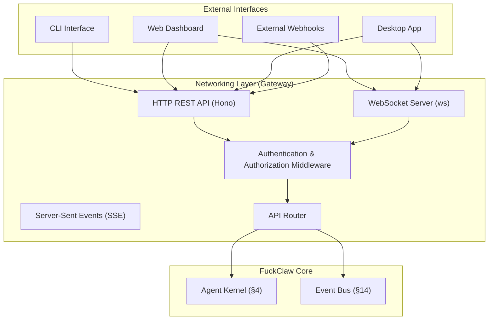

# §21 — Networking

## 21.1 Purpose

The Networking subsystem manages FuckClaw's external interfaces. It provides HTTP APIs, WebSocket connections for real-time streaming, authentication, and inbound/outbound webhooks.

## 21.2 Architecture



## 21.3 Authentication & Security

FuckClaw assumes full trust of the *authenticated* operator, but it must strictly authenticate network requests.

1. **Local Access (Default)**: If bound to `127.0.0.1`, FuckClaw relies on OS-level user permissions.
2. **Network Access**: If bound to `0.0.0.0`, all API requests must include a Bearer token (`Authorization: Bearer <token>`).
3. **Webhook Verification**: Webhook payloads are verified using HMAC signatures (e.g., `x-hub-signature-256` for GitHub).

## 21.4 HTTP REST API

The HTTP API is built with Hono and provides structured access to core capabilities.

### 21.4.1 Key Endpoints

| Method | Path | Description |
|---|---|---|
| `POST` | `/api/tasks` | Create a new task (synchronous or async) |
| `GET` | `/api/tasks/:id` | Get task status and details |
| `DELETE` | `/api/tasks/:id` | Cancel a running task |
| `GET` | `/api/memory/search` | Search memory records |
| `POST` | `/api/memory/query` | Execute a hybrid memory query |
| `GET` | `/api/graph/entity/:id` | Get an entity from the knowledge graph |
| `GET` | `/api/tools` | List registered tools |
| `POST` | `/api/webhooks/:id` | Webhook ingress endpoint |
| `GET` | `/api/system/health` | System health check |

## 21.5 Real-time Streaming

### 21.5.1 WebSocket Server

The WebSocket server provides bidirectional communication for interactive sessions (CLI, UI).

- **Inbound**: Send follow-up messages, interrupt signals, or provide requested input.
- **Outbound**: Receive reasoning traces, streaming tool output, and system events in real-time.

```json
// Example Outbound WebSocket Message (Tool Streaming)
{
  "type": "stream",
  "taskId": "task_01HQ...",
  "source": "tool.shell",
  "content": "Compiling source files...\n"
}
```

### 21.5.2 Server-Sent Events (SSE)

An alternative to WebSockets, primarily used for unidirectional streaming of LLM generation tokens to clients that do not require bidirectional interaction.

## 21.6 Ingress / Egress Rules

- **Ingress**: All inbound connections pass through the Gateway, are authenticated, and routed to the appropriate subsystem (Kernel for tasks, Scheduler for webhooks).
- **Egress**: All outbound connections are managed by the Tool Runtime (§9) or LLM Router (§12). The networking layer itself does not initiate outbound requests.

## 21.7 Interfaces

```typescript
export interface INetworkManager {
  /** Start the HTTP and WebSocket servers */
  start(config: NetworkConfig): Promise<void>;
  
  /** Stop the servers gracefully */
  stop(): Promise<void>;
  
  /** Register a custom route (e.g., for a plugin) */
  registerRoute(method: HttpMethod, path: string, handler: RouteHandler): void;
  
  /** Broadcast a message to all connected WebSocket clients */
  broadcast(topic: string, payload: unknown): void;
}
```

## 21.8 Failure Modes

| Failure | Impact | Mitigation |
|---|---|---|
| Port already in use | Server fails to start | Configurable ports; graceful exit with clear error |
| Invalid API key (Network access) | Request rejected | 401 Unauthorized; rate limit failed auth attempts |
| Webhook signature mismatch | Request rejected | 401 Unauthorized; log security warning |
| WebSocket connection drops | Real-time updates lost | Client-side auto-reconnect; state recovery via REST API upon reconnection |

## 21.9 Future Improvements

1. **mTLS (Mutual TLS)**: Support client certificate authentication for high-security network deployments
2. **Reverse Proxy Integration**: Pre-configured templates for Nginx/Caddy integration (SSL, rate limiting)
3. **GraphQL API**: Provide a GraphQL endpoint for complex, nested data fetching (e.g., Knowledge Graph queries)