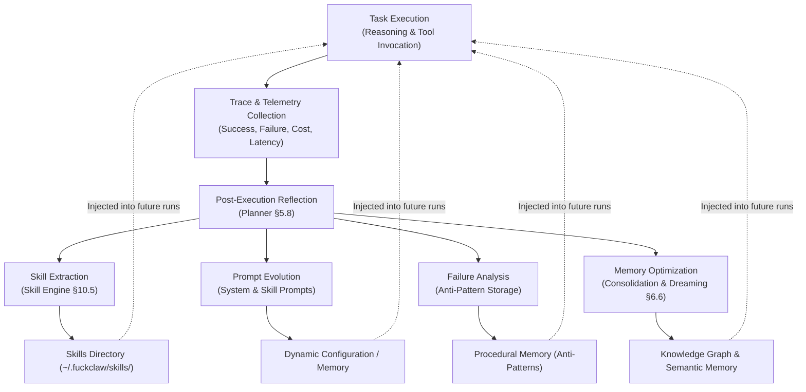

# §23 — AI Self-Improvement

## 23.1 Purpose

A static AI degrades in utility as the operator's environment changes. FuckClaw incorporates continuous **self-improvement mechanisms** that allow it to extract reusable skills, refine its system prompts, optimize its memory retrieval, and learn from execution failures — without requiring explicit code updates from the operator.

## 23.2 The Self-Improvement Loop



## 23.3 Mechanisms of Self-Improvement

### 23.3.1 Automatic Skill Extraction
Described in detail in §10.5. When the agent detects a recurring sequence of successful tool calls and reasoning patterns across multiple tasks, it extracts the sequence into a reusable Skill Manifest.

### 23.3.2 Failure Learning & Anti-Patterns
When a task fails or requires multiple replans (§5.7), the agent records the root cause in **Procedural Memory** as an **Anti-Pattern**:

```typescript
interface AntiPatternRecord {
  id: string;
  context: string; // e.g., "Docker build with Node.js on ARM64"
  mistake: string; // e.g., "Used standard node image without --platform flag"
  consequence: string; // e.g., "Build failed due to architecture mismatch"
  correctiveAction: string; // e.g., "Specify --platform=linux/amd64 or use multi-arch base"
  confidence: number;
}
```

During subsequent task planning for similar contexts, relevant anti-patterns are retrieved and injected into the prompt as negative constraints ("Avoid the following known failure patterns...").

### 23.3.3 Prompt Evolution (Prompt Refinement)
The agent periodically analyzes the effectiveness of its internal system prompts and skill instructions:

1. **Evaluation**: If a skill's success rate falls below a threshold (e.g., 70%), it is flagged for refinement.
2. **Analysis**: The LLM reviews the last $N$ failures for that skill.
3. **Mutation**: The LLM drafts an updated prompt that explicitly addresses the failure modes.
4. **Validation**: The new prompt is tested against synthetic or recorded historical test cases before being deployed.

### 23.3.4 Memory & Knowledge Graph Optimization
Through the Dreaming cycle (§6.6.2), the agent audits its own semantic beliefs, resolves contradictions, merges duplicate entities in the Knowledge Graph, and prunes stale episodic memories.

## 23.4 Safeguards on Self-Improvement

Because FuckClaw operates with full autonomy, self-improvement must not cause catastrophic drift or degradation:

1. **Rollback Capabilities**: Every extracted skill and prompt modification is versioned. If a new skill version performs worse than its predecessor, it is automatically rolled back.
2. **Human Inspection**: Extracted skills and prompt changes are clearly logged in the Observability audit trail (§18) and visible in the Web Dashboard.
3. **Bounded Mutation**: Self-improvement cannot modify the core Agent Kernel code; it can only modify skills, prompts, configuration, and memory records.

## 23.5 Interfaces

```typescript
export interface ISelfImprovementEngine {
  /** Trigger a self-improvement analysis cycle */
  runAnalysis(): Promise<SelfImprovementReport>;
  
  /** Process a completed task trace for potential learnings */
  processTrace(trace: ReasoningTrace): Promise<void>;
  
  /** Propose a prompt optimization */
  proposePromptImprovement(target: string): Promise<PromptMutationProposal>;
  
  /** Revert a self-improvement change */
  rollback(changeId: string): Promise<void>;
}
```

## 23.6 Failure Modes

| Failure | Impact | Mitigation |
|---|---|---|
| Overfitting to a single failure | Agent becomes overly cautious or rigid | Anti-patterns require validation or multiple occurrences before becoming high-weight constraints |
| Degraded prompt mutations | Lower reasoning performance | Automated A/B testing or benchmarking against test suites before promoting prompts |
| Skill explosion | Too many redundant skills | Periodic consolidation of overlapping skills |

## 23.7 Future Improvements

1. **Fine-Tuning Data Generation**: Automatically curate datasets of successful, high-quality reasoning traces and tool calls to fine-tune local models (e.g., LLaMA, Mistral) for specific routine tasks
2. **Reinforcement Learning from Operator Feedback (RLOF)**: Implicitly learn operator preferences from corrections, edits, or interruptions during interactive sessions
3. **Cross-Agent Knowledge Transfer**: Export learned skills and anti-patterns to share with other instances of FuckClaw running across different machines or teams